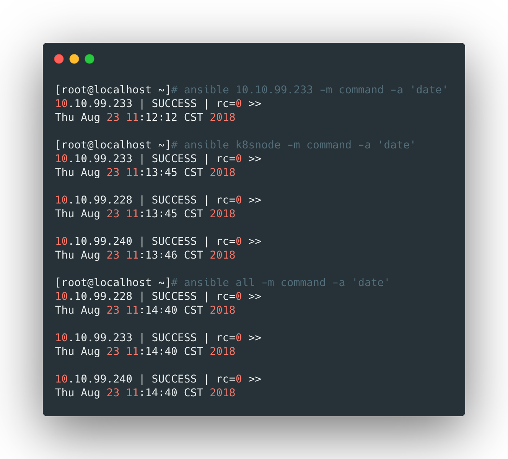

## 依赖安装

```bash
yum install -y epel-release libselinux-python
```

<br>


## 安装ansible

```bash
yum install -y ansible
```

<br>

 

## 生成的文件

安装完成后将生成如下的几种文件：

- `/etc/ansible/ansible.cfg`：主配置文件；
- `/etc/ansible/hosts`：主机列表；
- `/usr/bin/ansible-doc`：帮助文档；
- `/usr/bin/ansible-playbook`：playbook文件；


<br>

## 设置免秘钥登录

首先查看当前用户家目录下有没有公钥，如果有的话，就直接执行下面的文件将公钥发送到目标主机：

```bash
ssh-copy-id <目标主机>
```


如果没有公钥，就重新生成：

```bash
ssh-keygen
ssh-copy-id <目标主机>
```

<br>


## 测试

首先在主机列表文件中增加几个服务器：

```bash
cat > /etc/ansible/hosts << EOF
[k8snode]
10.10.99.228
10.10.99.233
10.10.99.240
EOF
```


然后使用下面的命令测试一下：

```bash
# 针对某一个主机
ansible 10.10.99.233 -m command -a 'date'

# 针对某一主机组
ansible k8snode -m command -a 'date'

# 针对所有主机
ansible all -m command -a 'date'
```




