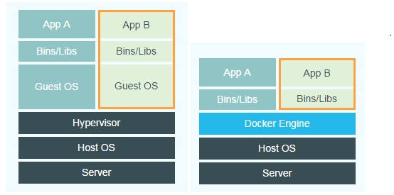
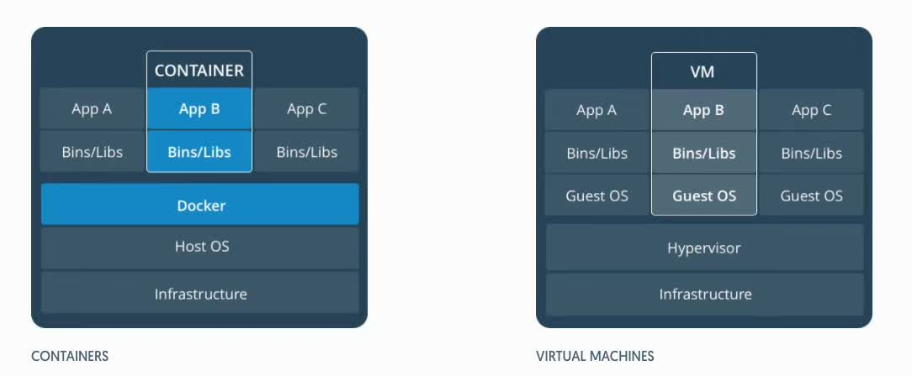

## 容器技术

容器是对软件和其依赖的标准化打包，能够实现应用间的相互隔离。容器共享一个系统内核，可以在多个主流操作系统上运行。

‌

容器技术解决了开发和运维的矛盾，为app提供了灵活的移植和扩展能力。

 

## 虚拟化技术和容器技术的区别

### 从虚拟化的角度

虚拟化技术通过Hypervisor对系统资源包括硬件设备进行虚拟化并对物理资源进行限定和调度。可以看见，每一个虚拟机都需要完整的操作系统，在操作系统上才是各种app。这就导致虚拟化出来的虚拟机体量比较大，启动速度慢且消耗资源多。

‌

容器技术没有虚拟化这一层，其中不包含操作系统，只有app相关的依赖库，这样容器就很小巧，移植性强于虚拟化，启动速度快且消耗资源少。

### 从隔离的角度

容器提供了app层面的隔离，而虚拟化提供了物理层面的隔离。

 

## 容器和虚拟机特性比较

| 特性     | 虚拟机                   | 容器                                                   |
| -------- | ------------------------ | ------------------------------------------------------ |
| 启动时间 | 分钟级                   | 秒级                                                   |
| 体量     | 通常G为单位              | 通常M为单位                                            |
| 资源占用 | 占用资源多               | 占用资源少                                             |
| 性能     | 有虚拟化层，开销大       | 无虚拟化层，开销小                                     |
| 安全性   | 操作系统级隔离，安全性高 | 进程级隔离，安全性低                                   |
| 使用要求 | 需要硬件支持虚拟化       | 可在大多数主流操作系统上运行，不需要考虑是否支持虚拟化 |

 

## 容器技术的作用

- 简化配置；
- 整合服务器；
- 代码流水线管理；
- 调试能力；
- 提升开发效率；
- 多租户；
- 隔离应用；
- 快速部署