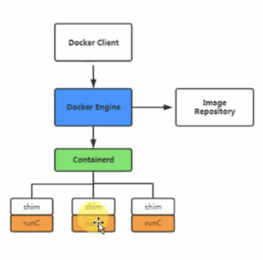

## 介绍

docker是容器技术的一种开源实现，其本身是一个容器引擎，docker分为docekr-ce社区版（免费）和docer-ee企业版（收费）。

docker早期版本基于LXC，并进一步进行封装，包括文件系统、网络互连、镜像管理等方面，极大简化了容器管理。后期移除了LXC，转为自研发的libcontainer，从1.11版本开始使用runc和libcontainerd。

 

##  docker架构

docker是一个典型的C/S架构，包括`docker server`和`docker client`。 ‌

- **`docker server`**：守护进程，一直运行在后台；
- **`docker client`**：docker的命令行工具，通过http协议与docker server进行通信，包含一系列子命令来管理容器和镜像；

当docker服务也就是docker engine接收到docker client的请求后，如果是镜像下载则自己处理，如果是创建容器则交给containerd进行处理，containerd再将请求发送给shim和runc处理。 

- containerd：简单的守护进程，使用runc管理容器，向docker engine提供接口；
- shim：只负责管理一个容器；
- runc：轻量级工具，用来运行容器；

 ‌

##  docker依赖的内核特性

docker依赖三个linux内核特性：

- `Namespace`：命名空间；
- `Control groups（Cgroups）`：控制组；
- `UnionFS`：联合文件系统；

***namespace***提供了一种系统的资源隔离，包括文件系统、网络、进程等。docker拥有5中namespace： 

- PID：进程隔离 
- NET：网络隔离 
- IPC：管理跨进程通信访问 
- MNT：管理挂载点 
- UTS：隔离内核和版本标识

***Cgroups\***是linux内核提供的一种可以限制、记录、隔离物理进程组的机制，其提供了如下的功能：

- 资源限制和控制
- 优先级设定 
- 资源计量

***UnionFS\***是联合文件系统，支持将不同位置的目录挂载到同一个虚拟文件系统，形成一种分层的模型；

**docker通过这三种特性，使得每个容器都拥有自己的root文件系统，每个容器都运行在自己的进程环境中，每个容器间虚拟网络接口和ip地址都是分离的，每个容器都有独立的cpu和内存资源；**