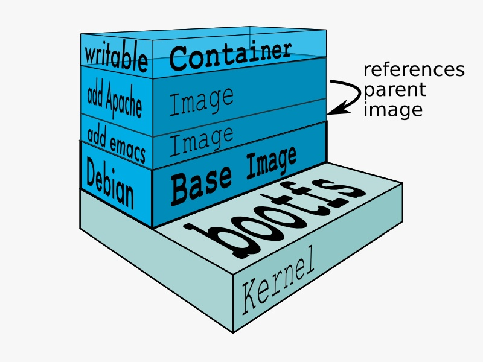

## 镜像‌

镜像（docker image）是文件（rootfs）和meta data的集合；image是分层的，并且每一层都可以通过添加、改变、删除文件来成为一个新的image。

**不同的image可以共享相同的layer（分层），image本身是read only的。**

 

‌

##  容器‌

容器是通过image创建，是在image之上创建的一个可读写层container layer。image负责app的存储和分发，container负责运行app。 容器可以类比为面向对象编程的类（image）和实例（container）