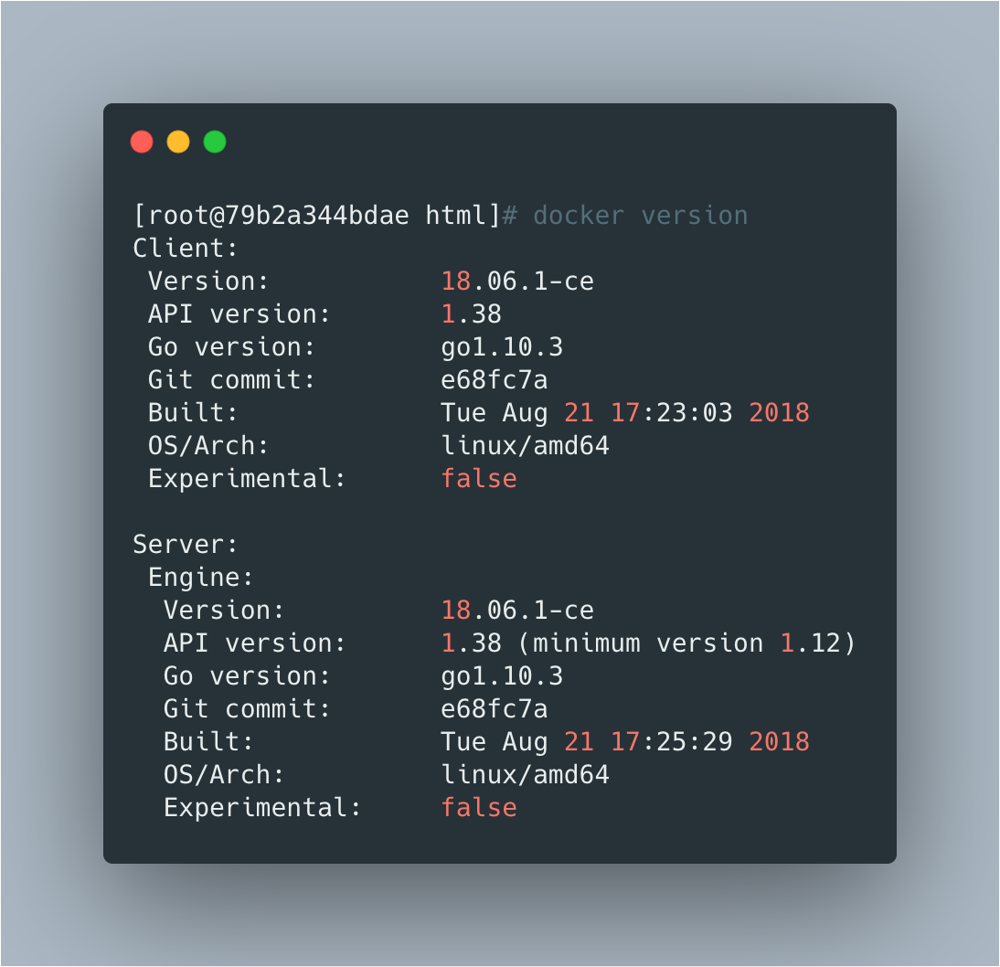

<br>

>  docker在拆分为ce和ee之后，大版本例如18表示发布的年份，小版本表示的是月份。

<br>

‌

##  安装依赖

```bash
yum install -y yum-utils device-mapper-persistent-data lvm2
```


<br>

##  添加repo源文件

```bash
yum-config-manager --add-repo https://download.docker.com/linux/centos/docker-ce.repo
```


<br>


##  【可选步骤】挂载数据目录

 docker默认会把数据都保存在`/var/lib/docker`下，所以如果是生产环境，建议挂载一个数据盘到该目录下防止爆盘。

<br>


##  安装docker-ce

###  查看可用版本

```bash
yum list docker-ce --showduplicates|sort -r
```

‌

###  安装最新版

```bash
yum install -y docker-ce
```

‌

###  安装指定版本

```bash
yum install -y docker-ce-18.03.1.ce-1.el7.centos
```


<br>

##  启动docker

```bash
systemctl start docker
systemctl enable docker
```

<br>


##  验证安装

```bash
# 查看docker server和client的版本
docker version
```





