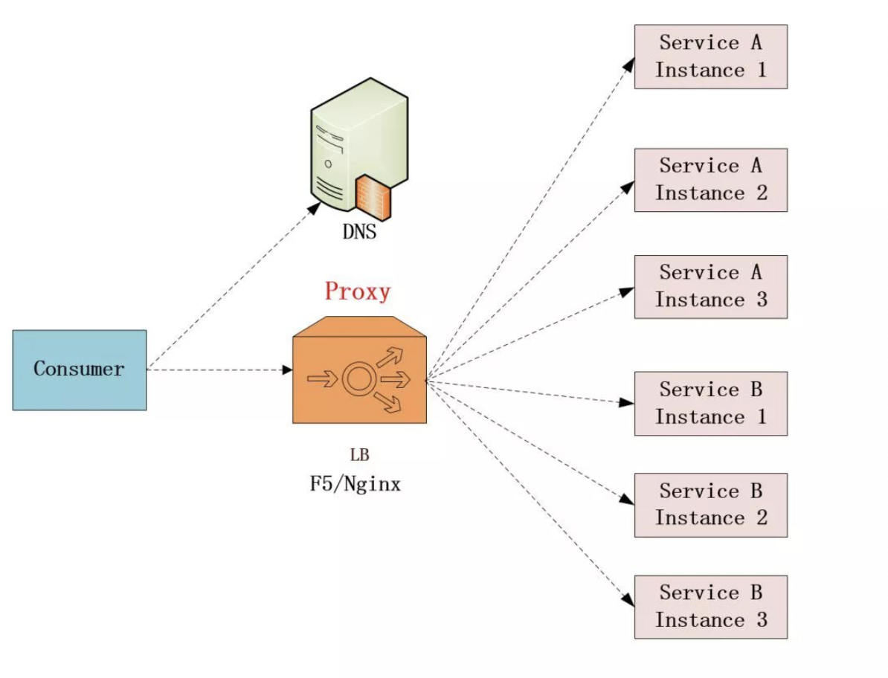
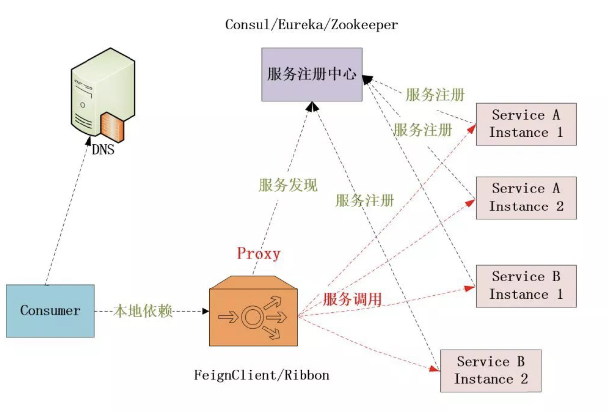
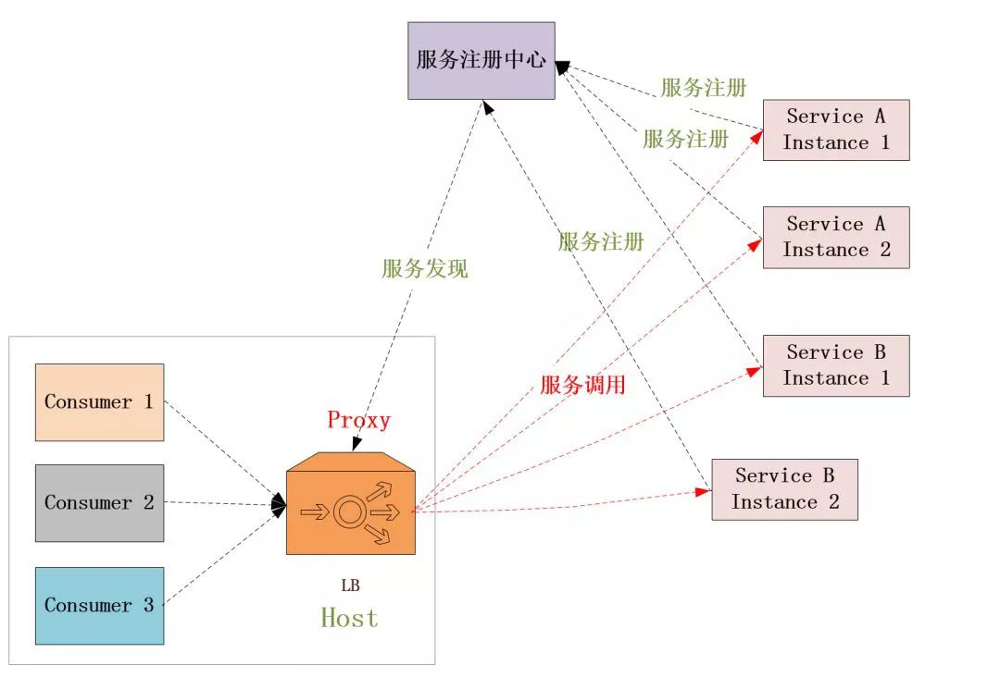
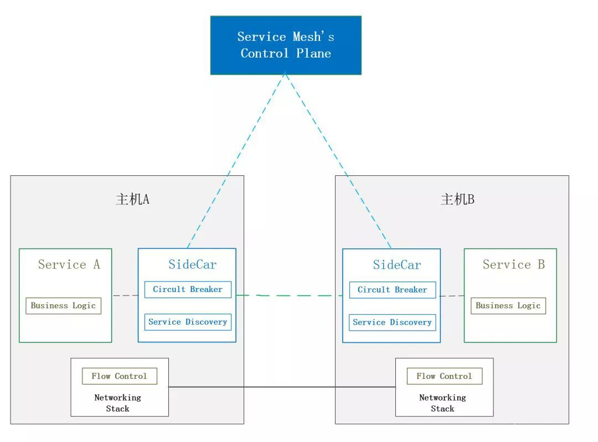
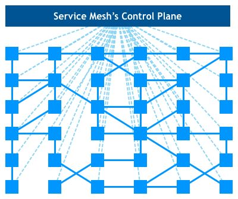

## 微服务的问题

在升级为微服务架构之后，服务少则几十，多则成百上千，在部署时，往往一个服务也会部署多个副本，这就会导致出现以下的问题：

1. 服务发现，即服务消费方如何发现服务提供方的位置；
2. 负载均衡，即微服务以集群方式部署后，以何种负载均衡策略访问集群中的实例；

### 集中式传统代理

集中式处理方式兴起于微服务架构之前，服务模块根据自身需要进行模块化设计与拆分，虽然呈现了一定分布式特性，但仍需要通过中间Nginx或者F5之类的负载均衡器进行调度以确保可用性。在实际中通过配合DNS，在Nginx或者F5上建立服务域名和ip端口之间的关系，来实现消费端通过域名解析出服务端地址并调用的功能。但这种方式的服务注册过于依赖运维人员的手工配置。

### 客户端嵌入式代理

这种方式是目前以Spring Cloud框架为代表的微服务架构模式所使用的方式，包括在此之前比较著名的Dubbo框架采用的也这样的方式。在这种模式下，服务发现和负载均衡逻辑都是以本地库的方式嵌在具体的应用中。

这种模式一般需要独立的服务中心注册组件配合，服务启动时自动注册到服务中心并定期上报心跳，客户端代理则通过注册中心进行服务发现并进行负载均衡。

> 基于Spring Cloud的微服务架构就是通过采用Consul作为注册中心，客户端通过集成Spring Cloud提供的相关本地组件，进行服务调用时通过FeignClient（底层采用Ribbon）实现了服务的发现与负载均衡。

客户端嵌入式模式在应用内部就嵌入了服务发现和负载均衡的逻辑，但是这样导致底层通信逻辑和业务逻辑耦合在一起，在某些情况下确实限制了某能力。

这种模式也并非完全是对集中式代理模式的替代，这种架构方式的主要关注点在于内部服务的治理，对于需要通过互联网访问的服务，我们依然需要通过F5/Nginx之类软硬件负载均衡器进行负载均衡，例如在这种模式下API Gateway在向外提供公网服务时，仍然是通过DNS+Nginx进行的扩展。

### 独立进程代理

这种模式实现服务发现和负载均衡的代理作为一个独立进程部署在主机上，主机上的多个消费者共用这个代理来实现负载军衡和服务发现的需求。

> 这种模式将负责服务发现、负载均衡、熔断限流等相关逻辑设置在一个进程内。

## 什么是ServiceMesh

ServiceMesh，中文名叫服务网格，本质上是一中实现独立进程代理的方式。它不是一个实际的产品，而是一个理论层面的东西，是随着微服务架构而产生的。

ServiceMesh实际上是解决的是微服务中网络通信的问题，他可以实现流量控制、熔断机制、服务发现和负载均衡等功能。

如果把主机和业务逻辑从视觉上剥离，就会看到一种类似网格的样式

### ServiceMesh实现方案

目前比较主流的ServiceMesh实现方案主要有两种：

- Linkerd：2016年始于CNCF项目，支持基于物理机或者虚拟机的部署，基于Go开发，为kubernetes定制的轻量级服务网格；
- Istio：Google、IBM和Lyft联合发起的项目，支持多平台部署；

### 实现方案对比

- 都是采用sidcar模式实现，每个服务都会有一个代理节点，服务间通信通过代理节点进行转发；代理节点构成数据层；
- 都有控制层用于监控和配置数据层代理节点，一般独立部署；
- Istio目前在功能丰富、稳定性和社区方面更加完善；

## ServiceMesh的优势

Service Mesh这种架构模式并不新鲜，很早就有公司进行过尝试，之所以又火起来的原因，主要还是因为传统集中代理模式和客户端嵌入式代理模式的确有一些固有的缺陷，传统集中代理模式相对比较重，有单点问题和性能问题。

客户端嵌入式代理模式则有客户端复杂，支持多语言困难，路由、熔断、限流等服务操作无法集中治理的问题。而Service Mesh则正好弥补了二者的不足，它是纯分布式的，没有单点的问题，性能也比较优秀并且与开发语言无关，还可以集中进行治理。

此外，随着微服务化、多语言和容器化的发展趋势，很多公司也迫切需要一种轻量级的服务发现机制，加上一些大厂助推（如Kubernetes与Docker的容器之争），正好Service Mesh迎合了这种趋势，所以才有今天火热的局面。

