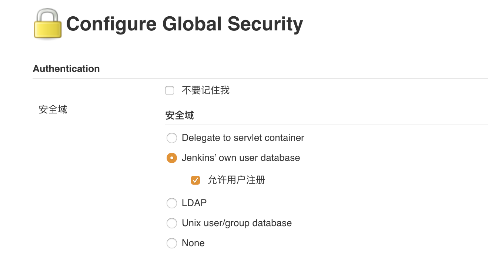

编辑jenkins目录下的`config.xml`文件，删除下面的代码：

```xml
<useSecurity>true</useSecurity>  
<authorizationStrategy class="hudson.security.FullControlOnceLoggedInAuthorizationStrategy">  
  <denyAnonymousReadAccess>true</denyAnonymousReadAccess>  
</authorizationStrategy>  
<securityRealm class="hudson.security.HudsonPrivateSecurityRealm">  
  <disableSignup>true</disableSignup>  
  <enableCaptcha>false</enableCaptcha>  
</securityRealm>
```


然后重启jenkins。


进入首页>“系统管理”>“Configure Global Security”；勾选如下的选项




保存后重新点击首页>“系统管理”,发现此时出现“管理用户”，之后修改用户密码就可以登陆了。