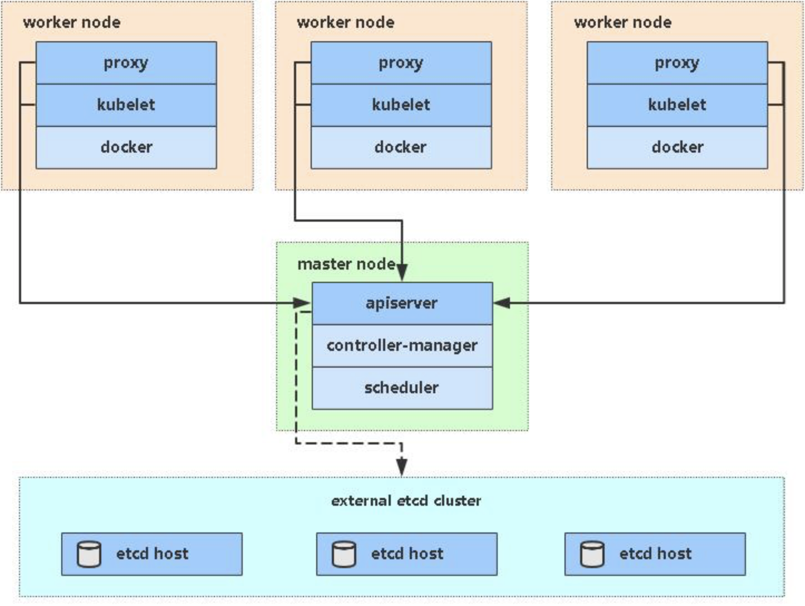

## 安装要求

在开始之前，部署Kubernetes集群机器需要满足以下几个条件：

- 一台或多台机器，操作系统 CentOS7.x-86_x64
- 硬件配置：2GB或更多RAM，2个CPU或更多CPU，硬盘30GB或更多
- 集群中所有机器之间网络互通
- 可以访问外网，需要拉取镜像
- 禁止swap分区

<br>

## 环境准备



| 角色       | IP            |
| ---------- | ------------- |
| k8s-master | 192.168.31.61 |
| k8s-node1  | 192.168.31.62 |
| k8s-node2  | 192.168.31.63 |


需要在每一个服务器上执行如下的操作：

```shell
# 关闭防火墙：
$ systemctl stop firewalld
$ systemctl disable firewalld

# 关闭selinux：
$ sed -i 's/enforcing/disabled/' /etc/selinux/config  # 永久
$ setenforce 0  # 临时

# 关闭swap：
$ swapoff -a  # 临时
$ vim /etc/fstab  # 永久

# 设置主机名：
$ hostnamectl set-hostname --static <hostname>

# 在master添加hosts：
$ cat >> /etc/hosts << EOF
192.168.31.61 k8s-master
192.168.31.62 k8s-node1
192.168.31.63 k8s-node2
EOF

# 将桥接的IPv4流量传递到iptables的链：
$ cat > /etc/sysctl.d/k8s.conf << EOF
net.bridge.bridge-nf-call-ip6tables = 1
net.bridge.bridge-nf-call-iptables = 1
EOF
$ sysctl --system  # 生效

# 时间同步：
$ yum install ntpdate -y
$ ntpdate time.windows.com
```


> **生产环境最好将 /var/lib/docker 和/var/lib/kubelet分别挂载一个数据盘**

<br>

## 安装Docker/kubeadm/kubelet

**在所有节点安装这三个组件。**

Kubernetes默认CRI（容器运行时）为Docker，因此先安装Docker。


### 安装Docker

```shell
wget https://mirrors.aliyun.com/docker-ce/linux/centos/docker-ce.repo -O /etc/yum.repos.d/docker-ce.repo
yum -y install docker-ce-18.06.1.ce-3.el7
systemctl enable docker && systemctl start docker
docker --version
```


```shell
# 这个文件中的insecure-registries地址为自建的harbor仓库地址，可以写成自己的或者更不要这个参数
cat > /etc/docker/daemon.json << EOF
{
  "registry-mirrors": ["https://b9pmyelo.mirror.aliyuncs.com"],
  "insecure-registries": ["192.168.31.70"],
  "exec-opts": ["native.cgroupdriver=systemd"],
  "log-driver": "json-file",
  "log-opts": {
    "max-size": "100m"
  },
  "storage-driver": "overlay2"
}
EOF
```


### 添加阿里云YUM软件源

```shell
cat > /etc/yum.repos.d/kubernetes.repo << EOF
[kubernetes]
name=Kubernetes
baseurl=https://mirrors.aliyun.com/kubernetes/yum/repos/kubernetes-el7-x86_64
enabled=1
gpgcheck=0
repo_gpgcheck=0
gpgkey=https://mirrors.aliyun.com/kubernetes/yum/doc/yum-key.gpg https://mirrors.aliyun.com/kubernetes/yum/doc/rpm-package-key.gpg
EOF
```


### 安装kubeadm，kubelet和kubectl

由于版本更新频繁，这里指定版本号部署：

```shell
yum install -y kubelet-1.17.0 kubeadm-1.17.0 kubectl-1.17.0
systemctl enable kubelet
```

> 版本尽量保持一致，否则可能会出现问题。

<br>

## 部署Kubernetes Master

在192.168.31.61（Master）执行。

```shell
kubeadm init \
  --apiserver-advertise-address=192.168.31.61 \
  --image-repository registry.aliyuncs.com/google_containers \
  --kubernetes-version v1.17.0 \
  --service-cidr=10.96.0.0/12 \
  --pod-network-cidr=10.244.0.0/16
```


> 由于默认拉取镜像地址k8s.gcr.io国内无法访问，这里指定阿里云镜像仓库地址。


### kubeadm init常用参数：

```bash
--apiserver-advertise-address string
API 服务器所公布的其正在监听的 IP 地址。如果未设置，则使用默认网络接口。

--apiserver-bind-port int32     默认值：6443
API 服务器绑定的端口。

--apiserver-cert-extra-sans stringSlice
用于 API Server 服务证书的可选附加主题备用名称（SAN）。可以是 IP 地址和 DNS 名称。

--cert-dir string     默认值："/etc/kubernetes/pki"
保存和存储证书的路径。

--certificate-key string
用于加密 kubeadm-certs Secret 中的控制平面证书的密钥。

--config string
kubeadm 配置文件的路径。

--control-plane-endpoint string
为控制平面指定一个稳定的 IP 地址或 DNS 名称。

--cri-socket string
要连接的 CRI 套接字的路径。如果为空，则 kubeadm 将尝试自动检测此值；仅当安装了多个 CRI 或具有非标准 CRI 插槽时，才使用此选项。

--dry-run
不要应用任何更改；只是输出将要执行的操作。

-k, --experimental-kustomize string
用于存储 kustomize 为静态 pod 清单所提供的补丁的路径。

--feature-gates string
一组用来描述各种功能特性的键值（key=value）对。选项是：

IPv6DualStack=true|false (ALPHA - default=false)

--ignore-preflight-errors stringSlice
错误将显示为警告的检查列表；例如：'IsPrivilegedUser,Swap'。取值为 'all' 时将忽略检查中的所有错误。

--image-repository string     默认值："k8s.gcr.io"
选择用于拉取控制平面镜像的容器仓库

--kubernetes-version string     默认值："stable-1"
为控制平面选择一个特定的 Kubernetes 版本。

--node-name string
指定节点的名称。

--pod-network-cidr string
指明 pod 网络可以使用的 IP 地址段。如果设置了这个参数，控制平面将会为每一个节点自动分配 CIDRs。

--service-cidr string     默认值："10.96.0.0/12"
为服务的虚拟 IP 地址另外指定 IP 地址段

--service-dns-domain string     默认值："cluster.local"
为服务另外指定域名，例如："myorg.internal"。

--skip-certificate-key-print
不要打印用于加密控制平面证书的密钥。

--skip-phases stringSlice
要跳过的阶段列表

--skip-token-print
跳过打印 'kubeadm init' 生成的默认引导令牌。

--token string
这个令牌用于建立控制平面节点与工作节点间的双向通信。格式为 [a-z0-9]{6}\.[a-z0-9]{16} - 示例：abcdef.0123456789abcdef

--token-ttl duration     默认值：24h0m0s
令牌被自动删除之前的持续时间（例如 1 s，2 m，3 h）。如果设置为 '0'，则令牌将永不过期

--upload-certs
将控制平面证书上传到 kubeadm-certs Secret。
```


这一步初始化之后，会生成一个节点加入集群的命令，例如：

```bash
kubeadm join 192.168.31.61:6443 --token esce21.q6hetwm8si29qxwn \
    --discovery-token-ca-cert-hash sha256:00603a05805807501d7181c3d60b478788408cfe6cedefedb1f97569708be9c5
```

记录下这个命令，后面加入节点需要用到。


配置kubectl工具：

```bash
mkdir -p $HOME/.kube
cp -i /etc/kubernetes/admin.conf $HOME/.kube/config
chown $(id -u):$(id -g) $HOME/.kube/config
$ kubectl get nodes
```

<br>


## 安装Pod网络插件（CNI）

这里使用的网络插件为flannel


```shell
$ kubectl apply -f https://raw.githubusercontent.com/coreos/flannel/master/Documentation/kube-flannel.yml
```

> 确保能够访问到quay.io这个registery。如果Pod镜像下载失败，可以改成这个镜像地址：lizhenliang/flannel:v0.11.0-amd64

<br>

## 加入Kubernetes Node

在每个Node上执行。


向集群添加新节点，执行在kubeadm init输出的kubeadm join命令：

```shell
kubeadm join 192.168.31.61:6443 --token esce21.q6hetwm8si29qxwn \
    --discovery-token-ca-cert-hash sha256:00603a05805807501d7181c3d60b478788408cfe6cedefedb1f97569708be9c5
```

> 需要替换为自己生成的token

<br>

## 测试kubernetes集群

在Kubernetes集群中创建一个pod，验证是否正常运行：

```shell
kubectl create deployment nginx --image=nginx
kubectl expose deployment nginx --port=80 --type=NodePort
kubectl get pod,svc
```

访问地址：http://NodeIP:Port  


## 部署 Dashboard

```shell
kubectl apply -f https://raw.githubusercontent.com/kubernetes/dashboard/v2.0.0-beta8/aio/deploy/recommended.yaml
```


默认Dashboard只能集群内部访问，修改Service为NodePort类型，暴露到外部：

```yaml
kind: Service
apiVersion: v1
metadata:
  labels:
    k8s-app: kubernetes-dashboard
  name: kubernetes-dashboard
  namespace: kubernetes-dashboard
spec:
  ports:
    - port: 443
      targetPort: 8443
  selector:
    k8s-app: kubernetes-dashboard
```
访问地址：http://NodeIP:30001


创建service account并绑定默认cluster-admin管理员集群角色：

```shell
kubectl create serviceaccount dashboard-admin -n kube-system
kubectl create clusterrolebinding dashboard-admin --clusterrole=cluster-admin --serviceaccount=kube-system:dashboard-admin
kubectl describe secrets -n kube-system $(kubectl -n kube-system get secret | awk '/dashboard-admin/{print $1}')
```
使用输出的token登录Dashboard。


