<br>

## 规划

|    主机名     |   IP地址    |        用途        |
| :-----------: | :---------: | :----------------: |
| SCA-LUM700011 | 10.8.138.8  | nginx+nfs+运维节点 |
| SCA-LUM700007 | 10.8.138.5  |      master-1      |
| SCA-LUM700008 | 10.8.138.6  |      Master-2      |
| SCA-LUM700012 | 10.8.138.10 |      Master-3      |
| SCA-LUM700013 | 10.8.138.9  |       Node-1       |
| SCA-LUM700014 | 10.8.138.11 |       node-2       |


前端还有一个elb，地址为`10.8.138.12`，代理master的apiserver。


集群使用`1.17.3`版本

<br>


## 安装nfs和nginx


### 安装nfs

nfs的作用是为集群提供共享存储，nginx后面用来代理集群的ingress等服务。在`SCA-LUM700011`这台nfs服务器上有挂载的磁盘，先对其格式化并创建nfs的数据目录：

```bash
mkfs.xfs /dev/vdb -f
mkdir -p /data/nfs-data
echo "/dev/vdb /data/nfs-data xfs defaults 0 0" >> /etc/fstab
mount -a
df -h
```


安装nfs相关服务并启动nfs：

```bash
yum install -y nfs-utils rpcbind
echo "/data/nfs-data *(rw,no_root_squash)" >> /etc/exports
systemctl start rpcbind
systemctl status rpcbind
systemctl enable rpcbind
systemctl start nfs 
systemctl status nfs
systemctl enable nfs
```


**每一个节点都应该安装`nfs-utils`，这个后面会装上**


### 安装nginx

这里使用yum方式安装nginx。

```bash
# 安装依赖
yum install -y gcc gcc-c++ autoconf pcre pcre-devel make automake yum-utils zlib zlib-devel openssl openssl-devel

# 添加yum源
cat > /etc/yum.repos.d/nginx.repo << EOF
[nginx-stable]
name=nginx stable repo
baseurl=http://nginx.org/packages/centos/\$releasever/\$basearch/
gpgcheck=1
enabled=1
gpgkey=https://nginx.org/keys/nginx_signing.key
module_hotfixes=true


[nginx-mainline]
name=nginx mainline repo
baseurl=http://nginx.org/packages/mainline/centos/\$releasever/\$basearch/
gpgcheck=1
enabled=0
gpgkey=https://nginx.org/keys/nginx_signing.key
module_hotfixes=true
EOF

# 安装nginx
yum install -y nginx

# 检查
nginx -v
nginx -V

# 启动nginx
systemctl start nginx
systenctl status nginx
systenctl enable nginx
```

<br>


## 配置sshkey

在`SCA-LUM700011`这台创建ssh key并分发到其他节点，将这台服务器作为运维节点，下面使用的ansible就在这个上面运行。

```bash
ssh-keygen
ssh-copy-id 10.8.138.5
ssh-copy-id 10.8.138.6
ssh-copy-id 10.8.138.10
ssh-copy-id 10.8.138.9
ssh-copy-id 10.8.138.11
```

<br>


## 安装ansible

`ansible`可以方便批量执行指令：


### 安装

```bash
yum install -y ansible
```


### 设置配置文件

```bash
cat > /etc/ansible/ansible.cfg <<EOF
[defaults]
log_path = /var/log/ansible.log

forks = 20
host_key_checking = False
retry_files_enabled = False
deprecation_warnings = False
nocows = True
remote_user = root
roles_path = roles/
gathering = smart
fact_caching = jsonfile
fact_caching_connection = /etc/ansible/facts
fact_caching_timeout = 600
callback_whitelist = profile_tasks
inventory_ignore_extensions = secrets.py, .pyc, .cfg, .crt, .ini
timeout = 30

[inventory]
unparsed_is_failed=true

[ssh_connection]
pipelining = True
ssh_args = -o ControlMaster=auto -o ControlPersist=600s
timeout = 10
control_path = %(directory)s/%%h-%%r
EOF
```


### 设置ansible host文件

```bash
cat > /etc/ansible/hosts <<EOF
[cluster]
10.8.138.5  hostname='SCA-LUM700007'
10.8.138.6  hostname='SCA-LUM700008'
10.8.138.10 hostname='SCA-LUM700012'
10.8.138.9  hostname='SCA-LUM700013'
10.8.138.11 hostname='SCA-LUM700014'

[ans]
10.8.138.8

[master]
10.8.138.5
10.8.138.6
10.8.138.10

[worker]
10.8.138.9
10.8.138.11
EOF
```


### 验证ansible

```bash
ansible cluster -m ping 
```

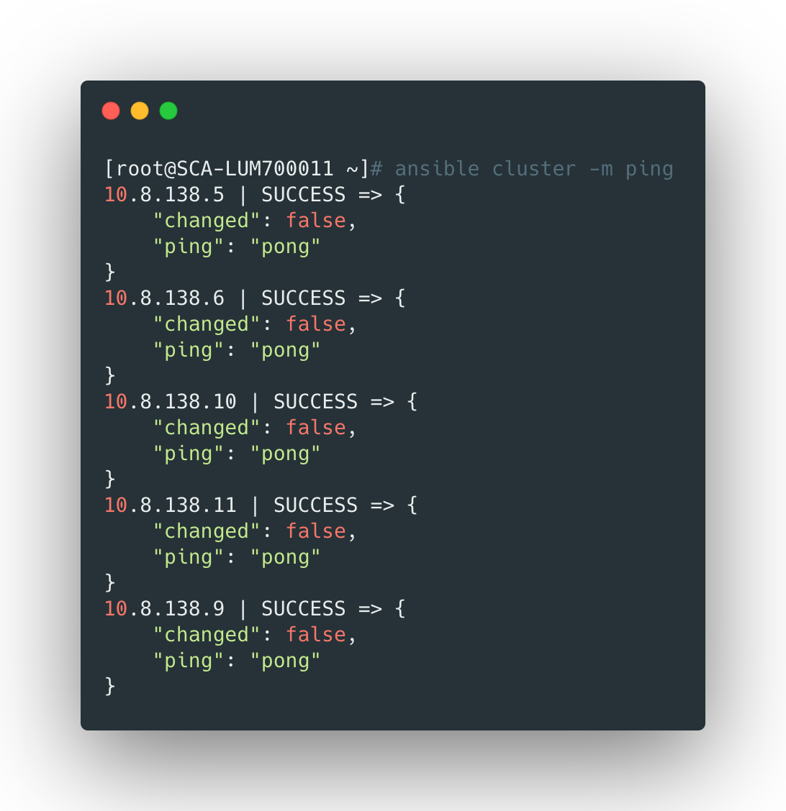

<br>


## 设置host

通过`ansible`为每个节点设置host文件：

```bash
ansible cluster -m shell -a 'cat >> /etc/hosts <<EOF
10.8.138.5  SCA-LUM700007 sca-lum700007 master1
10.8.138.6  SCA-LUM700008 sca-lum700008 master2
10.8.138.10 SCA-LUM700012 sca-lum700012 master3
10.8.138.9  SCA-LUM700013 sca-lum700013 node1
10.8.138.11 SCA-LUM700014 sca-lum700014 node2
EOF'
```


<br>


## 安装docker

需要给集群所有的节点安装docker：


### 添加docker repo文件

```bash
ansible cluster -m shell -a 'yum-config-manager --add-repo https://download.docker.com/linux/centos/docker-ce.repo'
```


### 设置存储目录

一般docker的数据存放路径为`/var/lib/docker`，所以在每个服务器上最好都有一个数据盘挂载到该目录下，防止docker数据过多爆盘。这里以一台服务器的设置为例：

```bash
mkdir /var/lib/docker
mkfs.xfs -f /dev/vdb
echo "/dev/vdb /var/lib/docker xfs default 0 0" >> /etc/fstab
mount -a
df -h
```


### 安装docker

这里使用的是18.06.3的版本：

```bash
# 查看当前可用的版本
yum list docker-ce --showduplicates|sort -r

# 安装docker
ansible cluster -m shell -a 'yum install -y docker-ce-18.06.3.ce-3.el7'
```


### 配置docker配置文件

```bash
cat > daemon.json <<EOF
{
  "exec-opts": ["native.cgroupdriver=systemd"],
  "log-driver": "json-file",
  "log-opts": {
    "max-size": "100m",
    "max-file": "5"
  },
  "storage-driver": "overlay2"
}
EOF

# 分发到集群节点
ansible cluster -m shell -a 'mkdir /etc/docker'
ansible cluster -m copy -a 'src=daemon.json dest=/etc/docker/daemon.json'
```


### 启动docker服务

```bash
ansible cluster -m shell -a 'systemctl daemon-reload'
ansible cluster -m shell -a 'systemctl restart docker'
ansible cluster -m shell -a 'systemctl status docker'
ansible cluster -m shell -a 'systemctl enable docker'
```

<br>


## 关闭swap

```bash
ansible cluster -m shell -a 'swapoff -a'
ansible cluster -m shell -a 'sed -i "/swap/s/^/#/g" /etc/fstab'
```

<br>


## 开启ipvs

本集群的service网络采用ipvs模式：

```bash
# 配置内核参数
ansible cluster -m sysctl -a 'name=net.ipv4.ip_forward value=1 state=present'
ansible cluster -m sysctl -a 'name=net.bridge.bridge-nf-call-iptables value=1 state=present'
ansible cluster -m sysctl -a 'name=net.bridge.bridge-nf-call-ip6tables value=1 state=present'

# 加载ipvs模块
cat > /tmp/ipvs.modules <<EOF
#!/bin/bash
ipvs_modules="ip_vs ip_vs_lc ip_vs_wlc ip_vs_rr ip_vs_wrr ip_vs_lblc ip_vs_lblcr ip_vs_dh ip_vs_sh ip_vs_nq ip_vs_sed ip_vs_ftp nf_conntrack_ipv4"
for kernel_module in \${ipvs_modules}; do
    /sbin/modinfo -F filename \${kernel_module} > /dev/null 2>&1
    if [ $? -eq 0 ]; then
        /sbin/modprobe \${kernel_module}
    fi
done
EOF

ansible cluster -m copy -a 'src=/tmp/ipvs.modules dest=/tmp/ipvs.modules mode=0755'
ansible cluster -m shell -a '/tmp/ipvs.modules'

# 验证 ipvs 支持
ansible cluster -m shell -a 'lsmod | grep ip_vs'

# 安装ipvsadm
ansible cluster -m yum -a 'name=ipvsadm state=present'
```

<br>


## 添加阿里云k8s yum源

```bash
cat > /etc/yum.repos.d/kubernetes.repo << EOF
[kubernetes]
name=Kubernetes
baseurl=https://mirrors.aliyun.com/kubernetes/yum/repos/kubernetes-el7-x86_64
enabled=1
gpgcheck=0
repo_gpgcheck=0
gpgkey=https://mirrors.aliyun.com/kubernetes/yum/doc/yum-key.gpg https://mirrors.aliyun.com/kubernetes/yum/doc/rpm-package-key.gpg
EOF

# 分发文件
ansible cluster -m copy -a 'src=/etc/yum.repos.d/kubernetes.repo dest=/etc/yum.repos.d/kubernetes.repo'
```

<br>


## 安装kubernetes基础工具

这里安装的是`1.17.3`版本：

```bash
# 安装kubectl、kubeadm、kubelet
ansible cluster -m shell -a 'yum install -y kubelet-1.17.3 kubeadm-1.17.3 kubectl-1.17.3'

# 检查
ansible cluster -m shell -a 'ls /usr/bin/kube*'

# 设置kubelet自启动
ansible cluster -m shell -a 'systemctl enable kubelet'
```

<br>


## 创建master

这一步在任意一个master上执行，这里我在`master1`上执行。需要配置下kubeadm的相关参数。


### 配置kubeadm参数

```bash
cat > kubeadm-config.yaml << EOF
apiVersion: kubeadm.k8s.io/v1beta2
kind: InitConfiguration
localAPIEndpoint:
  advertiseAddress: 0.0.0.0
  bindPort: 6443
nodeRegistration:
  criSocket: /var/run/dockershim.sock
  taints:
  - effect: NoSchedule
    key: node-role.kubernetes.io/master
  kubeletExtraArgs:
    cgroup-driver: "systemd"
  ignorePreflightErrors:
  - IsPrivilegedUser
---
apiVersion: kubeadm.k8s.io/v1beta2
kind: ClusterConfiguration
controlPlaneEndpoint: 10.8.138.12:6443
certificatesDir: /etc/kubernetes/pki
clusterName: kubernetes
apiServer:
  timeoutForControlPlane: 5m0s
  extraArgs:
    authorization-mode: "Node,RBAC"
  certSANs:
  - "10.8.138.12"
  - "14.116.177.22"
  - "kubernetes"
  - "kubernetes.default"
  - "kubernetes.default.svc"
  - "kubernetes.default.svc.cluster"
  - "kubernetes.default.svc.cluster.local"
controllerManager:
  extraArgs:
    "node-cidr-mask-size": "20"
scheduler:
  extraArgs:
    address: "0.0.0.0"
dns:
  type: CoreDNS
etcd:
  local:
    dataDir: /var/lib/etcd
#    extraArgs:
#      listen-client-urls: "http://10.100.0.1:2379"
#    serverCertSANs:
#    serverCertSANs:
#    - "localhost"
#    - "127.0.0.1"
#    peerCertSANs:
#    - "localhost"
#    - "127.0.0.1"
imageRepository: registry.cn-hangzhou.aliyuncs.com/google_containers
kubernetesVersion: v1.17.3
networking:
  dnsDomain: cluster.local
  serviceSubnet: 172.24.0.0/16
  podSubnet: 172.21.0.0/16
---
apiVersion: kubeproxy.config.k8s.io/v1alpha1
kind: KubeProxyConfiguration
bindAddress: 0.0.0.0
#clusterCIDR:
mode: ipvs  # 定义代理模式： userspace、 iptables 或 ipvs 。默认使用 iptables ，大集群建议使用 ipvs。
ipvs:
  scheduler: lc
  syncPeriod: 30s
  minSyncPeriod: 5s
  tcpTimeout: 0s
  tcpFinTimeout: 0s
  udpTimeout: 0s
---
apiVersion: kubelet.config.k8s.io/v1beta1
kind: KubeletConfiguration
EOF
```

- 其中`10.8.138.12`为我前端slb的IP地址，代理后端三个master节点的6443；
- 根据实际情况在`certSANs`中添加IP和域名；
- 注意修改其中的kubernetes的版本，以及ipvs模式的调度算法（这里我使用的是lc）


### 验证配置

下面的命令可以验证配置是否有误，并不会真正执行：

```bash
kubeadm init --config=kubeadm-config.yaml --upload-certs --dry-run
```


### 创建集群

```bash
# 创建集群
kubeadm init --config=kubeadm-config.yaml --upload-certs
```


执行成功的话，会出现下面的信息：

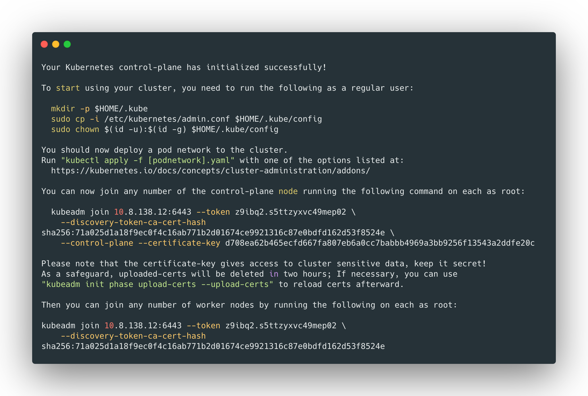


从上边可以看出，添加master节点和node节点就可以在对应服务器上执行下面的命令：

```bash
# 添加master
kubeadm join 10.8.138.12:6443 --token z9ibq2.s5ttzyxvc49mep02 \
    --discovery-token-ca-cert-hash sha256:71a025d1a18f9ec0f4c16ab771b2d01674ce9921316c87e0bdfd162d53f8524e \
    --control-plane --certificate-key d708ea62b465ecfd667fa807eb6a0cc7babbb4969a3bb9256f13543a2ddfe20c
    
# 添加node节点
kubeadm join 10.8.138.12:6443 --token z9ibq2.s5ttzyxvc49mep02 \
    --discovery-token-ca-cert-hash sha256:71a025d1a18f9ec0f4c16ab771b2d01674ce9921316c87e0bdfd162d53f8524e
```

> 命令中的token有两个小时时效，时效后需要重新获取


### 添加其他master

在剩下的两个master节点`SCA-LUM700008`和`SCA-LUM700012`执行下面的命令：

```bash
kubeadm join 10.8.138.12:6443 --token z9ibq2.s5ttzyxvc49mep02 \
    --discovery-token-ca-cert-hash sha256:71a025d1a18f9ec0f4c16ab771b2d01674ce9921316c87e0bdfd162d53f8524e \
    --control-plane --certificate-key d708ea62b465ecfd667fa807eb6a0cc7babbb4969a3bb9256f13543a2ddfe20c
```

> 不需要拷贝kubeadm-config.yaml文件，会通过第一个apiserver回去配置信息；


### 验证master部署情况

```bash
# 查看master
kubectl get node --kubeconfig /etc/kubernetes/admin.conf

# 查看pod
kubectl get pod --all-namespaces --kubeconfig /etc/kubernetes/admin.conf
```

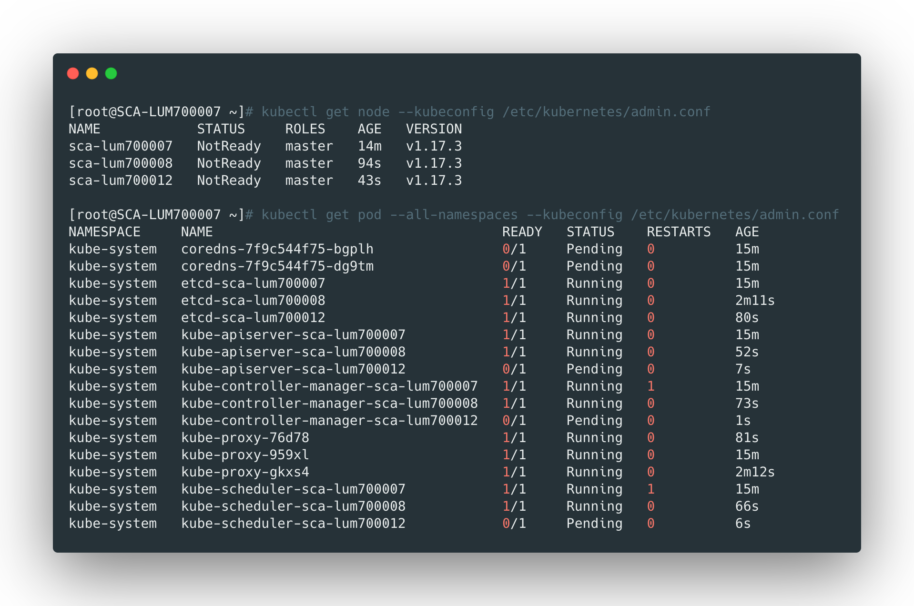

> 这里有些pod没有启动是正常的，因为集群还没部署完成。


### 设置kubectl

现在执行kubectl命令需要`--kubeconfig`参数指定配置文件，执行下面的命令设置：

```bash
cp /etc/kubernetes/admin.conf /root/.kube/config
```


### 确认kube-proxy开启了ipvs

首先查看网卡信息，多了一个kube-ipvs0网卡：

```bash
ip a s
```

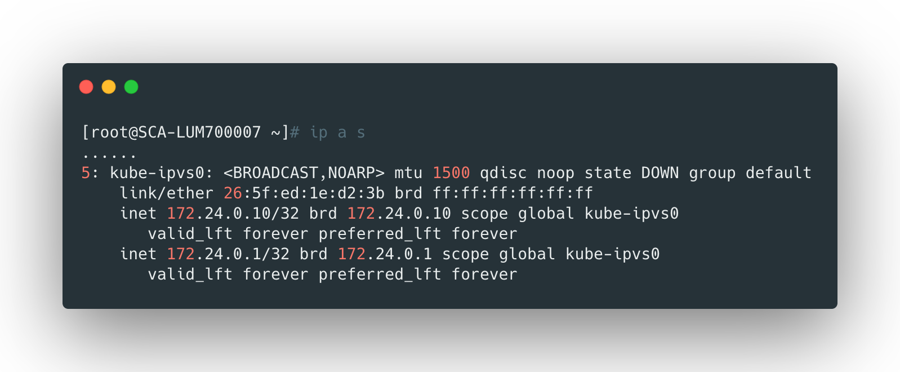


查看ipvs规则：

```bash
ipvsadm -Ln
```

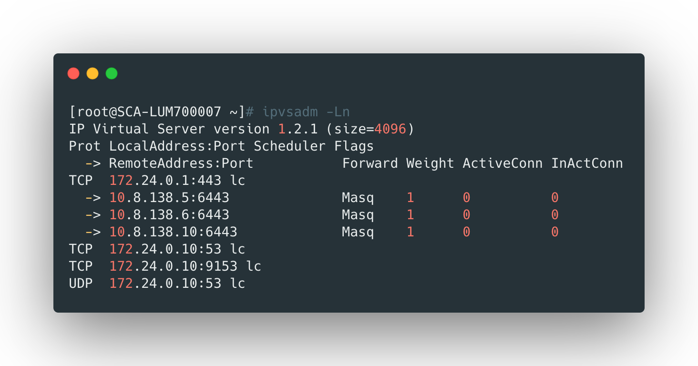


<br>

## etcd配置

### 更新etcd配置

更新后会自动重启服务：

```bash
ansible master -m shell -a 'sed -i "/--initial-cluster=/c\    - --initial-cluster=sca-lum700012=https://10.8.138.10:2380,sca-lum700007=https://10.8.138.5:2380,sca-lum700008=https://10.8.138.6:2380" /etc/kubernetes/manifests/etcd.yaml'

# apiserver 默认访问本地的 etcd 节点，如果需要访问集群所有节点可以修改配置。
ansible master -m shell -a 'sed -i "/- --etcd-servers/c\    - --etcd-servers=https://10.8.138.10:2379,https://10.8.138.5:2379,https://10.8.138.6:2379" /etc/kubernetes/manifests/kube-apiserver.yaml'
```


### 查看etcd节点状态

```bash
# 下载etcdctl
curl -L -O https://github.com/etcd-io/etcd/releases/download/v3.4.3/etcd-v3.4.3-linux-amd64.tar.gz
tar xzf etcd-v3.4.3-linux-amd64.tar.gz
mv etcd-v3.4.3-linux-amd64/etcd* /usr/local/bin/

# 查看状态
ETCDCTL=3 etcdctl --write-out=table   --cert /etc/kubernetes/pki/etcd/peer.crt   --key /etc/kubernetes/pki/etcd/peer.key   --cacert /etc/kubernetes/pki/etcd/ca.crt   --endpoints https://10.8.138.10:2379,https://10.8.138.5:2379,https://10.8.138.6:2379   member list
```

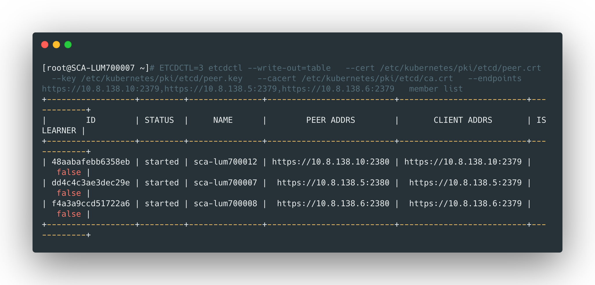


### 查看集群状态

```bash
ETCDCTL=3 etcdctl --cluster --write-out=table   --cert /etc/kubernetes/pki/etcd/peer.crt   --key /etc/kubernetes/pki/etcd/peer.key   --cacert /etc/kubernetes/pki/etcd/ca.crt   --endpoints https://10.8.138.10:2379,https://10.8.138.5:2379,https://10.8.138.6:2379   endpoint status
```

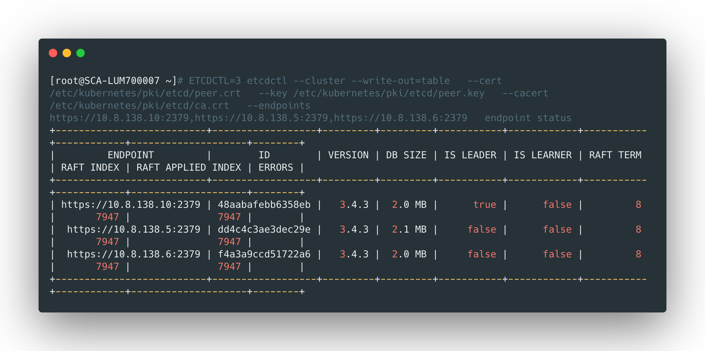


### etcd节点健康状态

```bash
ETCDCTL=3 etcdctl --cluster --write-out=table   --cert /etc/kubernetes/pki/etcd/peer.crt   --key /etc/kubernetes/pki/etcd/peer.key   --cacert /etc/kubernetes/pki/etcd/ca.crt   --endpoints https://10.8.138.10:2379,https://10.8.138.5:2379,https://10.8.138.6:2379   endpoint health
```

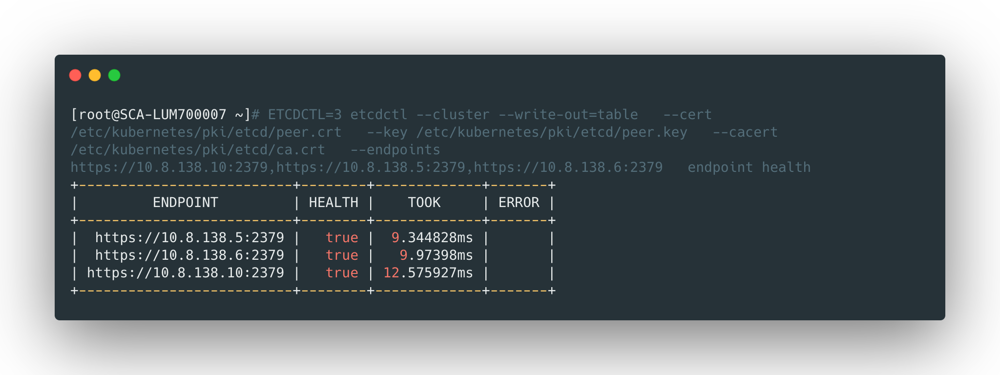

<br>


## 创建node

在所有node节点上执行下面的命令：

```bash
kubeadm join 10.8.138.12:6443 --token z9ibq2.s5ttzyxvc49mep02 \
    --discovery-token-ca-cert-hash sha256:71a025d1a18f9ec0f4c16ab771b2d01674ce9921316c87e0bdfd162d53f8524e
```


查看：

```bash
kubectl get node 
```

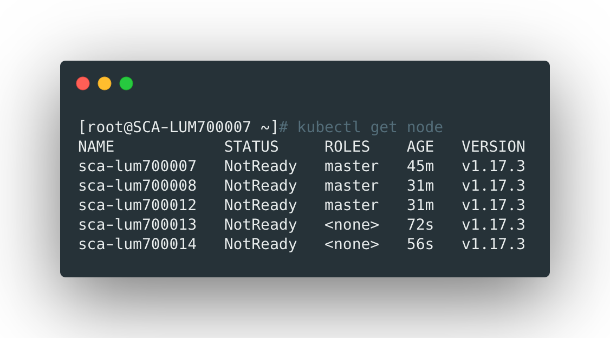


**节点已经添加进来了，因为没有部署CNI所以都是NOTREADY。*


<br>


## 部署calico

### 下载calico

```bash
# 下载calico的yaml文件
curl -L https://docs.projectcalico.org/v3.11/manifests/calico.yaml -o calico.yaml
```


### 部署calico

修改calico.yaml：

```yaml
# 修改为pod网段
- name: CALICO_IPV4POOL_CIDR
  value: "10.100.0.0/16"
  
# 增加该参数，设定端口范围
- name: FELIX_KUBENODEPORTRANGES
  value: "30000:50000"
```


部署calico：

```bash
kubectl apply -f calico.yaml
```


部署完成后，查看节点状态，应该都READY：

```bash
kubectl get node
```

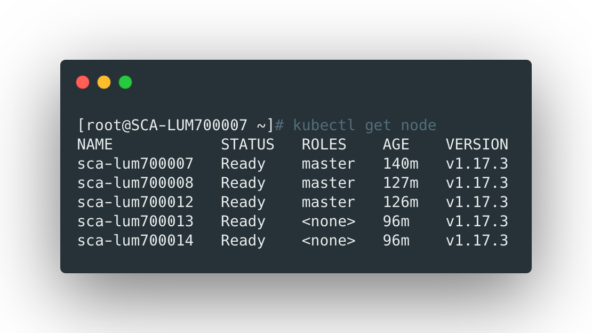


### 设置calico命令行工具

下载calico命令行工具：

```bash
# 下载
curl -L -o /usr/local/bin/calicoctl https://github.com/projectcalico/calicoctl/releases/download/v3.11.2/calicoctl-linux-amd64

# 配置
mkdir -p /etc/calico
cat > /etc/calico/calicoctl.cfg <<EOF
apiVersion: projectcalico.org/v3
kind: CalicoAPIConfig
metadata:
spec:
  datastoreType: kubernetes
  kubeconfig: /etc/kubernetes/admin.conf  # 使用 admin 配置
  #k8sAPIEndpoint: https://10.8.138.12:6443
  #k8sCertFile: /etc/kubernetes/pki/apiserver-kubelet-client.crt
  #k8sKeyFile: /etc/kubernetes/pki/apiserver-kubelet-client.key
  #k8sCAFile: /etc/kubernetes/pki/ca.crt
EOF
```


### 查看calico节点

```bash
calicoctl node status
```

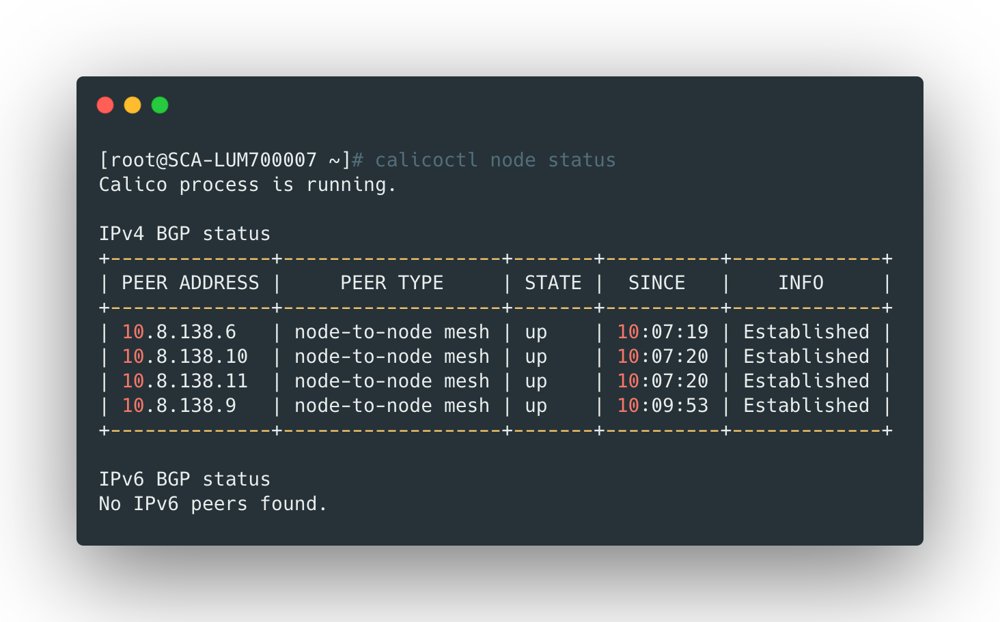


### 

### 查看ippool

```bash
calicoctl get ippool -o wide
NAME                  CIDR            NAT    IPIPMODE   VXLANMODE   DISABLED   SELECTOR
default-ipv4-ippool   172.21.0.0/16   true   Always     Never       false      all()
```


### 查看ip状态

```bash
calicoctl ipam show
```

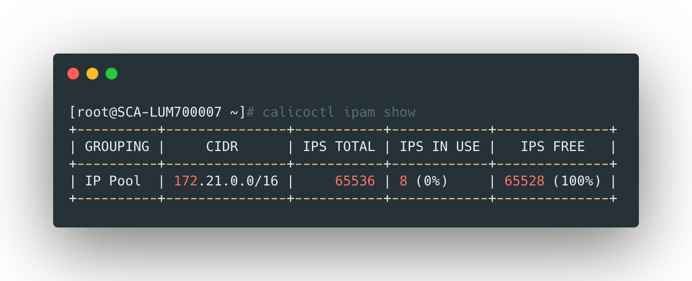


<br>


## 集群校验

```bash
kubectl config get-clusters
kubectl cluster-info
```

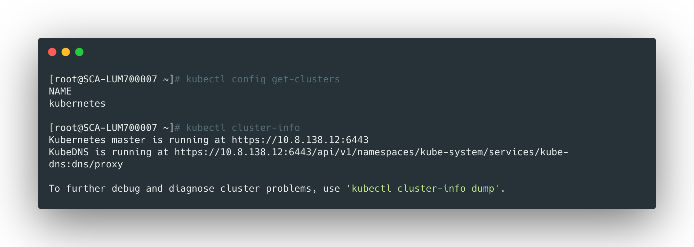


