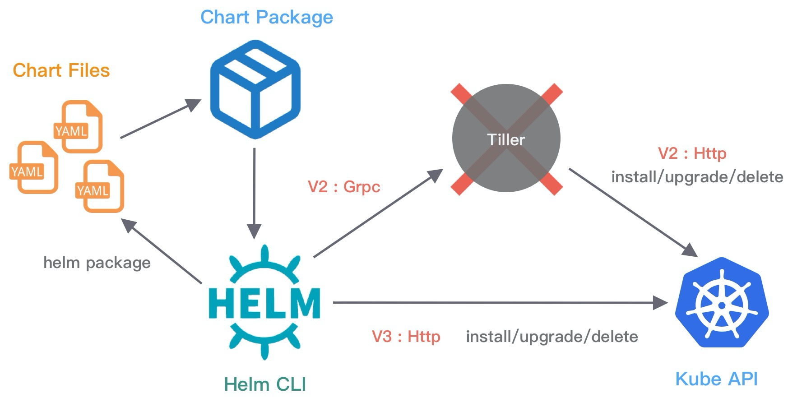

## 什么是helm

helm是在kubernetes中对应用包进行管理的工具。通过helm可以方便的对应用进行打包，分发，安装，升级及回退

> 类似于centos中的yum包管理器


<br>


## 使用YAML部署服务的问题

用户定义应用程序的规格，kubernetes则负责按照定义的规则部署并运行应用程序，如果应用系统出现问题导致偏离了定义的规格，kubernetes负责对其进行自动修正。而用户对于应用程序定义的规格，是维护在一个或多个yaml文件中的。于是会面临以下的问题：

- 如何管理，编辑和更新这些这些分散的kubernetes应用配置文件？
- 如何把一套的相关配置文件作为一个应用进行管理？
- 如何分发和重用kubernetes的应用配置？

<br>


## helm解决的问题

1、对yaml文件的统一管理

2、yaml文件的高效复用

3、服务快速部署

4、应用的版本管理

<br>


## v2和v3对比

helm版本已经迭代到了v3，相比于v2，v3有了以下的改进：

- 移除了tiller：v2版本中helm client与kube-apiserver交互需要通过tiller，而v3移除该组件，helm clinet直接通过kubeconfig连接kube-apiserver；

  > tiller组件的serviceaccount往往具有集群的最大权限，所以在多租户场景下会有安全隐患。

- 不需要执行`helm init`进行初始化，官方提过的二进制文件拿来即用；
- v3release数据保存在release所在namespace下，以secret存储，命名格式为：`sh.helm.release.v1.<release_name>.<revision_version>`；
- helm3增加了Library类型的charts,作为可以被复用的chart；
- v2 需要单独维护仓库，v3 中可以将 Chart 推送到 Docker 镜像仓库中，提供 helm push/login 功能；
- ......





## helm v3组成

`helm`：命令行工具；

`chart`：yaml打包后的资源；

`release`：版本，会记录每个chart的版本；

`repository`：helm仓库，可以使用例如：dockerhub、harbor等；


创建一个新的helm项目后的目录结构：

```bash
$ helm create demo
Creating demo

$ tree demo
demo
├── charts
├── Chart.yaml
├── templates
│   ├── deployment.yaml
│   ├── _helpers.tpl
│   ├── hpa.yaml
│   ├── ingress.yaml
│   ├── NOTES.txt
│   ├── serviceaccount.yaml
│   ├── service.yaml
│   └── tests
│       └── test-connection.yaml
└── values.yaml
```

- `charts`：依赖的子chart所在目录；
- `Chart.yaml`：chart的描述信息，如名称、版本等；
- `templates`：模板文件存放目录；
  - `_helpers.tpl`：定义一些通用变量被当前和其他模板调用，该文件不会渲染部署到k8s中；
  - `NOTES.txt`：部署成功后的提示信息；
  - `tests`：测试用例服务的配置文件；
- `values.yaml`：模板变量定义的文件；

