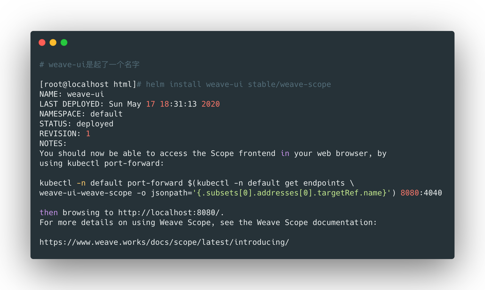

## 通过官方安装

这里以部署weave项目为例


### 查找项目

使用下面的命令在chart源中查找需要安装的服务：

```bash
helm search repo weave

NAME              	CHART VERSION	APP VERSION	DESCRIPTION
stable/weave-cloud	0.3.7        	1.4.0      	Weave Cloud is a add-on to Kubernetes which pro...
stable/weave-scope	1.1.10       	1.12.0     	A Helm chart for the Weave Scope cluster visual...
```


### 安装

使用下面的命令安装：




### 检查部署

```bash
helm list
NAME    	NAMESPACE	REVISION	UPDATED                                	STATUS  	CHART             	APP VERSION
weave-ui	default  	1       	2020-05-17 18:31:13.261091966 +0800 CST	deployed	weave-scope-1.1.10	1.12.0
```


<br>


## 自定义chart

### 首先创建chart

```bash
helm create mychart
```


自行上面的命令后，会通过基础模板创建出一个chart目录（这里是mychart）：

- Chart.yaml：chart的属性信息；
- templates：所有的yaml模板文件；
- values.yaml：所有全局变量的值在此定义；


### 安装chart

```bash
helm install web mychart
```


<br>


## 升级chart

```bash
helm upgrade web mychart
```


