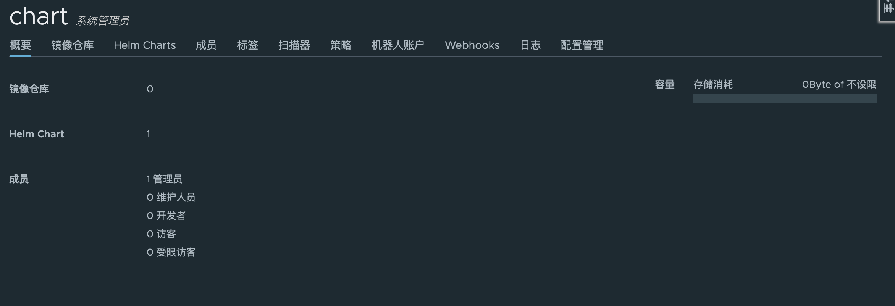
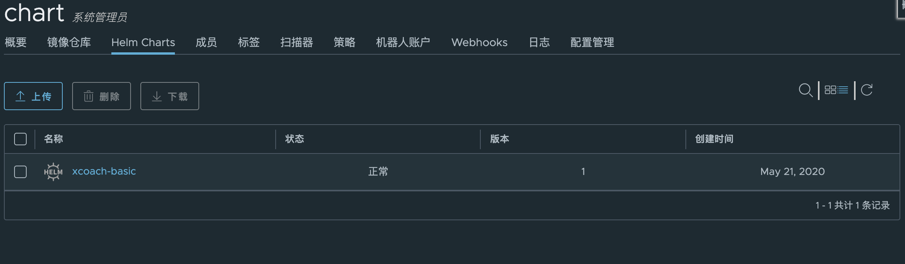

harbor1.6之后有一个新的特性，支持将chart包推送到harbor中进行存储。


## 前提

版本要求：

- harbor：大于1.6；
- helm：大于3；
- harbor在执行`install.sh`的时候需要加上`--with-chartmuseum`参数来开启chart功能；

<br>


## 安装helm-push插件

```bash
helm plugin install https://github.com/chartmuseum/helm-push
```


如果上边在线安装很慢，可以使用下面离线安装的方式：

```bash
mkdir -p /root/.helm/plugins/helm-push
cd /root/.helm/plugins/helm-push
wget https://github.com/chartmuseum/helm-push/releases/download/v0.8.1/helm-push_0.8.1_linux_amd64.tar.gz
tar zxf helm-push_0.8.1_linux_amd64.tar.gz
```


查看安装的插件：

```bash
$ helm plugin ls
NAME	VERSION	DESCRIPTION
push	0.8.1  	Push chart package to ChartMuseum
```


<br>


## harbor创建项目

安装完成后，例如创建一个`chart`项目，其中就会看到 `Helm Charts`这个标签。




<br>


## helm添加harbor repo

如果harbor是http的，执行下面的：

```bash
helm repo add myharbor http://10.8.138.11:8181/chartrepo/chart --password Harbor12345 --username admin

helm repo ls
NAME    	URL
stable  	http://mirror.azure.cn/kubernetes/charts
harbor  	https://helm.goharbor.io
myharbor	http://10.8.138.11:8181/chartrepo/chart
```

> 如果是公开项目，就不需要用户和密码。


如果harbor是https的，需要指定ca证书：

```bash
helm repo add myharbor  https://harbor.example.com/chartrepo/chart --ca-file /root/helm/ca/newca/ca.crt
```


<br>


## 推送helm包

```bash
# 先打包
helm package test-helm/

# 推送
helm push test-helm-0.1.0.tgz myharbor --username admin --password Harbor12345
```





<br>


## 搜索harbor中的helm chart

推送上去后首先更新helm repo：

```bash
helm repo update
```


然后就可以搜索到了：

```bash
helm search repo test
```

