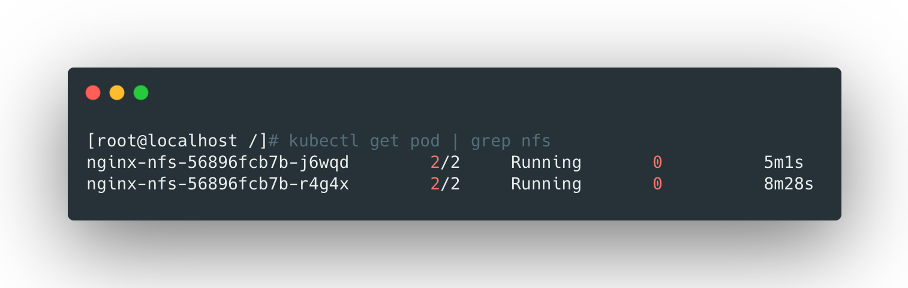
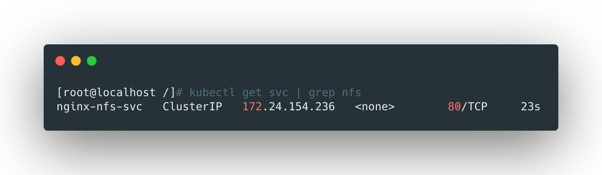
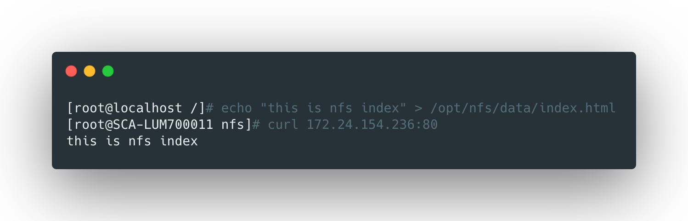

## 使用nfs类型的volume

这种方式是直接在yaml中定义数据卷为nfs类型，示例如下：

```yaml
apiVersion: apps/v1
kind: Deployment
metadata:
  name: nginx-nfs
spec:
  replicas: 3
  selector:
    matchLabels:
      app: nginx-nfs
  template:
    metadata:
      labels:
          app: nginx-nfs
    spec:
      containers:
      - name: nginx-nfs
        image: nginx
        volumeMounts:
        - name: wwwroot
          mountPath: /usr/share/nginx/html
        ports:
        - containerPort: 80
      volumes:
      - name: wwwroot
        nfs:
          server: 10.8.138.8
          path: /opt/nfs/data
```




然后可以将这个pod作为service暴露出来：

```yaml
apiVersion: v1
kind: Service
metadata:
  name: nginx-nfs-svc
  labels:
    app: nginx-nfs-svc
spec:
  ports:
  - port: 80
    targetPort: 80
  selector:
    app: nginx-nfs
```




验证访问的话，可以向nfs数据目录中放入一个html文件然后访问：



<br>

