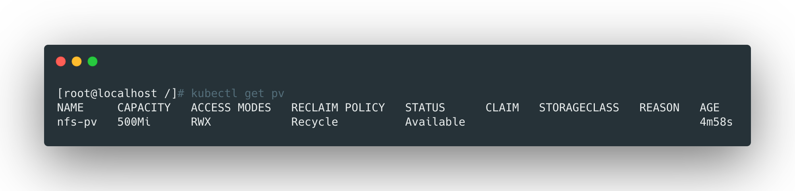
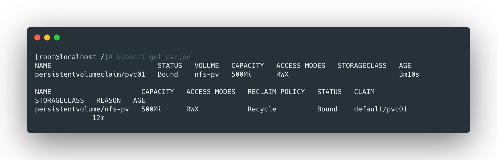
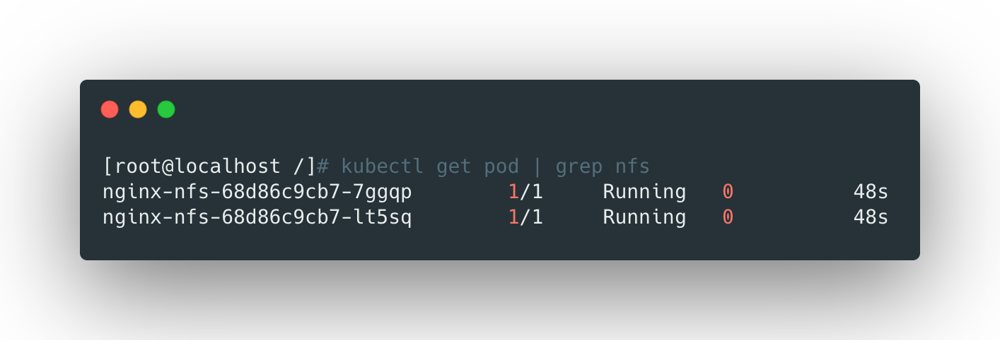

pv是持久卷，是对存储的一种抽象，将存储作为集群的一种资源；

pvc是持久卷申请，pvc是服务使用，消费pv。

> pv和pvc将底层存储抽象，用户将不关注底层存储的具体细节。


## 创建pv

```yaml
apiVersion: v1
kind: PersistentVolume
metadata:
  name: nfs-pv
spec:
  capacity:
    storage: 500Mi
  accessModes:
    - ReadWriteMany
  persistentVolumeReclaimPolicy: Recycle
  nfs:
    path: /opt/nfs/data
    server: 10.8.138.8
```


这里就创建了一个名为`nfs-pv`的pv，大小500Mi，其中指定了nfs的数据目录和nfs地址。


- `accessModes`：pv访问模式，支持如下几个：
  - `ReadWriteOnce`：读写挂载在一个节点上；
  - `ReadOnlyMany`：只读挂载多个节点上；
  - `ReadWriteMany`：读写挂载在多个节点上；
- `persistentVolumeReclaimPolicy`：回收策略，支持以下几个：
  - `Retain`：不作任何操作，需要手动删除（默认）
  - `Recycle`：没有pvc使用时清空数据让其他pvc使用；
  - `Delete`：删除；




> 可以看到pv目前是可用状态。

<br>


## 创建pvc

服务，例如pod的直接消费对象为pvc而非pv，所以还需要创建pvc来绑定pv。

```yaml
apiVersion: v1
kind: PersistentVolumeClaim
metadata:
  name: pvc01
spec:
  accessModes:
    - ReadWriteMany
  resources:
    requests:
      storage: 500Mi
```

这里就创建了一个大小为500Mi，名字为pvc01的pvc请求。


pvc是自动绑定pv的，有如下两个原则：

- 根据pvc申请的容量，采用最小配原则匹配到合适的pv并绑定；
- 根据访问模式匹配，绑定pv和pvc访问模式一致的；




> 可以看到pvc和pv都是绑定状态了。

<br>


## 应用使用pvc

```yaml
apiVersion: apps/v1
kind: Deployment
metadata:
  name: nginx-nfs
spec:
  replicas: 2
  selector:
    matchLabels:
      app: nginx-nfs
  template:
    metadata:
      labels:
          app: nginx-nfs
    spec:
      containers:
      - name: nginx-nfs
        image: nginx
        volumeMounts:
        - name: wwwroot
          mountPath: /usr/share/nginx/html
        ports:
        - containerPort: 80
      volumes:
      - name: wwwroot
        persistentVolumeClaim:
          claimName: pvc01
```

 使用pvc的时候，只需要在`volumes`定义的时候制定pvc名称即可。




