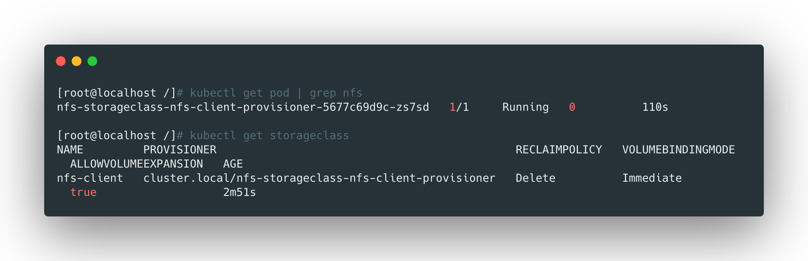
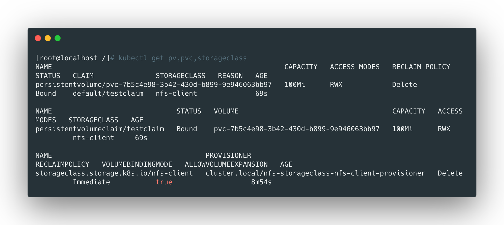

storageclass是动态存储卷。他可以在请求存储空间的时候动态生成pv，而不需要预先生成一堆pv等待绑定，更加的灵活。


**nfs默认不支持storageclass，需要安装额外的插件**


## 安装nfs-client

这里使用helm方式安装：

```bash
helm install nfs-storageclass --set nfs.server=10.8.138.8 --set nfs.path=/opt/nfs/data --namespace default stable/nfs-client-provisioner
```



> 可以看到nfs-client服务已经创建，storageclass也已经创建了。


## Pvc使用storageclass

```yaml
apiVersion: v1
kind: PersistentVolumeClaim
metadata:
  name: testclaim
spec:
  storageClassName: "nfs-client"
  accessModes:
    - ReadWriteMany
  resources:
    requests:
      storage: 100Mi
```

这里创建一个名为`testclaim`的100Mi的pvc，使用`nfs-client`这个storageclass。




