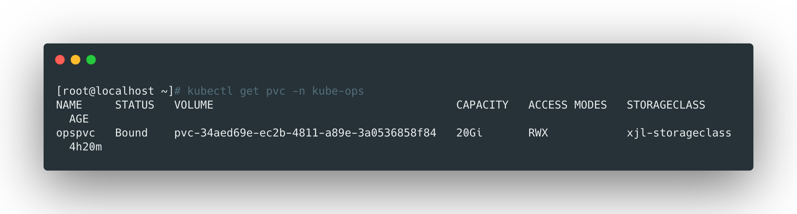
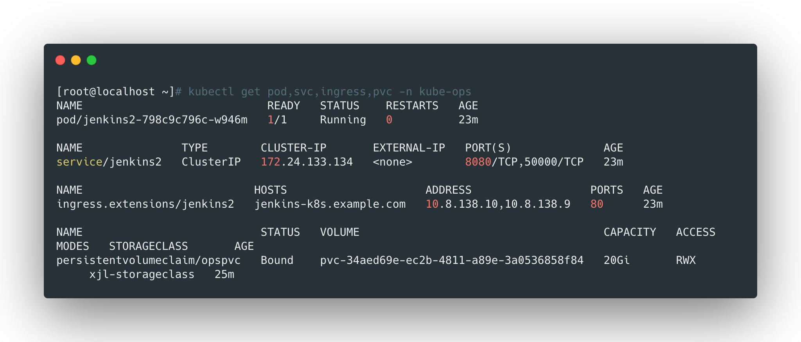
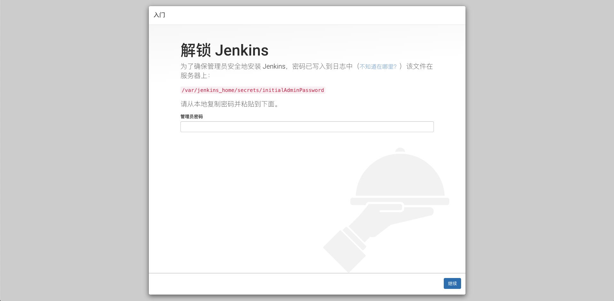
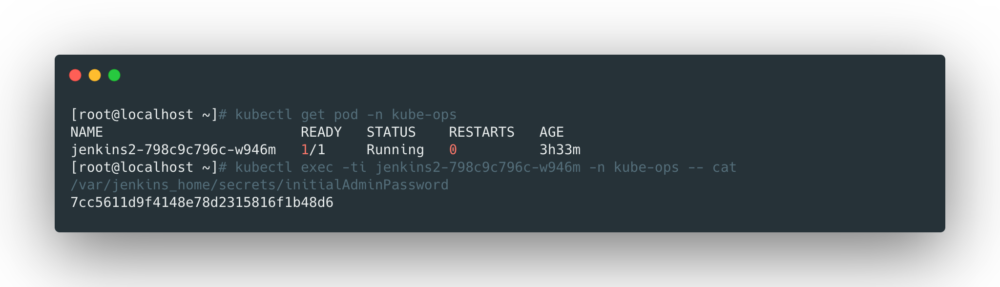
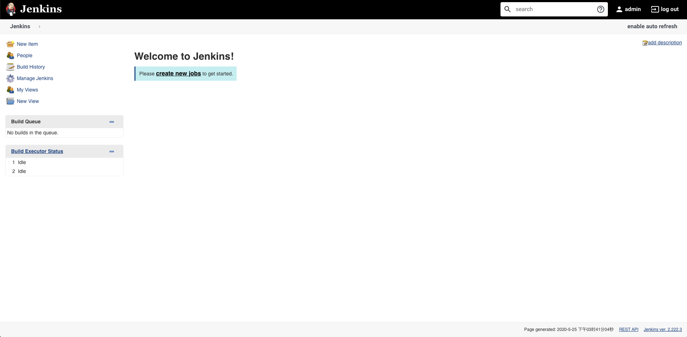

## 新建namespace

```yaml
# create_namespace.yaml
apiVersion: v1
kind: Namespace
metadata:
  name: kube-ops

kubectl create -f create_namespace.yaml
```


<br>


## 创建storageclass对象

这里使用nfs作为后端存储，可以参考：[创建nfs类型的storageclass](https://github.com/liyongzhezz/mynotebook/blob/master/Kubernetes/4%E3%80%81%E5%AD%98%E5%82%A8/nfs/4%E3%80%81%E5%88%9B%E5%BB%BAnfs%E7%B1%BB%E5%9E%8B%E7%9A%84storageclass.md)


<br>


## 创建pvc

```yaml
# create_pvc.yaml
kind: PersistentVolumeClaim
apiVersion: v1
metadata:
  name: opspvc
  namespace: kube-ops
spec:
  storageClassName: xjl-storageclass
  accessModes:
    - ReadWriteMany
  resources:
    requests:
      storage: 20Gi

kubectl create -f create_pvc.yaml
```



<br>


## 创建serviceaccount并授权

```yaml
# jenkins-serviceaccount.yaml
apiVersion: v1
kind: ServiceAccount
metadata:
  name: jenkins2
  namespace: kube-ops

---

apiVersion: rbac.authorization.k8s.io/v1
kind: Role
metadata:
  name: jenkins2
  namespace: kube-ops
rules:
  - apiGroups: ["extensions", "apps"]
    resources: ["deployments"]
    verbs: ["create", "delete", "get", "list", "watch", "patch", "update"]
  - apiGroups: [""]
    resources: ["services"]
    verbs: ["create", "delete", "get", "list", "watch", "patch", "update"]
  - apiGroups: [""]
    resources: ["pods"]
    verbs: ["create","delete","get","list","patch","update","watch"]
  - apiGroups: [""]
    resources: ["pods/exec"]
    verbs: ["create","delete","get","list","patch","update","watch"]
  - apiGroups: [""]
    resources: ["pods/log"]
    verbs: ["get","list","watch"]
  - apiGroups: [""]
    resources: ["secrets"]
    verbs: ["get"]

---

apiVersion: rbac.authorization.k8s.io/v1
kind: RoleBinding
metadata:
  name: jenkins2
  namespace: kube-ops
roleRef:
  apiGroup: rbac.authorization.k8s.io
  kind: Role
  name: jenkins2
subjects:
  - kind: ServiceAccount
    name: jenkins2
    namespace: kube-ops
```


```bash
kubectl create -f jenkins-serviceaccount.yaml
```


<br>

## 新建deployment

```yaml
# jenkins-deployment.yaml
apiVersion: apps/v1
kind: Deployment
metadata:
  name: jenkins2
  namespace: kube-ops
  labels:
    app: jenkins2
spec:
  selector:
    matchLabels:
      app: jenkins2
  template:
    metadata:
      labels:
        app: jenkins2
    spec:
      terminationGracePeriodSeconds: 10
      serviceAccount: jenkins2
      containers:
      - name: jenkins
        image: jenkins/jenkins:lts
        imagePullPolicy: IfNotPresent
        ports:
        - containerPort: 8080
          name: web
          protocol: TCP
        - containerPort: 50000
          name: agent
          protocol: TCP
        resources:
          limits:
            cpu: 2000m
            memory: 2Gi
          requests:
            cpu: 500m
            memory: 512Mi
        livenessProbe:
          httpGet:
            path: /login
            port: 8080
          initialDelaySeconds: 60
          timeoutSeconds: 5
          failureThreshold: 12
        readinessProbe:
          httpGet:
            path: /login
            port: 8080
          initialDelaySeconds: 60
          timeoutSeconds: 5
          failureThreshold: 12
        volumeMounts:
        - name: jenkinshome
          subPath: jenkins2
          mountPath: /var/jenkins_home
        env:
        - name: LIMITS_MEMORY
          valueFrom:
            resourceFieldRef:
              resource: limits.memory
              divisor: 1Mi
        - name: JAVA_OPTS
          value: -Xmx$(LIMITS_MEMORY)m -XshowSettings:vm -Dhudson.slaves.NodeProvisioner.initialDelay=0 -Dhudson.slaves.NodeProvisioner.MARGIN=50 -Dhudson.slaves.NodeProvisioner.MARGIN0=0.85 -Duser.timezone=Asia/Shanghai
      securityContext:
        fsGroup: 1000
      volumes:
      - name: jenkinshome
        persistentVolumeClaim:
          claimName: opspvc
```


```bash
kubectl create -f jenkins-deployment.yaml
```

<br>


## 新建service

```yaml
# jenkins-service.yaml
apiVersion: v1
kind: Service
metadata:
  name: jenkins2
  namespace: kube-ops
  labels:
    app: jenkins2
spec:
  selector:
    app: jenkins2
  type: ClusterIP
  ports:
  - name: web
    port: 8080
    targetPort: 8080
    protocol: TCP
  - name: agent
    port: 50000
    targetPort: 50000
    protocol: TCP
    
kubectl create -f jenkins-service.yaml
```

<br>


## 新建Ingress

设定jenkins的域名为：`jenkins-k8s.example.com`


```yaml
# jenkins-ingress.yaml
apiVersion: extensions/v1beta1
kind: Ingress
metadata:
  name: jenkins2
  namespace: kube-ops
  annotations:
    kubernetes.io/ingress.class: "nginx"
spec:
  rules:
  - host: jenkins-k8s.example.com
    http:
      paths:
      - backend:
          serviceName: jenkins2
          servicePort: 8080
        path: /

kubectl create -f jenkins-ingress.yaml
```

<br>


## 查看服务运行情况

```bash
kubectl get pod,svc,ingress,pvc -n kube-ops
```




<br>


## nginx设置反向代理

这里使用ingress作为服务入口，外部通过nginx最为ingress的代理，设置jenkins对应的nginx配置如下：

```nginx
# jenkins-k8s.conf
upstream jenkins-k8s {
    server 10.8.138.10:80 max_fails=3 fail_timeout=10s weight=2;
    server 10.8.138.9:80 max_fails=3 fail_timeout=10s weight=2;
}

server {
    listen 80;
    server_name jenkins-k8s.example.com;
    access_log /var/log/nginx/jenkins-k8s.example.com_access.log elk_json;
    error_log /var/log/nginx/jenkins-k8s.example.com_error.log;
    expires -1;

    location / {
        proxy_pass http://jenkins-k8s;
        proxy_set_header Host jenkins-k8s.example.com;
        proxy_set_header X-Real-IP $remote_addr;
        proxy_set_header X-Forwarded-For $proxy_add_x_forwarded_for;
        proxy_buffering          off;
        proxy_redirect off;
        proxy_intercept_errors on;
        proxy_http_version 1.1;
        proxy_connect_timeout    30;
        proxy_read_timeout       30;
        proxy_send_timeout       30;
        proxy_buffer_size 64k;
        proxy_buffers 8 64k;
    }

    location = /favicon.ico {
        log_not_found off;
        access_log off;
		}

    location ~* /\.(svn|git)/ {
        return 404;
    }
}
```


- upstream中的两台机器是我的k8s中的ingress节点；
- 域名`jenkins-k8s.example.com`需要和nginx节点的IP做hosdt绑定；

<br>


## 访问测试

通过浏览器，使用域名访问jenkins，可以看到如下的页面：




使用如下的命令获取到token并解锁jenkins：




进入后根据实际情况安装插件，然后设置一个用户名和密码，就完成jenkins的部署了。




<br>


## jenkins汉化

选择 `Manage Jenkins` --> `Plugin Manager` --> `Available`，搜索插件`locale plugin`并安装。

> 一般安装完成就自动切换为中文了。

