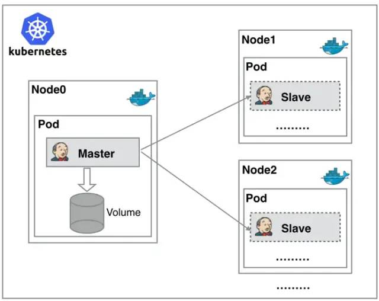
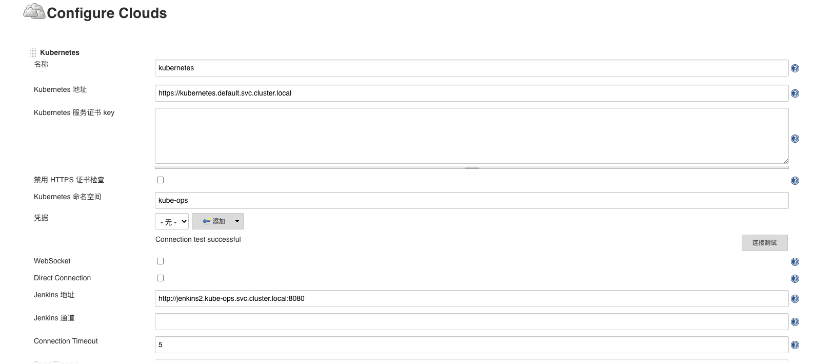
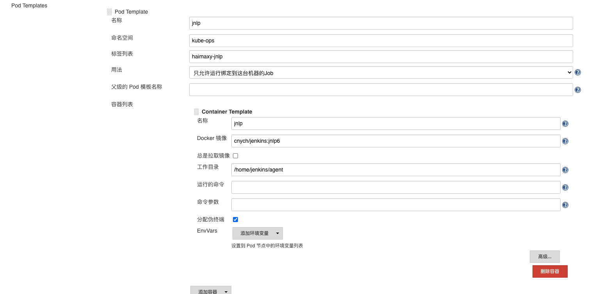
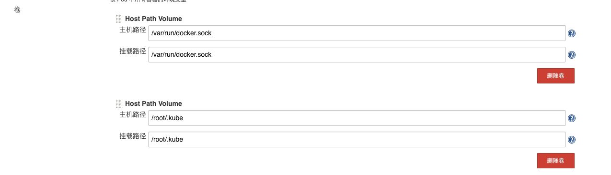
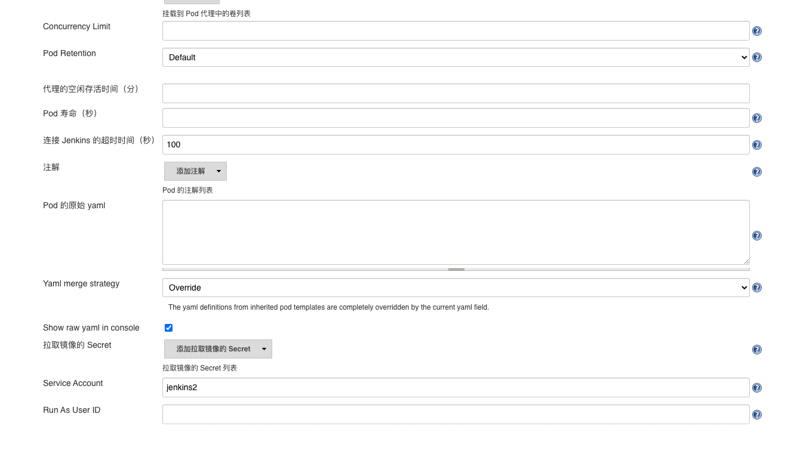
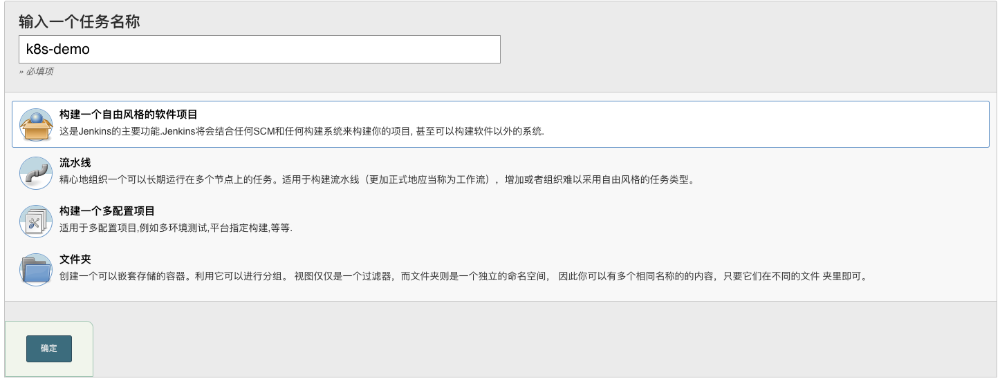
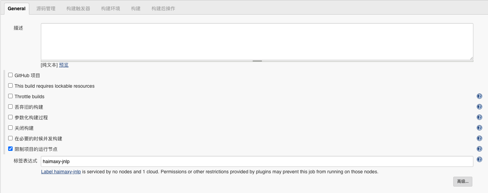
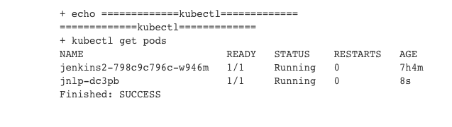

<br>

## 什么是动态生成slave

Jenkins Master 和 Jenkins Slave 以 Pod 形式运行在 Kubernetes 集群的 Node 上，Master 运行在其中一个节点，并且将其配置数据存储到一个 Volume 上去，Slave 运行在各个节点上，并且它不是一直处于运行状态，它会按照需求动态的创建并自动删除。


这种方式的工作流程大致为：当 Jenkins Master 接受到 Build 请求时，会根据配置的 Label 动态创建一个运行在 Pod 中的 Jenkins Slave 并注册到 Master 上，当运行完 Job 后，这个 Slave 会被注销并且这个 Pod 也会自动删除，恢复到最初状态。


<br>


## 优势

- 服务高可用，当 Jenkins Master 出现故障时，Kubernetes 会自动创建一个新的 Jenkins Master 容器，并且将 Volume 分配给新创建的容器，保证数据不丢失，从而达到集群服务高可用。
- 动态伸缩，合理使用资源，每次运行 Job 时，会自动创建一个 Jenkins Slave，Job 完成后，Slave 自动注销并删除容器，资源自动释放，而且 Kubernetes 会根据每个资源的使用情况，动态分配 Slave 到空闲的节点上创建，降低出现因某节点资源利用率高，还排队等待在该节点的情况。
- 扩展性好，当 Kubernetes 集群的资源严重不足而导致 Job 排队等待时，可以很容易的添加一个 Kubernetes Node 到集群中，从而实现扩展。


<br>


## 插件安装和设置

搜索插件`kubernetes`并安装。


选择`Manage Jenkins` —> `Configure System` —> (拖到最下方)`Add a new cloud`，选择`kubernetes`，填写kubernetes和jenkins信息：



- `namespace`这里填写的是`kube-ops`；
- `jenkins地址`按照k8s集群内域名的格式填写；
- 点击测试，如果出现`success`表名连接集群成功；


然后点击`pod template`，添加一个pod模板，就是`jenkins-slave`运行的模板：



> 这里的template名称和标签列表似乎只能是这个值，否则slave启动会失败。


需要挂载两个主机目录：

- ` /var/run/docker.sock`：该文件是用于 Pod 中的容器能够共享宿主机的 Docker（docker in docker 的方式）；
- ` /root/.kube` ：将这个目录挂载到容器的 /home/jenkins/.kube 目录下面这是为了让我们能够在 Pod 的容器中能够使用 kubectl 工具来访问 Kubernetes 集群，方便后面在 Slave Pod 部署 Kubernetes 应用；




这里设置一下超时时间和serviceaccount，方式出现权限问题。



设置完成后保存。


**因为需要kubeconfig文件，所以从master上将/root/.kube拷贝到node节点上**

<br>


## 测试

新建一个任务：




这里的标签表达式填入上面设置的标签`haimaxy-jnlp`：




然后在`构建`这个步骤中，选择`执行shell`，使用下面的脚本测试：

```bash
echo "测试 Kubernetes 动态生成 jenkins slave"echo "==============docker in docker==========="
docker info

echo "=============kubectl============="
kubectl get pods
```


点击保存后，执行构建，因为整个构建很简单，所以速度很快，查看构建日志可以看见构建成功了：



或者可以在master节点上执行下面的命令动态查看构建过程：

```bash
watch kubectl get pod -n kube-ops
```

> 可以看到会创建一个slave的pod执行成功后自动删除。