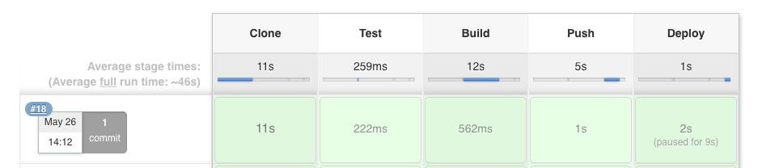

## 什么是pipeline

在 Jenkins 中的构建工作可以有多种方式，常用的是 Pipeline 这种方式。Pipeline就是一套运行在 Jenkins 上的工作流框架，将原来独立运行于单个或者多个节点的任务连接起来，实现单个任务难以完成的复杂流程编排和可视化的工作。


### Pipeline 核心概念

- Node：节点，一个 Node 就是一个 Jenkins 节点，Master 或者 Agent，是执行 Step 的具体运行环境，比如动态运行的Slave；
- Stage：阶段，一个 Pipeline 可以划分为若干个 Stage，每个 Stage 代表一组操作，比如：Build、Test、Deploy，Stage 是一个逻辑分组的概念，可以跨多个 Node
- Step：步骤，Step 是最基本的操作单元，可以是打印一句话，也可以是构建一个 Docker 镜像，由各类 Jenkins 插件提供，比如命令：sh 'make'，就相当于我们平时 shell 终端中执行 make 命令一样。


### 如何创建Pipline

- Pipeline 脚本是由 Groovy 语言实现的，但是我们没必要单独去学习 Groovy，当然你会的话最好
- Pipeline 支持两种语法：Declarative(声明式)和 Scripted Pipeline(脚本式)语法
- Pipeline 也有两种创建方法：可以直接在 Jenkins 的 Web UI 界面中输入脚本；也可以通过创建一个 Jenkinsfile 脚本文件放入项目源码库中
- 一般我们都推荐在 Jenkins 中直接从源代码控制(SCMD)中直接载入 Jenkinsfile Pipeline 这种方法

<br>


## 创建一个简单的pipline

新建任务，选择`流水线`：


在流水线脚本中，输入下面的脚本，然后点击保存：


```groovy
node('haimaxy-jnlp') {    stage('Clone') {
      echo "1.Clone Stage"
    }
    stage('Test') {
      echo "2.Test Stage"
    }
    stage('Build') {
      echo "3.Build Stage"
    }
    stage('Deploy') {
      echo "4. Deploy Stage"
    }
}
```

> 这个构建脚本，首先给node添加了上面设置的动态slave标签，然后设置了4个简单的构建流程


直接点击构建，会看到构建成功：


在k8s集群上执行下面的命令，也看到了动态创建的pod执行该构建，成功后被清除：


<br>


## 通过pipeline部署服务到k8s


### 大致流程

要部署 Kubernetes大概的流程如下：

- `CI阶段`：编写代码 -- 测试 -- 编写 Dockerfile --构建打包 Docker 镜像 -- 推送 Docker 镜像到仓库；
- `CD阶段`：编写 Kubernetes YAML 文件 -- 利用 kubectl 工具部署应用


### jenkins添加凭证

由于我们是拉取私有仓库（harbor中）的镜像，所以需要密码认证。为了避免明文密码泄露，所以使用jenkins的凭证管理密码：


**注意这里的ID，后面要用到。**


### 创建代码

在自己的gitlab中先创建一个空的项目（没有gitlab自行搭建一个就好），这里我的是`pipline-demo`：


将项目克隆到服务器上：

```bash
git clone http://10.8.138.11/root/pipeline-demo.git
```


添加代码：

```bash
cat > app.py << EOF
from flask import Flask
app = Flask(__name__)

@app.route('/')
def hello_world():
    return 'Hello World!'

if __name__ == '__main__':
    app.run(host='0.0.0.0')
EOF
```


### 添加dockerfile

```dockerfile
FROM centos:7

WORKDIR /root

RUN yum install -y epel-release
RUN yum install -y python-pip && /usr/bin/pip install flask

ADD app.py /root

CMD python /root/app.py

EXPOSE 5000
```


### 添加部署yaml

创建一个deployment的yaml文件，用于部署服务：

```bash
cat > deployment.yaml << EOF
apiVersion: apps/v1
kind: Deployment
metadata:
  name: jenkins-demo
spec:
  selector:
    matchLabels:
      app: jenkins-demo
  template:
    metadata:
      labels:
        app: jenkins-demo
    spec:
      containers:
      - image: 10.8.138.11:8181/python-demo/python-demo:<BUILD_TAG>
        imagePullPolicy: IfNotPresent
        name: jenkins-demo
EOF
```

**这里的镜像tag会在Jenkinsfile中导入**


###  添加Jenkinsfile

```bash
cat > Jenkinsfile << EOF
node('haimaxy-jnlp') {
    stage('Clone') {
      echo "1.Clone Stage"
      checkout scm
      script {
        build_tag = sh(returnStdout: true, script: 'git rev-parse --short HEAD').trim()
      }
    }

    stage('Test') {
      echo "2.Test Stage"
    }

    stage('Build') {
      echo "3.Build Docker Image Stage"
      sh "docker build -t 10.8.138.11:8181/python-demo/python-demo:${build_tag} ."
    }

    stage('Push') {
      echo "4.Push Docker Image Stage"
      withCredentials([usernamePassword(credentialsId: 'harbor', passwordVariable: 'harborPassword', usernameVariable: 'harborUser')]) {
        sh "docker login -u ${harborUser} -p ${harborPassword} 10.8.138.11:8181"
        sh "docker push 10.8.138.11:8181/python-demo/python-demo:${build_tag}"
      }
    }

    stage('Deploy') {
      echo "5. Deploy Stage"
      def userInput = input(
        id: 'userInput',
        message: 'Choose a deploy environment',
        parameters: [
          [
            $class: 'ChoiceParameterDefinition',
            choices: "Dev\nQA\nProd",
            name: 'Env'
          ]
        ]
      )
      echo "This is a deploy step to ${userInput}"
      sh "sed -i 's/<BUILD_TAG>/${build_tag}/' deployment.yaml"

      if (userInput == "Dev") {
        echo "Deploying to DEV ."
      } else if (userInput == "QA"){
        echo "Deploying to QA ."
      } else {
        echo "Deploying to Prod ."
      }

      sh "kubectl apply -f deployment.yaml"
    }
}
EOF
```

- 这个Jenkinsfile将流水线分为：获取代码、测试、构建、推送、部署这几步，其中测试暂时忽略；
- 克隆这一步中，使用script将上传代码的commit与镜像tag进行关联，方便后续问题定位；
- 推送镜像这一步，使用的是之前在jenkins中创建的凭证，`credentialsId`为凭证的ID，`passwordVariable`和`usernameVariable`的前缀为凭证ID；
- 一般情况下，部署的时候都会选择现部署到测试或者开发环境，再部署到生产，所以这里通过获取用户输入来选择部署到哪个环境（当然这里只是一个示例，并没有那么多环境）；
- 部署这一步中，通过`sed`命令将镜像tag进行替换；


### 推动代码到代码库

```bash
git add .
git commit -m 'init project'
git push origin master
```


### 修改流水线配置

编辑之前创建的`pipeline-demo`流水线，修改流水线定义为如下：


> 根据实际情况填写代码库地址、分支以及凭据；


### 运行流水线

直接点击构建，会经过5个构建步骤，当运行到部署这一步的时候，需要选择一个部署环境：


最后运行成功了：




在集群中，容器也已经启动了（默认是和jenkins在一个namespace下）


