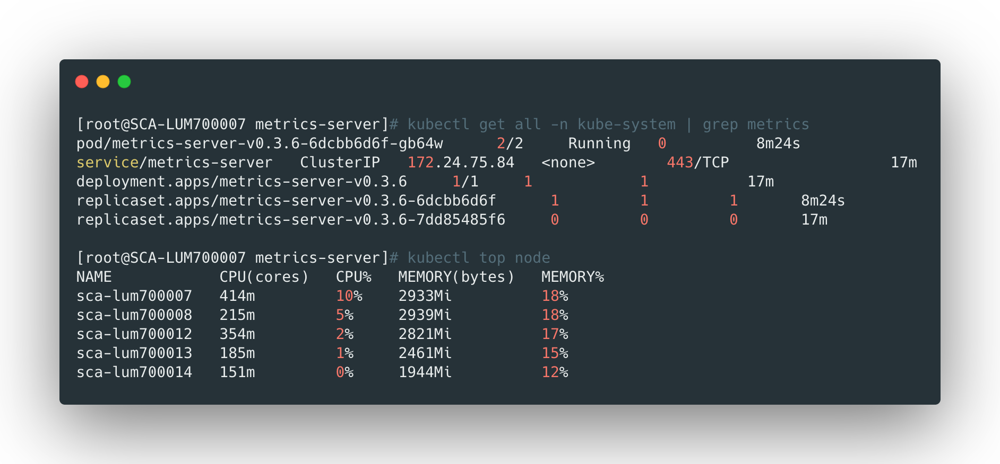

## metrics-server介绍

metrics-server是一个集群内的性能监控服务，可以用来在集群范围可以进行资源使用状况信息的收集，它通过Kubelet收集在各个节点上提供的指标信息。很多功能例如自动扩缩容都依赖它。

<br>


## 前提条件

kube-apiserver需要设置如下的参数：

```yaml
--requestheader-client-ca-file=/opt/kubernetes/cert/ca.pem 
--requestheader-username-headers=X-Remote-User 
--requestheader-group-headers=X-Remote-Group 
--requestheader-extra-headers-prefix=X-Remote-Extra- 
--requestheader-allowed-names=""
--proxy-client-key-file=/opt/kubernetes/cert/st01009vm2-key.pem 
--proxy-client-cert-file=/opt/kubernetes/cert/st01009vm2.pem 
--enable-aggregator-routing=true
--runtime-config=api/all
```

- --requestheader-XXX、--proxy-client-XXX 是 kube-apiserver 的 aggregator layer 相关的配置参数，metrics-server & HPA 需要使用；
- --requestheader-client-ca-file：用于签名 --proxy-client-cert-file 和 --proxy-client-key-file 指定的证书；在启用了 metric aggregator 时使用；
- 如果 --requestheader-allowed-names 不为空，则--proxy-client-cert-file 证书的 CN 必须位于 allowed-names 中，默认为 aggregator，这里让其匹配所有名称；


> 如果是kubeadm部署，默认已经添加了

<br>


## 部署

可以从官方获取，地址为：[metrics-server](https://github.com/kubernetes/kubernetes/tree/master/cluster/addons/metrics-server)，也可以从我的仓库下载：

```bash
git clone https://github.com/liyongzhezz/yaml.git
```


相关的yaml文件在`metrics-server`目录下，直接执行下面的命令部署即可：

```bash
cd metrics-server
kubectl apply -f .
```


部署完成后检查并校验是否能够正常工作：

```bash
kubectl get all -n kube-system | grep metrics
kubectl top node 
```


