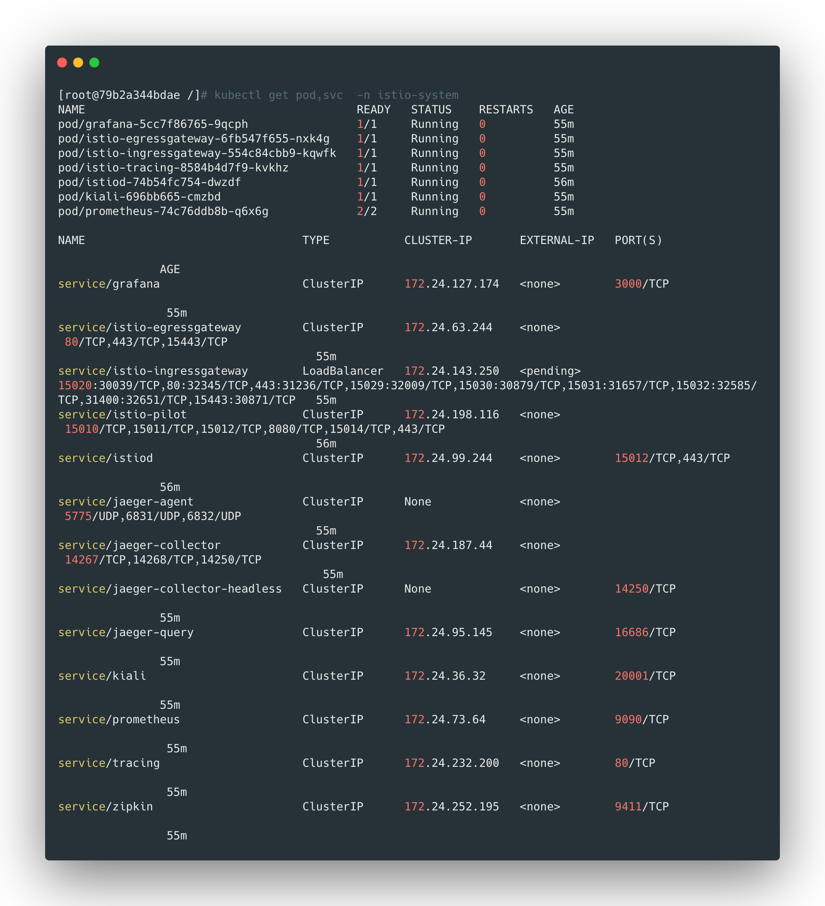

**这里使用的版本为1.5.3版本**


## 下载离线安装包

```bash
wget https://github.com/istio/istio/releases/download/1.5.3/istio-1.5.3-linux.tar.gz
tar zxf istio-1.5.3-linux.tar.gz
cd istio-1.5.3
cp -p bin/istioctl /usr/local/bin/
```


设置`istioctl`命令自动补全：

```bash
cp istio-1.5.3/tools/istioctl.bash /root/
cat << EOF >>/root/.bashrc
source ~/istioctl.bash
EOF
chomd +x /root/istioctl.bash
source /root/.bashrc
```


## 使用istioctl命令部署

```bash
# 采用demo配置
istioctl manifest apply --set profile=demo
```


namespace设置label，实现sidcar自动注入：

```bash
# 这里以default为例
kubectl label namespace default istio-injection=enabled
```


查看pod和service创建情况，确保所有的都启动：

