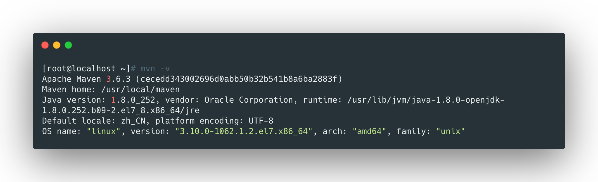
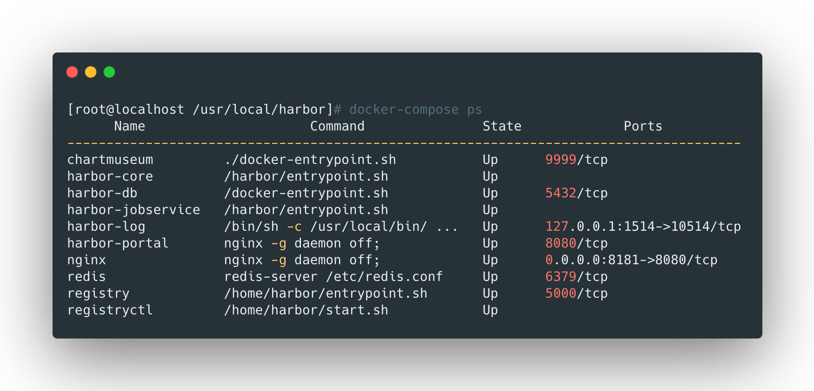

## 安装java环境

```bash
yum install -y java*

java -version
openjdk version "1.8.0_252"
OpenJDK Runtime Environment (build 1.8.0_252-b09)
OpenJDK 64-Bit Server VM (build 25.252-b09, mixed mode)
```

<br>


## 安装maven

```bash
# 从官方下载
wget https://mirror.bit.edu.cn/apache/maven/maven-3/3.6.3/binaries/apache-maven-3.6.3-bin.tar.gz

tar zxf apache-maven-3.6.3-bin.tar.gz
mv apache-maven-3.6.3 /usr/local/maven

# 设置maven变量
cat >> /etc/profile << EOF
export MAVEN_HOME=/usr/local/maven
export PATH=\$MAVEN_HOME/bin:\$PATH
EOF
source /etc/profile

# 修改默认的maven仓库地址问国内的阿里云源；
# 在<mirrors></mirrors>下添加
vim /usr/local/maven/conf/settings.xml
<mirror>
  <id>alimaven</id>
  <mirrorOf>central</mirrorOf>
  <name>aliyun maven</name>
  <url>http://maven.aliyun.com/nexus/content/repositories/central/</url>
</mirror>

# 检查
mvn -v
```




<br>


## 安装tomcat

```bash
# 下载安装包
wget https://mirror.bit.edu.cn/apache/tomcat/tomcat-8/v8.5.55/bin/apache-tomcat-8.5.55.tar.gz
mv apache-tomcat-8.5.55 /usr/local/tomcat

# 将Tomcat的webroot配置为Jenkins的源码地址
cat > /usr/local/tomcat/conf/server.xml << EOF
<?xml version="1.0" encoding="UTF-8"?>
<Server port="8005" shutdown="SHUTDOWN">
<Listener className="org.apache.catalina.startup.VersionLoggerListener" />
<Listener className="org.apache.catalina.core.AprLifecycleListener" SSLEngine="on" />
<Listener className="org.apache.catalina.core.JreMemoryLeakPreventionListener" />
<Listener className="org.apache.catalina.mbeans.GlobalResourcesLifecycleListener" />
<Listener className="org.apache.catalina.core.ThreadLocalLeakPreventionListener" />
<GlobalNamingResources>
<Resource name="UserDatabase" auth="Container"
type="org.apache.catalina.UserDatabase"
 description="User database that can be updated and saved"
factory="org.apache.catalina.users.MemoryUserDatabaseFactory"
 pathname="conf/tomcat-users.xml" />
</GlobalNamingResources>

<Service name="Catalina">

<Connector port="8081" protocol="HTTP/1.1"

connectionTimeout="20000"

redirectPort="8443" />

<Engine name="Catalina" defaultHost="localhost">

<Realm className="org.apache.catalina.realm.LockOutRealm">

<Realm className="org.apache.catalina.realm.UserDatabaseRealm"

resourceName="UserDatabase"/>

</Realm>
<Host name="localhost"  appBase="webapps"

unpackWARs="true" autoDeploy="true">
<Valve className="org.apache.catalina.valves.AccessLogValve" directory="logs"
prefix="localhost_access_log" suffix=".txt"

pattern="%h %l %u %t &quot;%r&quot; %s %b" />

<Context path="" docBase="/data/jenkins/wwwroot" reloadable="true" />

 </Host>

</Engine>

</Service>
</Server>
EOF
```

> 在这里设置了tomcat暴露jenkins的端口为8081


<br>


## 安装jenkins

```bash
cat >> /etc/profile << EOF
export JENKINS_HOME=/data/jenkins/data
EOF
source /etc/profile

# 创建Jenkins的webroot和data目录；
mkdir -p /data/jenkins/{wwwroot,data}

# 下载jenkins并将程序解压到webroot下面；
wget http://mirrors.jenkins.io/war-stable/latest/jenkins.war
mkdir -p /data/jenkins/{wwwroot,data}

# 启动tomcat并检查jenkins
/usr/local/tomcat/bin/startup.sh
```


**安装常用插件：**

-   Locale：Jenkins本地语言化插件；
-   Git Parameter：此插件后面可能会用到，主要是配合Git插件使用的一些参数设置；
-   Maven Integration：此插件为JAVA项目提供maven编译的环境；
-   AnsiColor：此插件是让我们是conlsoe里面输出一些信息，可以打印出带颜色的一些信息；


通过浏览器访问8081端口即可进入jenkins，自行进行几步初始化设置。

<br>


## 安装gitlab

```bash
# 在清华大学的仓库下载
wget https://mirrors.tuna.tsinghua.edu.cn/gitlab-ce/yum/el7/gitlab-ce-12.9.3-ce.0.el7.x86_64.rpm
yum install -y gitlab-ce-12.9.2-ce.0.el7.x86_64.rpm 

# 修改Gitlab配置，主要修改访问IP；
vim /etc/gitlab/gitlab.rb
external_url 'http://10.8.138.11'

# 重载配置
gitlab-ctl reconfigure
```


配置完毕后，访问80端口即可进入gitlab，登录后默认的用户为`root`，需要重置密码。

<br>


## 安装docker和docker-compose

```bash
# 添加docker镜像源
yum-config-manager --add-repo https://download.docker.com/linux/centos/docker-ce.repo

# 查看可用版本
yum list docker-ce --showduplicates|sort -r

# 选择合适的版本安装
yum install -y docker-ce-18.06.3.ce-3.el7
yum install -y docker-compose

# 配置内核参数，默认网桥功能为打开，所以为了更好的使用Docker，需要做一些内核的初始化配置；
cat >> /etc/sysctl.conf << EOF
net.bridge.bridge-nf-call-ip6tables = 1
net.bridge.bridge-nf-call-iptables = 1
net.bridge.bridge-nf-call-arptables = 1
EOF
sysctl -p

# 设定镜像加速器，让我们更快的pull官方镜像仓库；这里把私有仓库也加进去了
cat >> /etc/docker/daemon.json << EOF
{
 "registry-mirrors": ["https://owcyje1z.mirror.aliyuncs.com"],
 "insecure-registries":["http://10.8.138.11:8181"]
}
EOF

# 设定iptables，防止Docker将iptables的FORWARD修改为DROP
sed -i '/^ExecStart.*/aExecStartPost=/usr/sbin/iptables -P FORWARD ACCEPT' /usr/lib/systemd/system/docker.service

systemctl daemon-reload 
systemctl start docker
systemctl status docker
systemctl enable docker
```

<br>


## 部署harbor

```bash
# 下载离线安装包
wget https://github.com/goharbor/harbor/releases/download/v2.0.0/harbor-offline-installer-v2.0.0.tgz

tar zxf harbor-offline-installer-v2.0.0.tgz
mv harbor /usr/local/harbor
cd /usr/local/harbor
mv harbor.yml.tmpl harbor.yml
mkdir /data/harbor

# 修改配置
grep -v '^.*#' harbor.yml
hostname: 10.8.138.11
http:
  port: 8181
harbor_admin_password: Harbor12345
database:
  password: root123
  max_idle_conns: 50
  max_open_conns: 100
data_volume: /data/harbor
clair:
  updaters_interval: 12
trivy:
  ignore_unfixed: false
  skip_update: false
  insecure: false
jobservice:
  max_job_workers: 10
notification:
  webhook_job_max_retry: 10
chart:
  absolute_url: disabled
log:
  level: info
  local:
    rotate_count: 50
    rotate_size: 200M
    location: /var/log/harbor
_version: 2.0.0
proxy:
  http_proxy:
  https_proxy:
  no_proxy:
  components:
    - core
    - jobservice
    - clair
    - trivy
    
# 安装，开启helm包仓库
./install.sh --with-chartmuseum

# 查看
docker-compose ps
```




<br>


