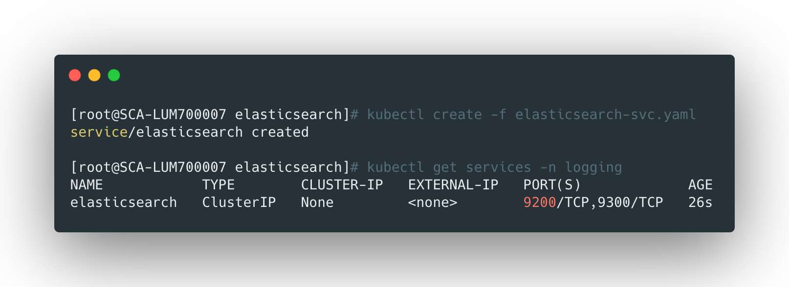
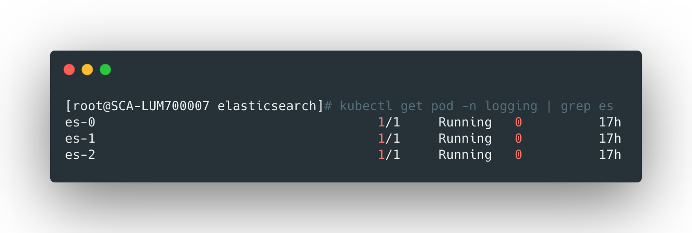
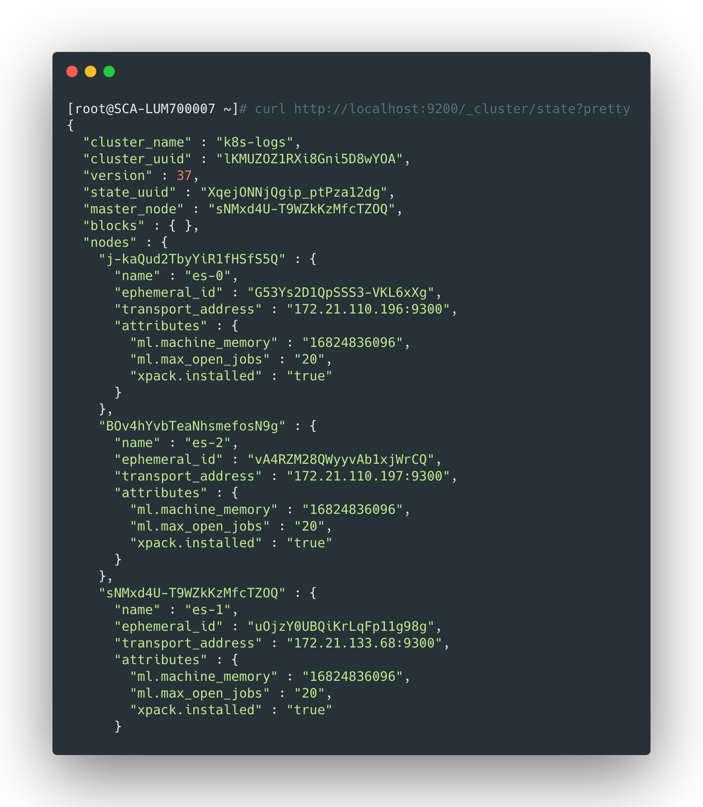

## 创建namespace

首先创建namespace，日志收集的所有服务都部署在这个namespace下，yaml文件可以在[namespace.yaml](https://github.com/liyongzhezz/yaml/blob/master/fluentd%2Bkafka%2Blogstash%E6%94%B6%E9%9B%86k8s%E6%97%A5%E5%BF%97/namespace.yaml) 找到，直接创建即可：

```bash
kubectl apply -f namespace.yaml
```


<br>


## 创建es service

这里创建一个es的handless类型的service，yaml配置文件可以在：[service.yaml]([https://github.com/liyongzhezz/yaml/blob/master/fluentd%2Bkafka%2Blogstash%E6%94%B6%E9%9B%86k8s%E6%97%A5%E5%BF%97/elasticsearch/service.yaml](https://github.com/liyongzhezz/yaml/blob/master/fluentd%2Bkafka%2Blogstash收集k8s日志/elasticsearch/service.yaml)) 找到，直接创建即可：

```bash
kubectl apply -f service.yaml
```





<br>


## 创建storageclass

es数据需要持久化存储，这里采用的是nfs作为后端存储，首先需要创建nfs-provisioner，yaml文件可以在 [nfs相关yaml]([https://github.com/liyongzhezz/yaml/tree/master/fluentd%2Bkafka%2Blogstash%E6%94%B6%E9%9B%86k8s%E6%97%A5%E5%BF%97/nfs](https://github.com/liyongzhezz/yaml/tree/master/fluentd%2Bkafka%2Blogstash收集k8s日志/nfs)) 找到，运行它们：

```bash
kubectl apply -f .
```


>  这一步会创建一个`nfs-client-provisioner`，后续创建storageclass会用到它。


下面创建storageclass，yaml配置文件可以在 [es-storageclass.yaml]([https://github.com/liyongzhezz/yaml/blob/master/fluentd%2Bkafka%2Blogstash%E6%94%B6%E9%9B%86k8s%E6%97%A5%E5%BF%97/elasticsearch/es-storageclass.yaml](https://github.com/liyongzhezz/yaml/blob/master/fluentd%2Bkafka%2Blogstash收集k8s日志/elasticsearch/es-storageclass.yaml)) 中找到：

```bash
kubectl apply -f es-storageclass.yaml
```


<br>


## 创建es集群

es集群的daemonset配置yaml文件可以在 [es-cluster-daemonset.yaml]([https://github.com/liyongzhezz/yaml/blob/master/fluentd%2Bkafka%2Blogstash%E6%94%B6%E9%9B%86k8s%E6%97%A5%E5%BF%97/elasticsearch/es-cluster-daemonset.yaml](https://github.com/liyongzhezz/yaml/blob/master/fluentd%2Bkafka%2Blogstash收集k8s日志/elasticsearch/es-cluster-daemonset.yaml)) 中找到，其中：

- `serviceName: elasticsearch`：指定service名称与之前创建的es service关联；
- 通过设定`initContainers`来设置pod的系统参数；
- `cluster.name`指定了集群的名称；
- `node.name`指定节点的名称，通过`metadata.name`获取每个pod的名字；
- `discovery.seed_hosts`指定的是es集群service的名字，它表明集群间节点互相发现的方式；
- `discovery.zen.minimum_master_nodes`一般设置为 **(N/2)+1**，N为节点数量，避免脑裂的参数；
- `ES_JAVA_OPTS`设置了jvm的资源，根据实际配置；
- 使用了`volumeClaimTemplates`并指定上边创建的storageclass来自动创建pvc；


直接运行创建：

```bash
kubectl apply -f es-cluster-daemonset.yaml
```




> pod会依次创建，创建后每个pod都会对应域名`es-[0,1,2].elasticsearch.logging.svc.cluster.local`。


<br>


## 测试集群

等待集群创建成功，执行下面的命令，将节点的9200端口映射到本机，测试下集群是否能够访问：

```bash
kubectl port-forward es-0 9200:9200 -n logging
```


在另一个终端访问测试：

```bash
curl http://localhost:9200/_cluster/state?pretty
```





出现上述输出说明es集群成功运行了，且主节点是es1