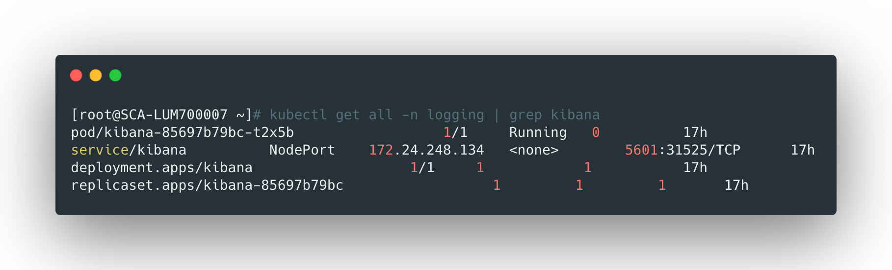
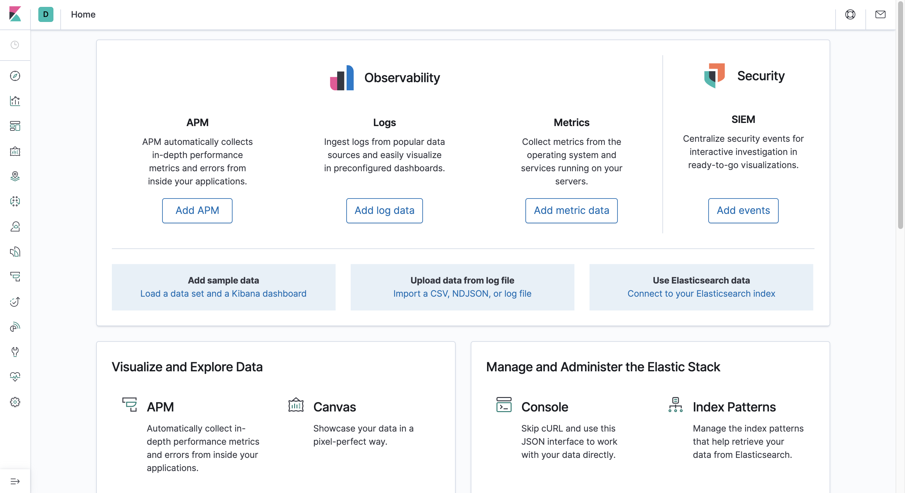

## 创建kibana service

kibana service的yaml配置文件可以在 [service.yaml]([https://github.com/liyongzhezz/yaml/blob/master/fluentd%2Bkafka%2Blogstash%E6%94%B6%E9%9B%86k8s%E6%97%A5%E5%BF%97/kibana/service.yaml](https://github.com/liyongzhezz/yaml/blob/master/fluentd%2Bkafka%2Blogstash收集k8s日志/kibana/service.yaml)) 找到，直接运行创建：

```bash
kubectl apply -f service.yaml
```


<br>


## 创建kibana服务

Kibana的yaml配置文件可以在 [deployment.yaml]([https://github.com/liyongzhezz/yaml/blob/master/fluentd%2Bkafka%2Blogstash%E6%94%B6%E9%9B%86k8s%E6%97%A5%E5%BF%97/kibana/deployment.yaml](https://github.com/liyongzhezz/yaml/blob/master/fluentd%2Bkafka%2Blogstash收集k8s日志/kibana/deployment.yaml)) 找到，其中：

- `ELASETICSEARCH_HOSTS`指定了es集群服务的k8s内域名和端口；


直接运行创建：

```bash
kubectl apply -f deployment.yaml
```


查看服务创建的情况：

```bash
kubectl get all -n logging | grep kibana
```





<br>


## 访问测试

kibana通过nodeport暴露服务，浏览器访问节点的对应service端口：



