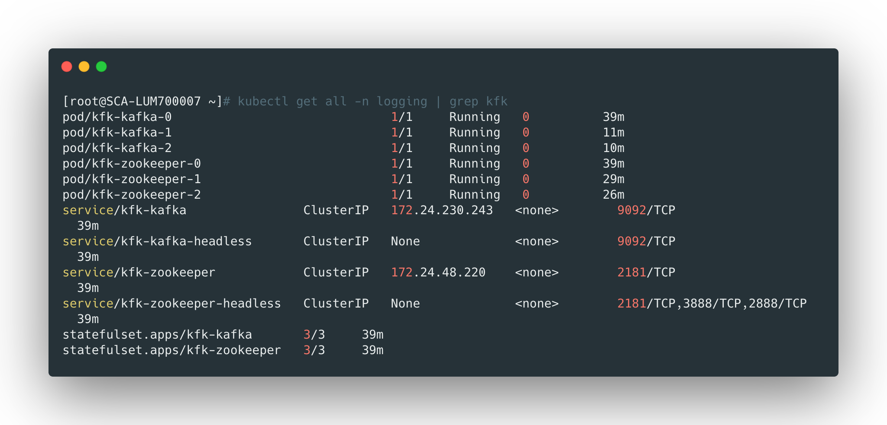
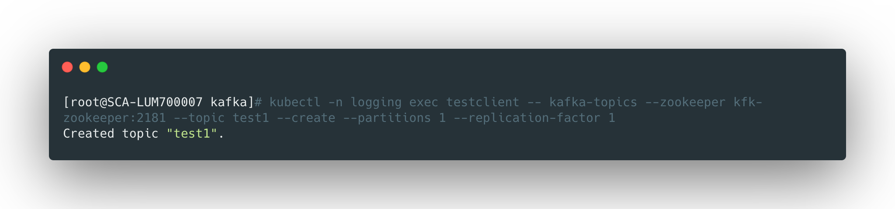

<br>

kafka用于接收fluentd收集上来的日志，并提供给后端logstash做进一步处理，这里使用helm的方式部署kafka集群。


## 添加helm repo

```bash
helm repo add incubator http://mirror.azure.cn/kubernetes/charts-incubator/
helm repo update
helm repo ls
```


<br>


## 下载kafka的chart包

```bash
helm fetch incubator/kafka
tar zxf kafka-0.21.2.tgz
```

<br>


## 部署kafka

首先新建一个`kafka.yaml`的文件作为定制的value文件：

```yaml
resources:
  limits:
    cpu: 200m
    memory: 1536Mi
  requests:
    cpu: 100m
    memory: 1024Mi

livenessProbe:
  initialDelaySeconds: 60

persistence:
  storageClass: "logging-storageclass"
```


> 使用之前创建的storageclass作为存储


运行下面的命令创建kafka：

```bash
helm install -f kafka.yaml kfk incubator/kafka -n logging
helm ls -n logging
```


<br>


## 检查kafka状态

```bash
kubectl get all -n logging | grep kfk
```




创建一个测试的pod：

```yaml
apiVersion: v1
kind: Pod
metadata:
  name: testclient
  namespace: logging
spec:
  containers:
  - name: kafka
    image: confluentinc/cp-kafka:5.0.1
    command:
      - sh
      - -c
      - "exec tail -f /dev/null"
```

```bash
kubectl apply -f testclient.yaml
```


在测试pod中创建新的topic：

```bash
kubectl -n logging exec testclient -- kafka-topics --zookeeper kfk-zookeeper:2181 --topic test1 --create --partitions 1 --replication-factor 1
```





topic创建成功了，运行下面的命令监听这个topic的消息：

```bash
kubectl -n logging exec -ti testclient -- kafka-console-consumer --bootstrap-server kfk-kafka:9092 --topic test1 --from-beginning
```


此时另起一个终端，使用下面的命令发送一个消息：

```bash
kubectl -n logging exec -ti testclient -- kafka-console-producer --broker-list kfk-kafka-headless:9092 --topic test1
```


此时发送随便一个字符串消息过去，监听的一端就会显示出来。

