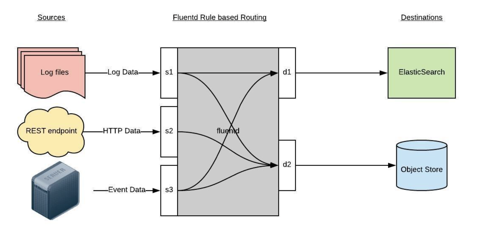
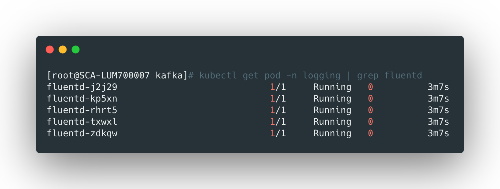

## 工作原理

fluentd是ruby编写的高效的日志聚合器，资源消耗相对较少。其通过给定的数据源抓取日志数据，处理后将其转发给其他的服务，如ES。主要运行步骤如下：

- 从多个日志源获取数据；
- 结构化并标记这些数据；
- 根据匹配的标签将数据发送到多个目标服务；



<br>


## 配置方式

fluentd通过配置文件声明数据源、过滤策略以及路由配置。


### 日志源配置

```xml
<source>
  @id fluentd-containers.log
  @type tail                             # Fluentd 内置的输入方式，其原理是不停地从源文件中获取新的日志。
  path /var/log/containers/*.log         # 挂载的服务器Docker容器日志地址
  pos_file /var/log/es-containers.log.pos
  tag raw.kubernetes.*                   # 设置日志标签
  read_from_head true
  <parse>                                # 多行格式化成JSON
    @type multi_format                   # 使用 multi-format-parser 解析器插件
    <pattern>
      format json                        # JSON 解析器
      time_key time                      # 指定事件时间的时间字段
      time_format %Y-%m-%dT%H:%M:%S.%NZ  # 时间格式
    </pattern>
    <pattern>
      format /^(?<time>.+) (?<stream>stdout|stderr) [^ ]* (?<log>.*)$/
      time_format %Y-%m-%dT%H:%M:%S.%N%:z
    </pattern>
  </parse>
</source>
```

- `id`表示引用该日志源的唯一标识符，可用于进一步过滤和结构化日志；
- `type`：Fluentd 内置的指令，`tail` 表示 Fluentd 从上次读取的位置通过 tail 不断获取数据，另外一个是 `http` 表示通过一个 GET 请求来收集数据；
- `path`：`tail` 类型下的特定参数，告诉 Fluentd 采集 `/var/log/containers` 目录下的所有日志，这是 docker 在 Kubernetes 节点上用来存储运行容器 stdout 输出日志数据的目录；
- `pos_file`：检查点，如果 Fluentd 程序重新启动了，它将使用此文件中的位置来恢复日志数据收集；
- `tag`：用来将日志源与目标或者过滤器匹配的自定义字符串，Fluentd 匹配源/目标标签来路由日志数据。


### 路由配置

这里以输送到es为例：

```xml
<match **>
@id elasticsearch
@type elasticsearch
@log_level info
include_tag_key true
type_name fluentd
host "#{ENV['OUTPUT_HOST']}"
port "#{ENV['OUTPUT_PORT']}"
logstash_format true

<buffer>
@type file
path /var/log/fluentd-buffers/kubernetes.system.buffer
flush_mode interval
retry_type exponential_backoff
flush_thread_count 2
flush_interval 5s
retry_forever
retry_max_interval 30
chunk_limit_size "#{ENV['OUTPUT_BUFFER_CHUNK_LIMIT']}"
queue_limit_length "#{ENV['OUTPUT_BUFFER_QUEUE_LIMIT']}"
overflow_action block
</buffer>
```

- `match`：标识一个目标标签，后面是一个匹配日志源的正则表达式，我们这里想要捕获所有的日志并将它们发送给 Elasticsearch，所以需要配置成`**`。
- `id`：目标的一个唯一标识符。
- `type`：支持的输出插件标识符，我们这里要输出到 Elasticsearch，所以配置成 elasticsearch，这是 Fluentd 的一个内置插件。
- `log_level`：指定要捕获的日志级别，我们这里配置成 `info`，表示任何该级别或者该级别以上（INFO、WARNING、ERROR）的日志都将被路由到 Elsasticsearch。
- `host/port`：定义 Elasticsearch 的地址，也可以配置认证信息，我们的 Elasticsearch 不需要认证，所以这里直接指定 host 和 port 即可。
- `logstash_format`：Elasticsearch 服务对日志数据构建反向索引进行搜索，将 logstash_format 设置为 `true`，Fluentd 将会以 logstash 格式来转发结构化的日志数据。
- `Buffer`： Fluentd 允许在目标不可用时进行缓存，比如，如果网络出现故障或者 Elasticsearch 不可用的时候。缓冲区配置也有助于降低磁盘的 IO。


### 过滤

由于 Kubernetes 集群中应用太多，也还有很多历史数据，所以我们可以只将某些应用的日志进行收集，比如我们只采集具有 `logging=true` 这个 Label 标签的 Pod 日志，这个时候就需要使用 filter，如下所示：

```xml
# 删除无用的属性
<filter kubernetes.**>
  @type record_transformer
  remove_keys $.docker.container_id,$.kubernetes.container_image_id,$.kubernetes.pod_id,$.kubernetes.namespace_id,$.kubernetes.master_url,$.kubernetes.labels.pod-template-hash
</filter>
# 只保留具有logging=true标签的Pod日志
<filter kubernetes.**>
  @id filter_log
  @type grep
  <regexp>
    key $.kubernetes.labels.logging
    pattern ^true$
  </regexp>
</filter>
```

<br>


## 制作带有kafka插件的fluentd镜像

fluentd的kafka插件需要安装，Dockerfile如下：

```bash
FROM quay.io/fluentd_elasticsearch/fluentd:v3.0.1

RUN echo "source 'https://mirrors.tuna.tsinghua.edu.cn/rubygems/'" > Gemfile && gem install bundler
RUN gem install fluent-plugin-kafka --no-document
CMD ["fluentd"]
```


执行下面的命令构建镜像：

```bash
docker build -t fluentd-with-kafka:v3.0.1 .
```

> 可以构建好之后推送到自己的仓库，这里我省略了这一步


<br>


## 创建topic

在kafka中创建新的topic，用于存储日志：

```bash
kubectl -n logging exec testclient -- kafka-topics --zookeeper kfk-zookeeper:2181 --topic k8s_log --create --partitions 1 --replication-factor 1
```

<br>


## 创建fluentd configmap

完整的yaml配置文件在 [fluentd-configmap.yaml]([https://github.com/liyongzhezz/yaml/blob/master/fluentd%2Bkafka%2Blogstash%E6%94%B6%E9%9B%86k8s%E6%97%A5%E5%BF%97/fluentd/fluentd-configmap.yaml](https://github.com/liyongzhezz/yaml/blob/master/fluentd%2Bkafka%2Blogstash收集k8s日志/fluentd/fluentd-configmap.yaml)) ，直接运行创建：

```bash
kubectl apply -f fluentd-configmap.yaml
```

<br>


## 部署fluentd服务

使用daemonset方式部署服务，yaml配置文件在 [fluentd-daemonset.yaml]([https://github.com/liyongzhezz/yaml/blob/master/fluentd%2Bkafka%2Blogstash%E6%94%B6%E9%9B%86k8s%E6%97%A5%E5%BF%97/fluentd/fluentd-daemonset.yaml](https://github.com/liyongzhezz/yaml/blob/master/fluentd%2Bkafka%2Blogstash收集k8s日志/fluentd/fluentd-daemonset.yaml)) 。

在文件中，添加了一个nodeSelector选项，可以控制哪些节点需要收集日志，这里我们设置全部节点打上标签：

```bash
kubectl label node --all beta.kubernetes.io/fluentd-ds-ready=true
```


因为是kubeadm搭建的集群，默认master上有污点，这里也设置了污点容忍，可收集master日志：

```yaml
tolerations:
  - operator: Exists
```


直接运行部署：

```bash
kubectl apply -f fluentd-daemonset.yaml
```


<br>


## 检查运行情况

```bash
kubectl get pod -n logging | grep fluentd 
```




