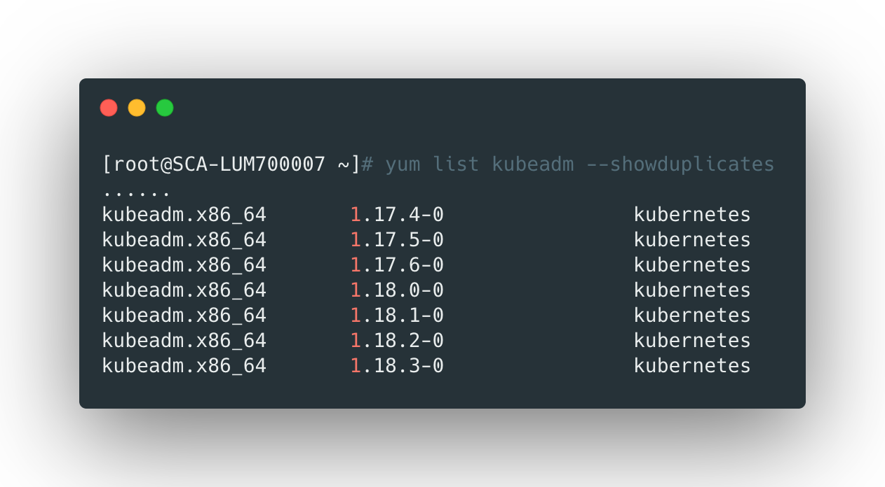
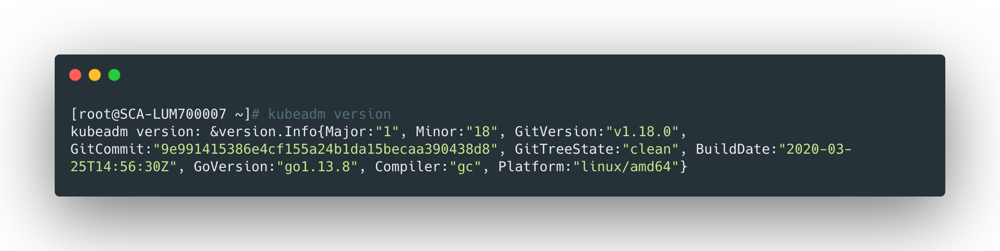
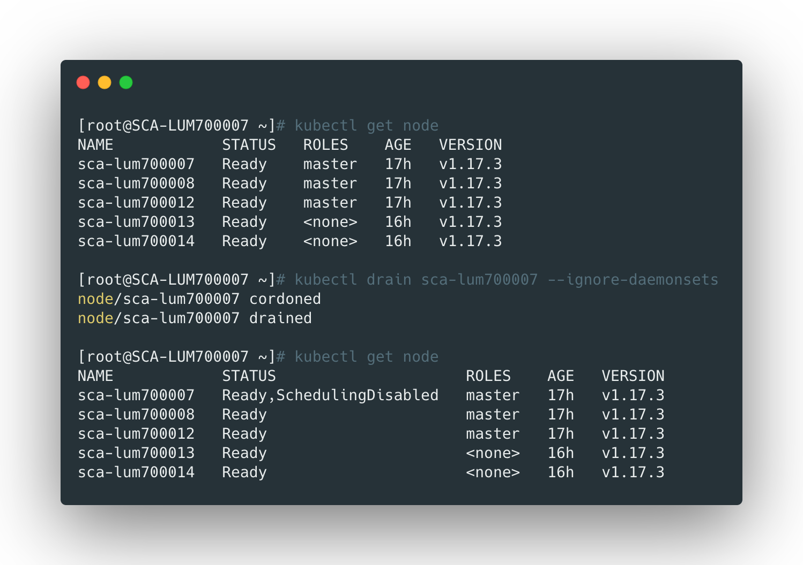
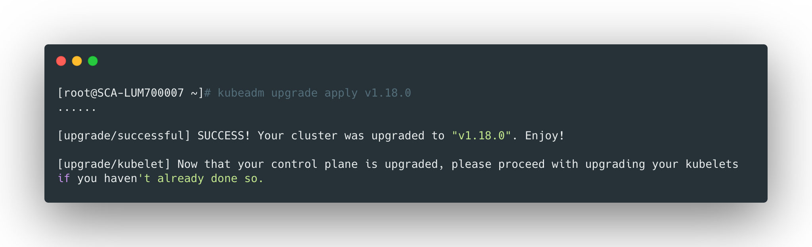
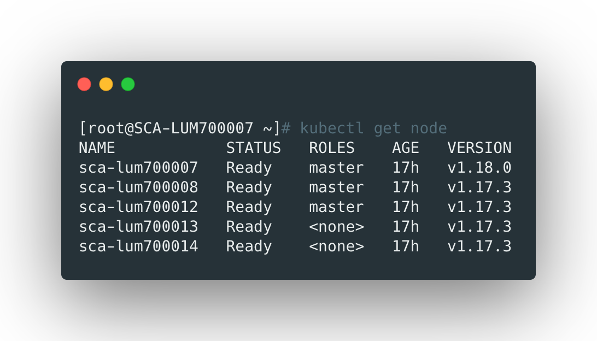
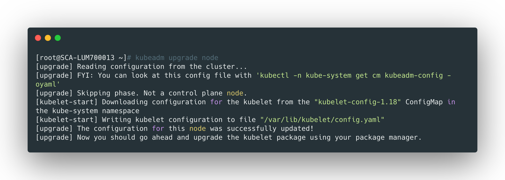
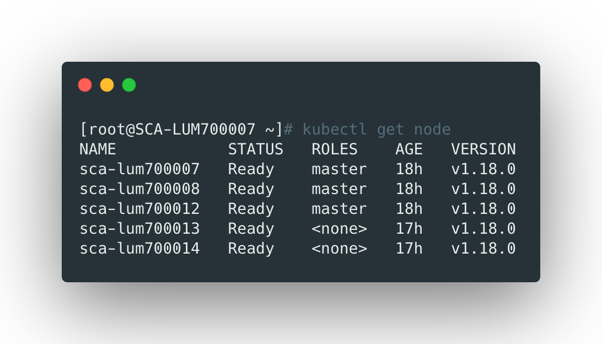

## 检查 kubeadm 可用版本

```bash
yum list kubeadm --showduplicates
```




这里我们当前的版本为1.17，下面升级到1.18.0。

<br>


## 升级 kubeadm

建议一台一台升级，批量操作存在无法预估的错误。这里先升级第一台master的kubeadm。

```bash
yum install -y kubeadm-1.18.0-0
kubeadm version
```



<br>


## 隔离 master1

先将master1隔离，使用`drain`命令可以优雅地结束节点的pod并将节点设置为不可调度：

```bash
kubectl drain sca-lum700007 --ignore-daemonsets
```



> 看到第一个master已经处于不可调度的状态了。

<br>


## 升级 kubernetes

```bash
kubeadm upgrade apply v1.18.0
```

当出现下面的输出内容时，表示命令执行成功了。



<br>


## 取消隔离master1

```bash
kubectl uncordon sca-lum700007
```

<br>


## 升级 kubectl 和 kubelet

```bash
yum install -y kubelet-1.18.0-0 kubectl-1.18.0-0
```

<br>


## 重启kubelet

```bash
systemctl daemon-reload
systemctl restart kubelet
```

<br>


## 确认节点升级成功

```bash
kubectl get node
```




**可以看到第一个节点已经升级成为1.18.0版本的了。后续几个master节点也是按照上边的步骤升级**

<br>


## 升级node节点

node节点的升级最好也是一个一个来，首先将node节点驱逐：

```bash
kubectl drain sca-lum700013 --ignore-daemonsets
```


然后在节点上执行下面的命令，升级kubernetes：

```bash
kubeadm upgrade node
```




在master上取消禁止调度：

```bash
kubectl uncordon sca-lum00013
```


升级worker节点上的kubelet：

```bash
yum install -y kubelet-1.18.0-0
systemctl daemon-reload
systemctl restart kubelet
```


<br>


## 注意事项


需要注意的是：

- 跨多个版本升级需要注意，最好不要一次升上去，防止出现问题；
- 升级的时候先从master开始，再升级worker；
- 升级的时候一个一个节点的进行，要先驱逐节点的pod并设置为不可调度；


最后，所有的节点都升级完毕：



