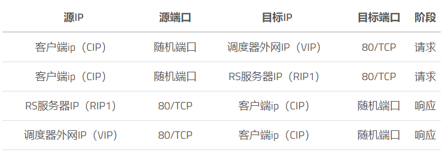

## LVS介绍

### 什么是lvs

lvs（Linux Virtual Server），是一种4层的负载均衡调度器并集成在Linux内核，由阿里章文嵩博士开发，并在各大互联网公司广泛应用。

 

在LVS架构中，VS表示调度服务器，负责请求的调度，RS表示后端实际提供服务的服务器。

  

### 工作原理

VS根据请求报文的目标IP、目标协议及端口，并根据相应的调度算法将其调度到后端的某台RS上。

 

lvs使用的是内核中ipvs工具实现调度功能。ipvs工作于内核空间netfilter的INPUT上，用户可以使用ipvsadm实现对ipvs的管理。

  

### lvs的类型

lvs分为如下的几种类型：

-  nat：修改请求报文的目标ip，是多ip的DNAT；
- tun：在原请求报文之外新加一个ip首部；
- DR：操作封装新的mac地址；
- fullnat：修改请求报文的源和目标ip；

 

## NAT工作模式

### 模型原理
lvs的NAT模型解决了DNAT一对一转发的缺陷，实现了一对多的DNAT转发。

其通过修改目标地址的IP来实现将请求转发到后端RS服务器上，RS服务器处理完成请求后请求报文还要经过调度器，调度器将响应报文的源IP修改为调度器的VIP后发给客户端。

***\*支持端口映射，可修改请求报文的目标端口\****

### 模型拓扑图

### 优势、缺陷及注意事项
优点是：

1. RS服务器可以运行任何支持TCP/IP的操作系统；
2. 它只需要一个IP地址配置在调度器上，服务器组可以用私有的 IP 地址；

缺点是：

1. 它的伸缩能力有限，当服务器结点数目升到20时，调度器本身性能有可能成为系统的新瓶颈，因为在NAT模型中请求和响应报文都需要通过负载调度器。

需要注意的是：

1. RS的IP（RIP）和调度器内网IP（DIP）应在同一网络中（不是必须）且使用私网地址，RS网关指向DIP；
2. 调度器必须是Linux系统，RS可以是任何系统；

 

## DR模型
### 工作原理

DR模型叫做直接路由，是LVS的默认模式，其实现是通过为请求报文重新封装一个MAC首部进行转发，源MAC是DIP所在的接口的MAC，目标MAC是选择的RS的RIP所在接口的MAC，其余IP和端口不变。

VIP地址为调度器和RS服务器组共享，调度器配置的VIP地址是对外可见的，用于接收虚拟服务的请求报文；所有的服务器把VIP地址配置在各自的Non-ARP网络设备上，它对外面是不可见的，只是用于处理目标地址为VIP的网络请求。RS将响应报文直接回送给客户端。

### 模式拓扑图

### 优势、缺陷及注意事项

优势是：

1. DR模式下负载调度器中只负责调度请求，而RS直接将响应返回给客户，可以极大地提高整个集群系统的吞吐量。

缺陷是：

1. DR模式不支持端口映射；

需要注意的是：

1. 调度器和RS都必须在物理上有一个网卡通过不分断的局域网相连，如通过交换机或者高速的 HUB 相连；
2. 调度器和RS都要配置有VIP，且在RS上需要抑制arp；
3. RIP网关不用指向DIP，RIP可以使用公网IP，但一般是私网IP；
4. 调度器的vip的掩码没必要设置为32，也不要设置`route add -host $VIP dev eth0:0`，因为vip本来就是要像正常的IP地址一样对外通信；
5. DR模式调度器跟RS是同一个网段，无需开启ip_forward转发；

 

## TUN模式

### 模式原理

不修改请求报文的IP首部（源IP为CIP，目标IP为VIP），而在请求报文之外再封装一个IP首部（源IP为DIP，目标IP为RIP），将报文发到选择的RS，RS响应后直接返回给客户端（源IP为VIP，目标IP为CIP）。

在TUN的集群系统中，调度器只将请求调度到不同的RS，RS将应答的数据直接返回给用户。这样，调度器就可以处理大量的请求，它甚至可以调度百台以上的RS（同等规模的服务器），而它不会成为系统的瓶颈。即使调度器只有100Mbps的全双工网卡，整个系统的最大吞吐量可超过 1Gbps。

### 拓扑图

### 优势、缺陷及注意事项

优势是：

1. TUN模式下效率更高，可以支持更多的后端服务器；

缺陷是：

1. TUN技术对服务器有要求，即所有的服务器必须支持IP Tunneling或者IP Encapsulation协议，且不支持端口映射；

需要注意的是：

1. DIP、VIP、RIP都应该是公网IP；
2. RS网关一般不能指向DIP；

 

## FULLNAT模式

### FULLNAT模式原理

通过同时修改请求报文的源IP和目标IP进行转发，将CIP修改为DIP，将VIP修改为RIP。支持端口映射

### 优势、缺陷

优势是：

1. 可以实现RS服务器和调度器异地部署；

缺陷是：

1. FULLNAT模式默认内核不支持；后端RS日志无法直接获取到实际客户端请求的IP地址；

 

## 各种模式的对比

 

