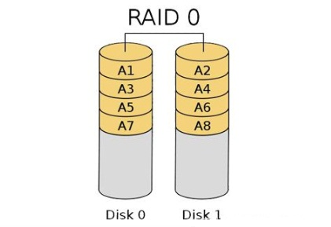
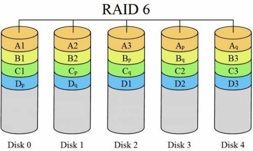
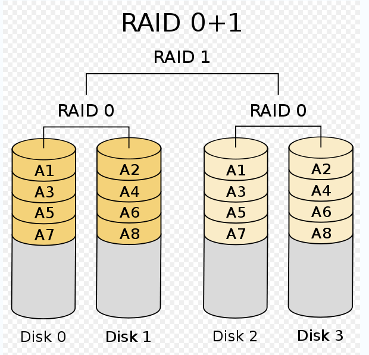
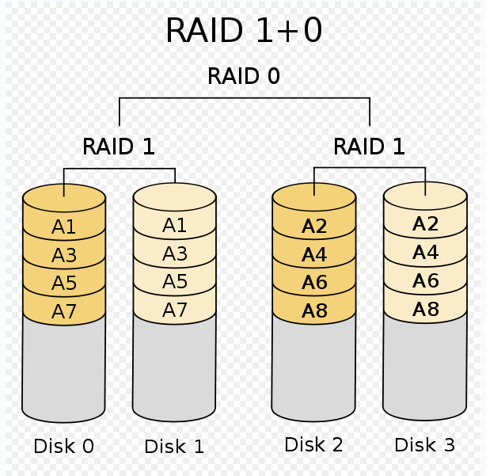

## 什么是Raid

Raid是磁盘阵列，它是一种把多块物理硬盘按照一定规则组合成为一块逻辑硬盘的方法，从而提供比一块硬盘更好的数据冗余和存储性能。

> raid往往由多块物理硬盘构成，但是在用户看来只有一块硬盘，用户可以对其进行格式化、分区等操作。

raid有以下的作用：

- 提高磁盘存储安全；
- 提高存储效率；
- 提高磁盘存储容量；

raid分为不同的级别，不同级别提供的存储特性也不同，常见的存储级别有：

- raid0
- raid1
- raid01
- raid10
- raid5
- ........

## raid0

特点：不校验数据，不提供数据冗余策略，将数据分散存储在所有的磁盘上。理论上读写性能是单个磁盘性能的n倍，n为组成raid0的磁盘个数，但实际会受到总线带宽限制，所以实际会低于理论值。

总容量计算公式：
$$
可用容量 = 所有磁盘容量之和
$$

> raid0最少需要两块磁盘

## raid1

特点：会对数据进行冗余处理，一旦工作磁盘发生故障，镜像磁盘会会接管，不会影响数据读写及完整性，但会损失可用空间。

总容量计算公式：
$$
可用容量 = 所有磁盘容量之和 * 50\%
$$

> raid1最少需要两块磁盘

## raid5

特点：兼顾了存储成本、性能和安全的方案，将数据和对应的奇偶校验信息存储在各个磁盘上，并且校验信息和数据在不同的磁盘上。当磁盘损坏，就是用剩余数据和奇偶校验信息去恢复数据。

总容量计算公式：
$$
可用容量 = (n-1)/n * 所有磁盘容量之和
$$

> raid5最少需要3块盘，最多允许坏一块磁盘

## raid6

raid6是在RAID 5基础上进一步加强数据保护，实际上是一种扩展RAID 5等级。除了每个硬盘上都有同级数据XOR校验区外，还有一个针对每个数据块的XOR校验区。当然，当前盘数据块的校验数据是交错存储的。这样一来，等于每个数据块有了两个校验保护屏障（一个分层校验，一个是总体校验），因此RAID 6的数据冗余性能相当好。但是，由于增加了一个校验，所以写入的效率较RAID 5差，而且控制系统的设计也更为复杂，第二块的校验区也减少了有效存储空间。

总容量计算公式：
$$
可用容量 = (n-2)/n * 所有磁盘容量之和
$$

## raid01

特点：先做raid0再做raid1，有一个盘损坏，同组的盘都不能运作，可靠性低；

## raid10

特点：先做raid1再做raid0，有一个盘损坏，剩下的盘都可以运作，可靠性高；

