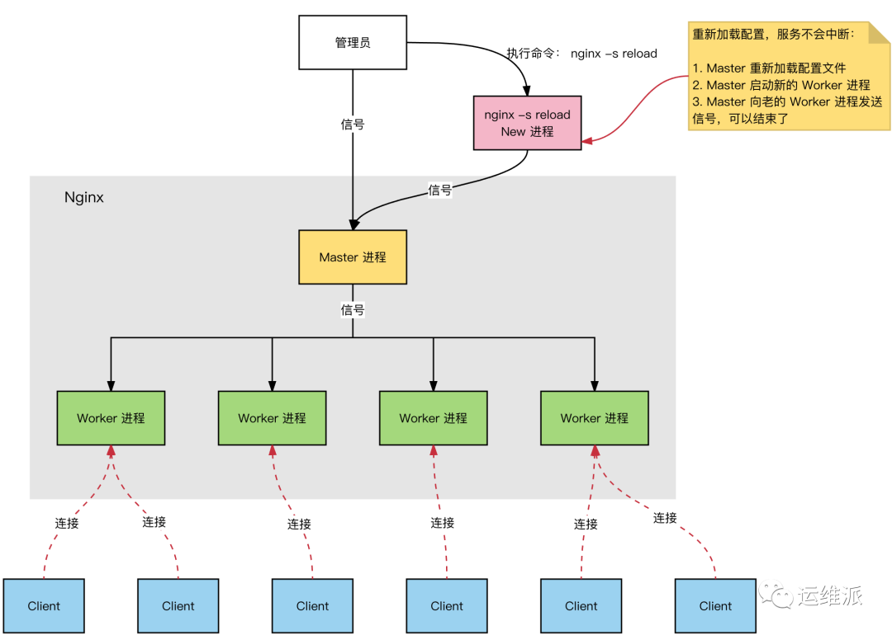

## nginx工作模型

Nginx 服务器，正常运行过程中：

- 多进程：一个 Master 进程、多个 Worker 进程。
- Master 进程：管理 Worker 进程。接收外部的操作（信号）；根据外部的操作的不同，通过信号管理 Worker；监控 Worker 进程的运行状态，Worker 进程异常终止后，自动重启 Worker 进程。
- Worker 进程：所有 Worker 进程都是平等的。网络请求由 Worker 进程处理。Worker 进程数量在 nginx.conf 中配置，一般设置为核心数，充分利用 CPU 资源，同时，避免进程数量过多，避免进程竞争 CPU 资源，增加上下文切换的损耗。

 

## 工作细节

master工作细节：

1. master建立listen的socket；
2. master fork出worker进程；
3. 新请求到来时，worker间相互竞争，获胜的获得listenfd可读时间；
4. 获胜的worker accept当前连接，处理请求；

worker工作细节：

1. 新请求到来时，所有worker的listenfd都变为可读的；
2. worker间相互竞争，获胜的获得listenfd可读时间；
3. worker处理并响应请求；

