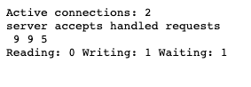

`http_stub_status_module`可以监控nginx的状态，其在yum安装时会默认加入，在源码安装时需要手动加入编译。


## 作用

<br>


这个模块的作用是展示nginx当前处理连接的状态，常用于监控nginx。


## 配置

<br>


格式：

```bash
location /status {
    stub_status;
}
```

**该模块需要配置在server中的location下。**


例如：

```bash
server {
    listen       80;
    server_name  localhost;

    location /status {
        stub_status;
    }

    location / {
        root   /usr/share/nginx/html;
        index  index.html index.htm;
    }

    error_page   500 502 503 504  /50x.html;
    location = /50x.html {
        root   /usr/share/nginx/html;
    }
}
```


## 生效配置

<br>


```bash
nginx -t 
nginx -s reload 
```


通过浏览器访问`location`匹配的模块路径，例如：`http://192.168.221.201/status`，即可看到如下信息：





- `Active connections`：当前活跃的连接数；
- `accepts`：nginx接收的总共的握手次数，这里是9；
- `handled`：处理的连接数，这里是9；
- `requests`：处理的请求数，这里是5；
- `Reading`：正在读的连接数；
- `Writing`：正在写的连接数；
- `Waiting`：等待连接个数；


> 正常情况下，握手次数和连接次数应该相等，表示没有丢失请求；


