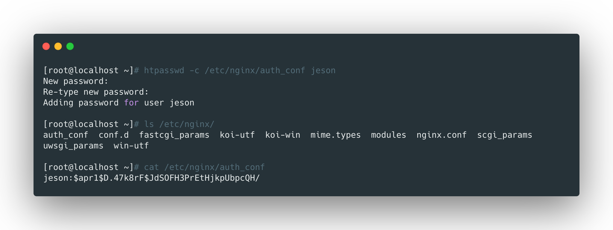

<br>

`http_auth_basic_module`是用来做用户登录认证的模块。


<br>


## 依赖工具安装

该模块一般配合htpasswd命令使用，htpasswd命令用于生成用户名密码的配置文件，安装方式如下：

```bash
yum install -y httpd-tools
```

<br>


## 生成用户名密码文件

使用该命令生成一个包含用户名和密码的配置文件：



> 第一次使用-c命令表示创建文件，直接接上用户名即可。

<br>


## 设置nginx配置文件

修改nginx的配置文件如下：

```nginx
location ~ ^/admin.html {
  root /usr/share/nginx/html;
  index index.html index.htm;
  auth_basic "Auth access is need!!!";
  auth_basic_user_file /etc/nginx/auth_conf;
}
```

- `auth_basic`是在验证的时候的提示信息；
- `auth_basic_user_file`保存用户信息的文件；

<br>


## 存在的问题

该方式存在局限性：

- 依赖文件的方式存储用户信息，效率低；
- 无法和其他系统打通用户密码，维护成本高；


解决方案：

- nginx+lua解决
- nginx+ldap，利用nginx-auth-ldap模块实现用户信息打通