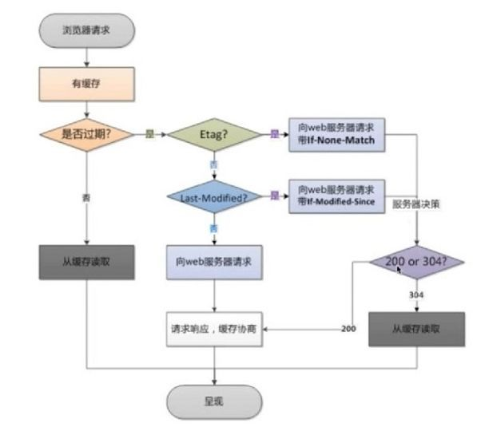

<br>

浏览器缓存可以让客户端不用每次请求都从后端服务器拿数据，这样可以有效减轻后端服务器的压力。


<br>


## 有缓存的情况下请求流程

1. 浏览器发起请求；
   1. 有缓存：校验缓存是否过期，读取缓存信息；超期则重新从服务端获取信息并缓存；
   2. 无缓存：请求后端服务器，获取响应信息；
2. 页面呈现信息；


<br>


## 校验过期的机制


### 校验本地缓存是否过期

通过 本地缓存信息header头中的`expries`、`cache-control(max-age)`来判断是否过期。


> expries在http1.0版本，cache-control在http1.1版本


### last-modified头信息验证

通过`Last-Modified`，用来和服务器端的本地文件进行校验，如果本地文件更新了，服务端的和客户端的不一致，就会重新返回给客户端；


### etag头信息验证

`last-modified`会返回给客户端一个时间，而这个时间是精确到秒的。如果一秒内文件更新了，那么通过`last-modified`就无法判别；`etag`是一串特殊的字符串，他可以更精确的反应文件是否更新，这是常用的方式。


### 缓存校验流程



<br>


## 配置方式

使用`expires`，向header中添加`Cache-Control`、`Expire`头信息，配置语法如下：

```bash
expires [modified] time;
expires epoch | max | off;

# 默认为off
# 可配置在http、server、location下
```


<br>


## 实例

```nginx
server {
  listen 80;
  server_name localhost;
  
  sendfile on;
  access_log /var/log/nginx/log/static_access.log main;
  
  location ~.*\.(html|htm)$ {
    expires 24h;
    root /opt/app/code/doc;
  }
  
  location = /50x.html {
    root /usr/share/nginx/html;
  }
}
```

> 表示访问 html结尾的文件，都缓存24小时


