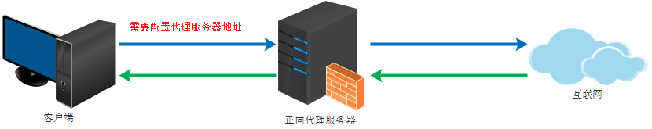

## 什么是代理

客户端当无法直接请求到服务端时，往往需要一个代理服务器进行请求代理，实现了客户端与服务端的通信。客户端先请求代理，代理将请求转发给服务端。


nginx可以实现如下的常用服务代理：

- http、https：http、https服务代理；
- icmp、pop、imap：邮件服务代理；
- rtmp：流媒体服务代理；
- ......


<br>


## 正向代理和反向代理


### 正向代理

正向代理类似一个跳板机，代理访问外部资源。





用户访问不了某网站，但能访问一个代理服务器，这个代理服务器能访问那个不能访问的网站，于是先连上代理服务器告诉他需要那个无法访问网站的内容，代理服务器去取回来然后返回。从网站的角度，只在代理服务器来取内容的时候有一次记录，有时候并不知道是用户的请求，也隐藏了用户的资料，这取决于代理告不告诉网站。

>  **客户端必须设置正向代理服务器，当然前提是要知道正向代理服务器的IP地址，还有代理程序的端口。**


正向代理的用途：

- 访问原来无法访问的资源，如google；
- 可以做缓存，加速访问资源；
- 对客户端访问授权，上网进行认证；
- 代理可以记录用户访问记录（上网行为管理），对外隐藏用户信息；


### 反向代理

反向代理（Reverse Proxy）实际运行方式是指以代理服务器来接受internet上的连接请求，然后将请求转发给内部网络上的服务器，并将从服务器上得到的结果返回给internet上请求连接的客户端，此时代理服务器对外就表现为一个服务器。


反向代理的用途：

- 保证内网的安全，可以使用反向代理提供WAF功能，阻止web攻击；


### 两种代理的区别

- 正向代理的代理对象为客户端；
- 反向代理的代理对象为服务端；


<br>


## 配置语法

```bash
proxy_pass URL;

# 可以配置在location下
```

> 表示将请求转发给`proxy_pass`指定的url，然后将响应结果再转发给客户端；


<br>


## 反向代理实例

```nginx
server {
  listen 80;
  server_name localhost;
  
  sendfile on;
  access_log /var/log/nginx/log/static_access.log main;
  
  location / {
    root /usr/share/nginx/html;
    index index.html index.htm;
  }
  
  location ~ /test_proxy.html$ {
    proxy_pass http://127.0.0.1:8080;
  }
  
  location = /50x.html {
    root /usr/share/nginx/html;
  }
}
```


> 当匹配到`test_proxy.html`的请求时，转发到本机的8080端口的服务。


<br>


## 正向代理实例

```nginx
server {
  listen 80;
  server_name localhost;
  
  sendfile on;
  access_log /var/log/nginx/log/static_access.log main;
  resolver 8.8.8.8；
  
  location / {
    proxy_pass http://$http_host$request_uri;
  }
  
  location = /50x.html {
    root /usr/share/nginx/html;
  }
}
```

> 将通过正向代理的所有请求，转发给 `http://$http_host$request_uri`。
>
> `resolvers`指定了使用的dns地址；


**正向代理需要在浏览器中设置代理，否则不能访问；**


<br>


## 实际中常会添加的配置项

```nginx
server {
  listen 80;
  server_name localhost;
  
  sendfile on;
  access_log /var/log/nginx/log/static_access.log main;
  
  location / {
    proxy_pass http://127.0.0.1:8080;
    proxy_redirect default;
    
    proxy_set_header Host $http_host;
    proxy_set_header X-Real-IP $remote_addr;
    
    proxy_connect_timeout 30;
    proxy_send_timeout 60;
    proxy_read_timeout 60;
    
    proxy_buffer_size 32k;
    proxy_buffering on;
    proxy_buffers 4 128k;
    proxy_busy_buffers_size 256k;
    proxy_max_temp_file_size 256k
  }
  
  location = /50x.html {
    root /usr/share/nginx/html;
  }
}
```

- `proxy_redirect`：重定向配合；
- `proxy_set_header`：向realserver转发时添加header头信息；X-Real-IP 用于获取用户真实IP；
- `proxy_connect_timeout`：连接超时时间，单位秒；
- `proxy_buffer_size`：缓冲区大小；
- `proxy_buffering`：打开buffering，可以减少IO；
- `proxy_max_temp_file_size`：当内存不够，buffer使用的临时文件大小；


