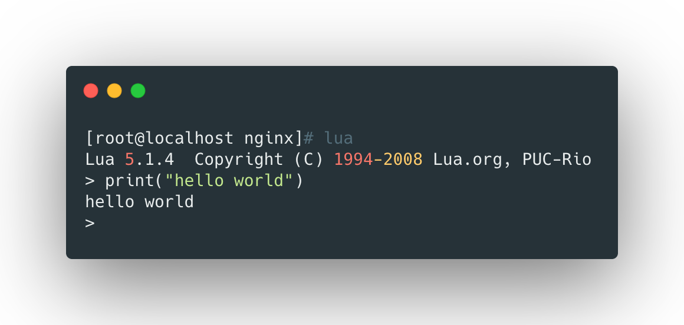
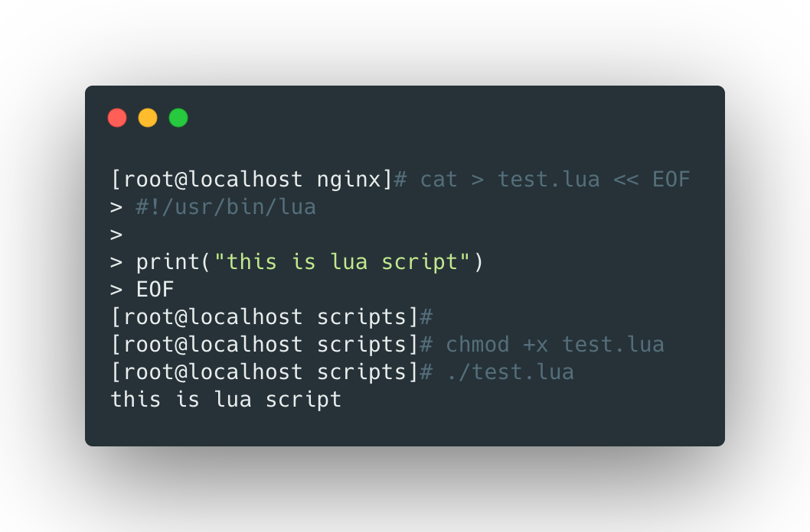

## 什么是lua

lua是一个具有如下特性的脚本语言：

- 简洁：可读性高，开发容易；
- 轻量：运行轻量；
- 可扩展：封装扩展容易；


> 可以将nginx的并发处理epoll和lua的轻量级实现简单功能的优势相结合，实现高并发场景。

<br>


## lua基础语法


### 安装lua

```bash
yum install -y lua
lua -v
```


### 运行lua

直接在命令行敲入`lua`命令即可进入lua解释器：




也可以使用脚本方式运行lua，例如运行下面的lua脚本：

```bash
cat > test.lua << EOF
#!/usr/bin/lua

print("this is lua script")
EOF

chmod +x test.lua
./test.lua
```




### lua注释

- 行注释使用`--`；
- 注释块使用`--[[ 代码块 --]]`；


<br>


### 变量

lua的变量没有特殊说明，都是局部变量，实例：

```lua
a = ‘alo\n123’
a = "alo\n123\""
a = '\97lo\10\04923"'
a = [[alo
123"]]
```

> 以上几种定义方式是等价的。


布尔类型：

- `nil`和`false`表示`false`；
- `0`和空字符串表示`true`；


### while循环

```lua
sum = 0
num = 1
while num <= 100 do
  sum = sum + num
  num = num + 1
end
print("sum =", sum)
```

> lua不支持 ++ 或者 +=的操作符


### for循环

```lua
if age == 40 and sec == "Male" then
  print("older zhan 40")
elseif age > 60 and sex ~="Female" then
  print("older zhan 40 and not Female")
else
  local age = io.read()
  print("your age is "..age)
end
```

> `~=`表示不等于，`io.read`表示从终端读取用户输入