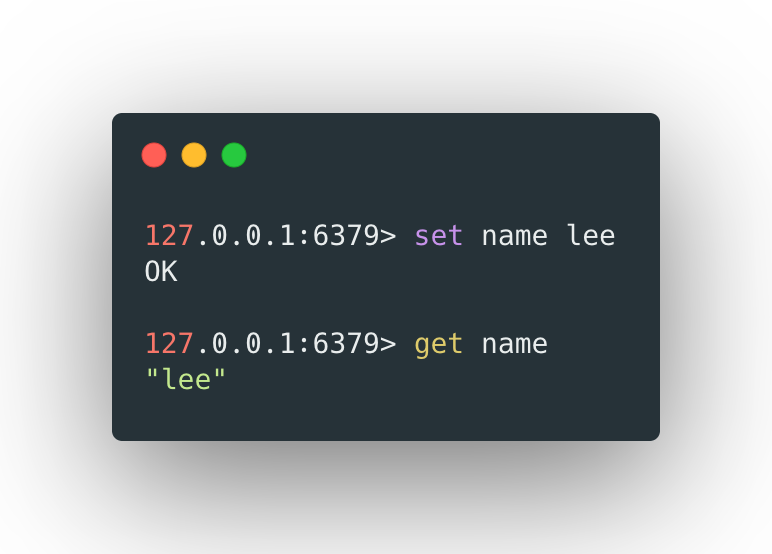
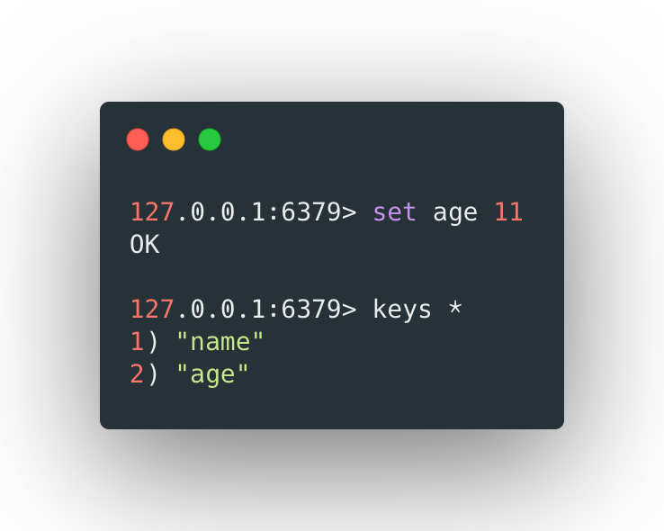
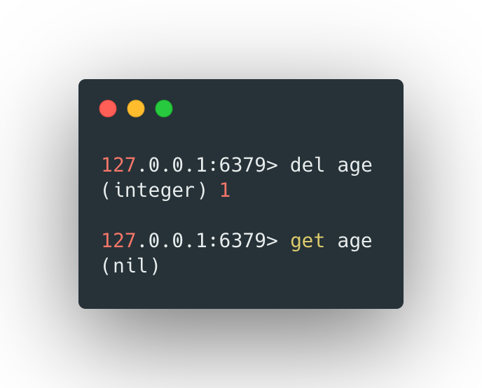
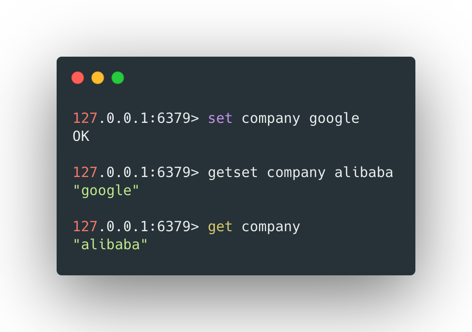
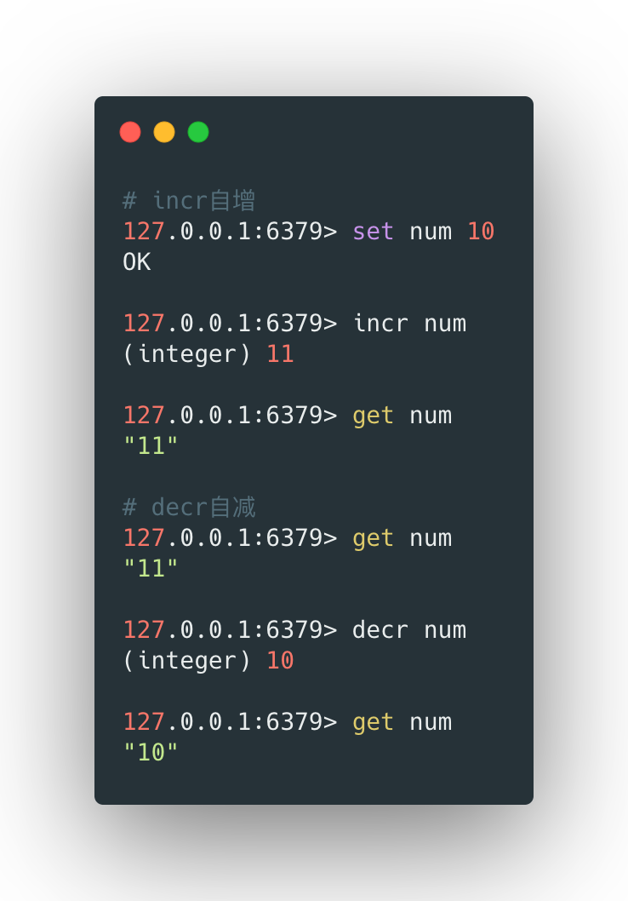
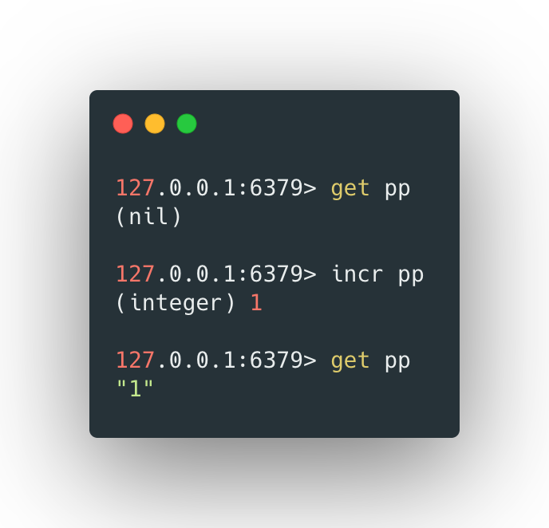
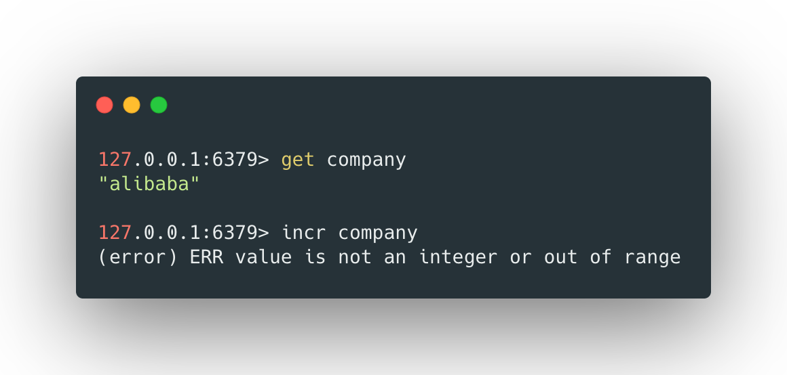
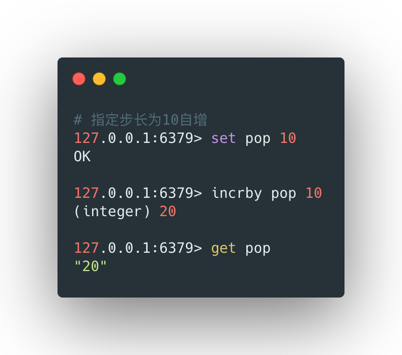
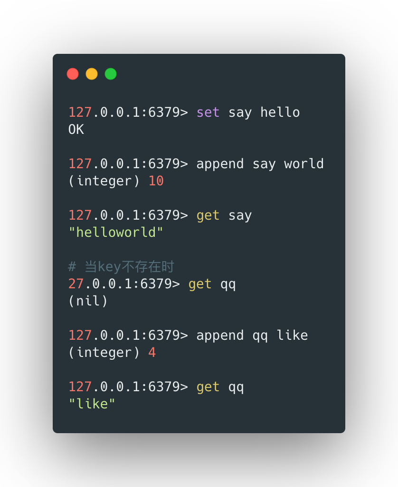

字符串是redis中最基础的数据类型，最多可以容纳512M的数据长度。

<br>

## 存取string类型

使用`set`和`get`指令可以在redis中存取string类型的数据，格式如下：

```shell
# 存数据
set [key] [value]

# 取数据
get [key]
```


> redis数据都是键值对，所以需要一个key和对应的value；key不要过长，否则会消耗很多内存，最好有统一的命名规范保证可读性。





获取所有的key，可以使用如下的方式：



<br>

## 删除string数据

使用`del`指令可以删除指定key下的数据，其格式如下：

```shell
del [key]
```


例如：




> 返回1说明删除成功，再次获取这个key对应的value的时候返回nil


<br>

## getset 重新赋值

`getset`命令会先获取key对应的value值，然后在对key重新复制，其格式如下：

```shell
getset [key] [value]
```


例如：




<br>

## value自增和自减

`incr`和`decr`命令可以分别让key对应的value自增1和自减1：

- 如果value是整型，则自增或自减1；
- 如果无法转换成整型，则报错；
- 如果key不存在，则创建这个key并并赋初始值0，然后自增或自减1；


其格式如下：

```shell
incr [key]
decr [key]
```


###  数值类型自增




### key不存在时




### value无法转换为整型




### 指定步长

默认`incr`和`decr`的步长都是1，但是`incrby`和`decrby`可以指定自增和自减的步长单位，其用法和`incr`与`decr`一致，格式如下：

```shell
incrby [key] [步长]
decrby [key] [步长]
```


例如：




<br>

## 字符串追加

`append`命令可以在指定key的value后面追加字符串。如果key不存在，则会创建这个key并将需要追加的内容作为value赋值，其格式如下：

```shell
append [key] [追加的内容]
```


例如：

