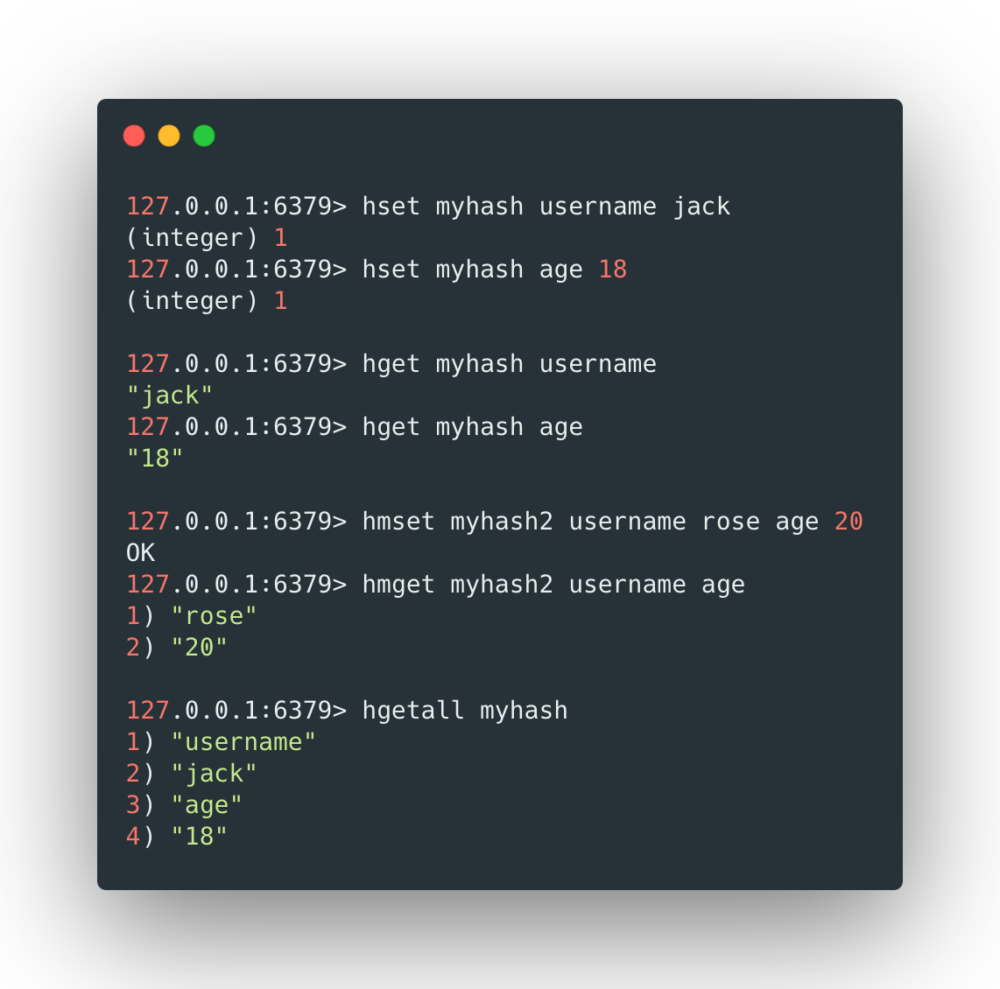
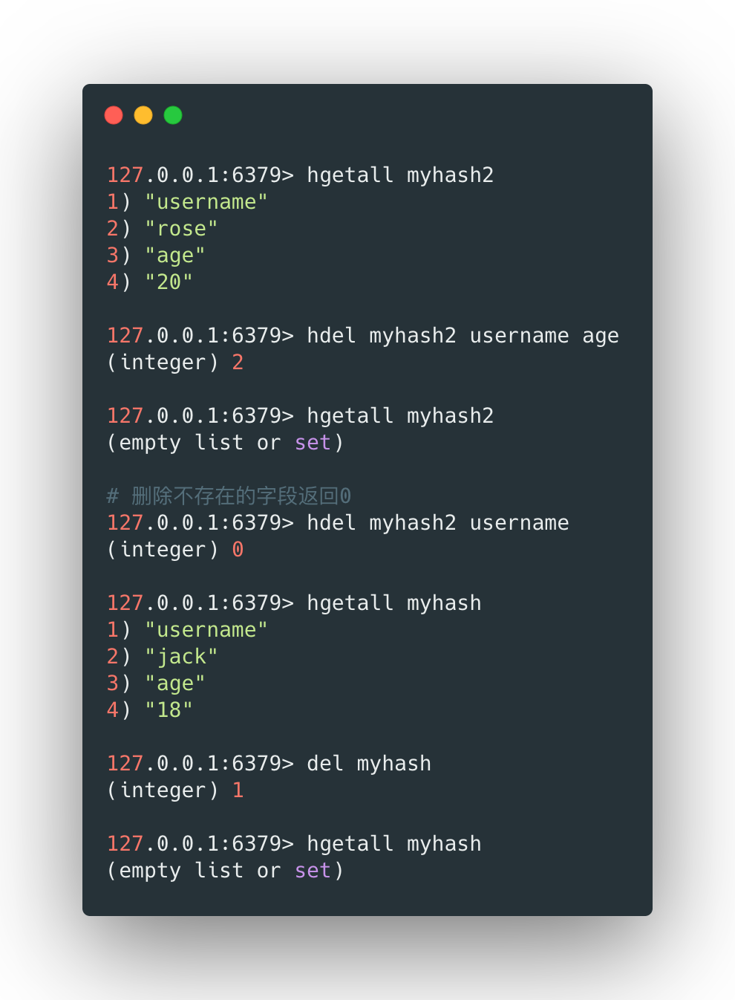
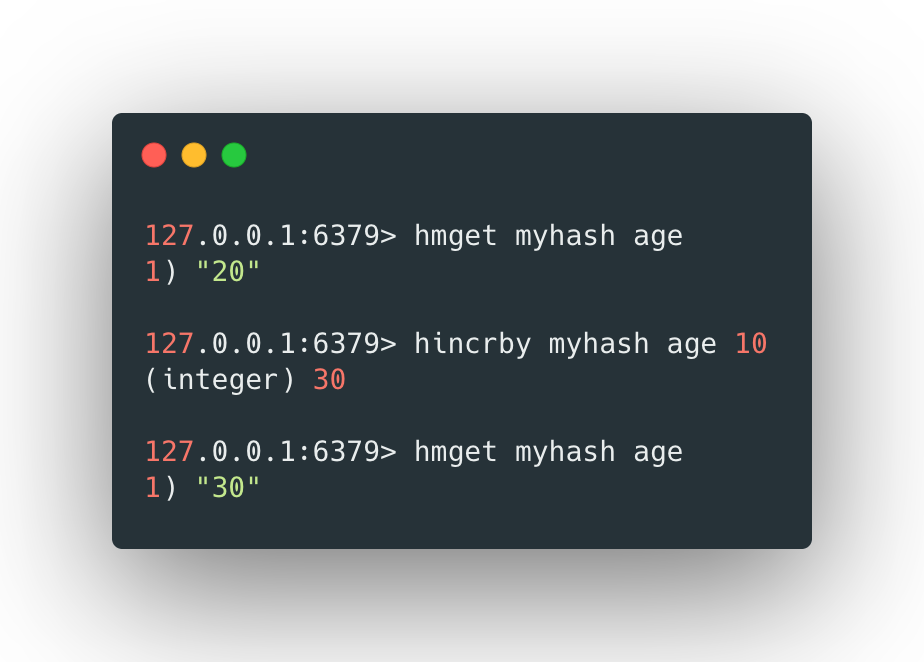
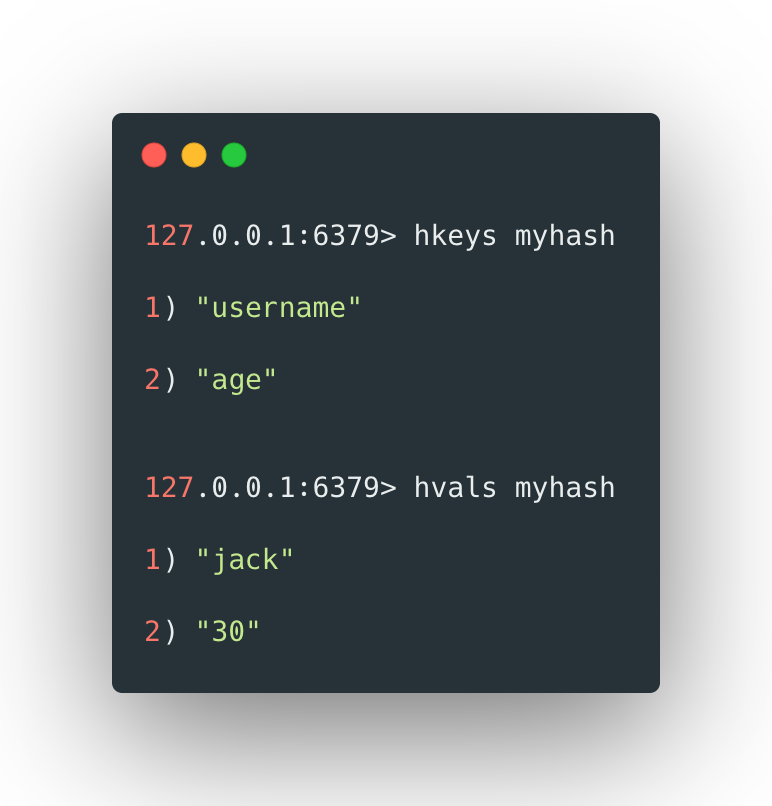
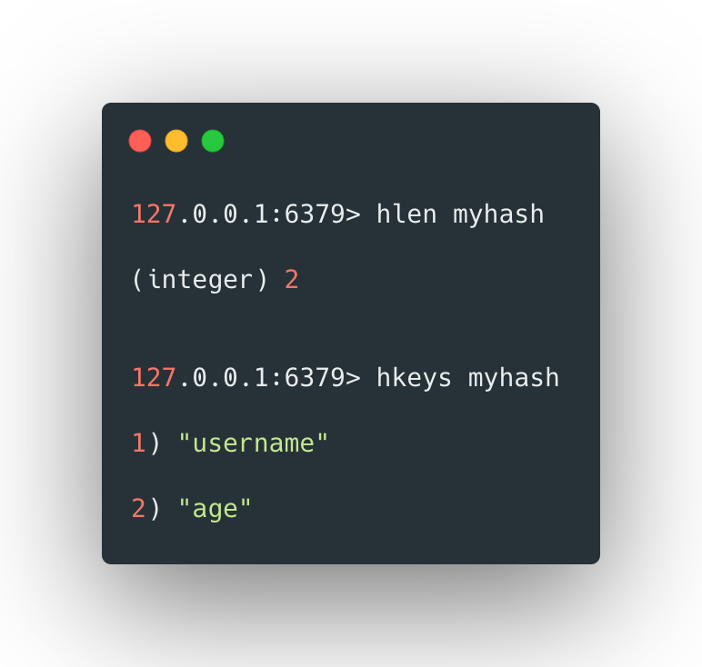
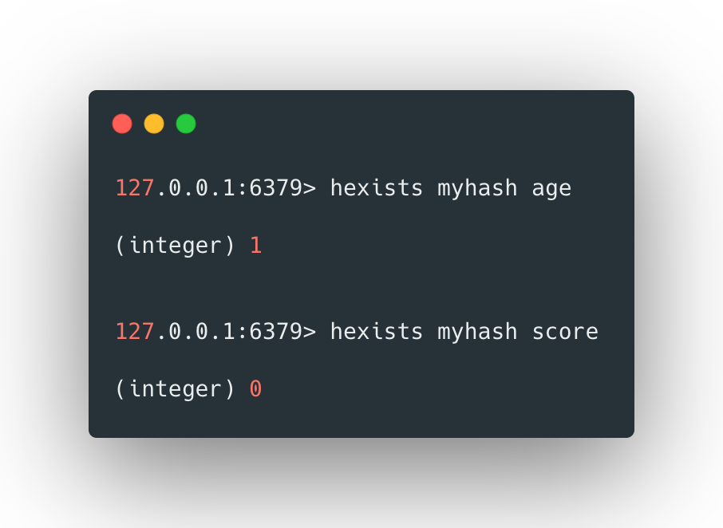

Redis hash 是一个string类型的field和value的映射表，hash特别适合用于存储对象。Redis 中每个 hash 可以存储海量的键值对。

<br>


## 存取hash类型数据

使用`hset`和`hget`可以分别对hash类型的数据进行存取操作，`hset`和`hget`只能一次存入和读取一对键值对，使用`hmset`和`hmget`可以一次存入和读取多个键值对。


使用hgetall可以获取到hash数据的所有值，其格式如下：

```bash
hset [key] [属性key] [属性value]
hget [key] [属性的key] 
hmset [key] [属性key1] [属性value1] [属性key2] [属性value2]  ...
hget [key] [属性的key1] [属性key2] ...
hgetall [key]
```


例如：



<br>


## 删除hash类型数据

`hdel`和`del`可以删除hash类型数据中属性以及其值，格式如下：

```bash
hdel [key] [属性1] [属性2]...
del [key]
```


例如：




<br>


## hash类型自增

`hincrby`操作可以给hash类型属性的值增加指定的单位，其格式如下：

```bash
hincrby [key] [属性] [步长]
```


例如：



 

<br>


## 获取所有属性名称和值

`hkeys`和`hvals`分别可以获得hash中所有的keys和所有的values，其格式如下：

```bash
hkeys [key]

hvals [ley]
```


例如：



 

## 获取属性的个数

`hlen`可以获得hash中属性的个数，其格式如下：

```bash
hlen [key]
```


例如：



 

## 判断属性是否存在

`hexists`可以判断hash中某个属性是否存在，存在则返回1，不存在则返回0，其格式如下：

```bash
hexists [key] [属性]
```


例如：



