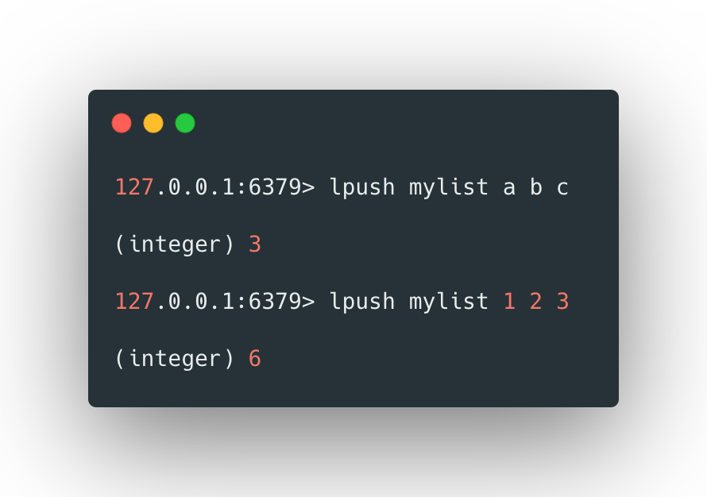
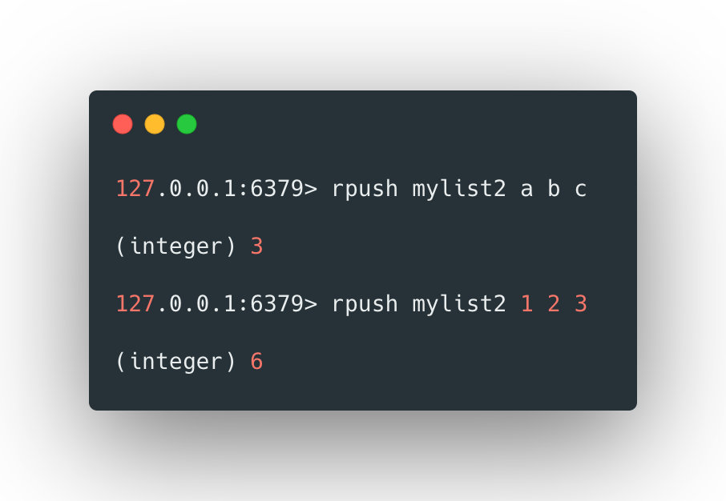
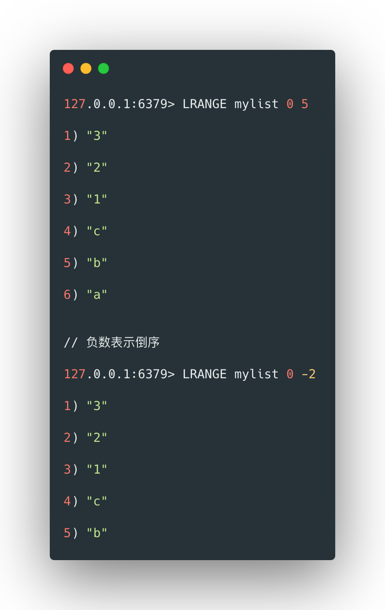
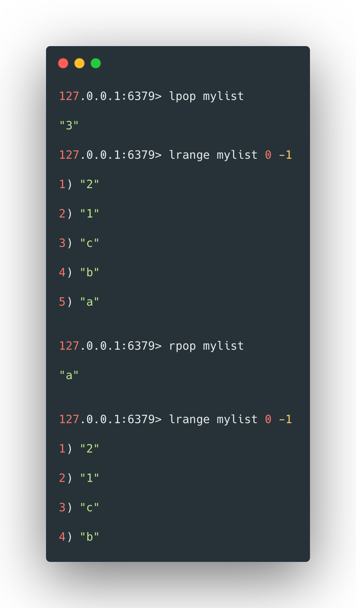
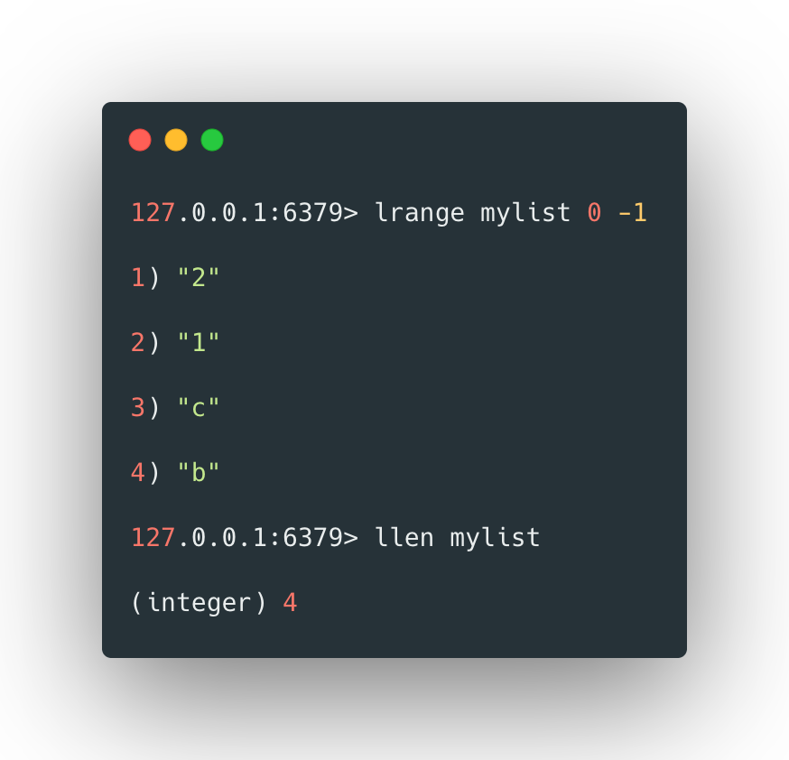
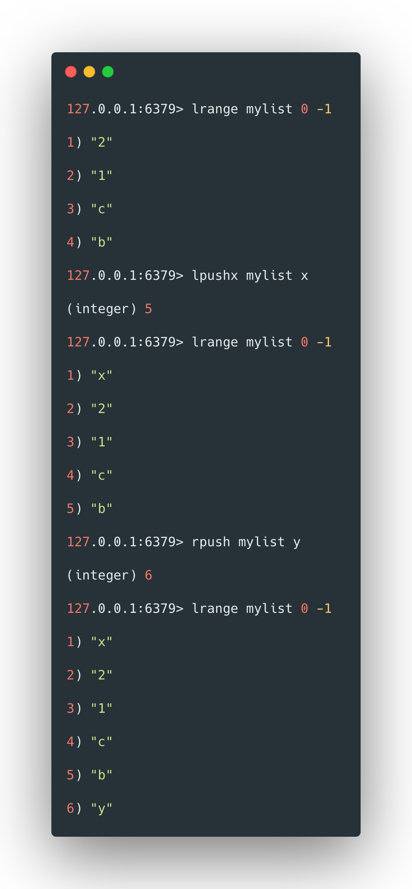
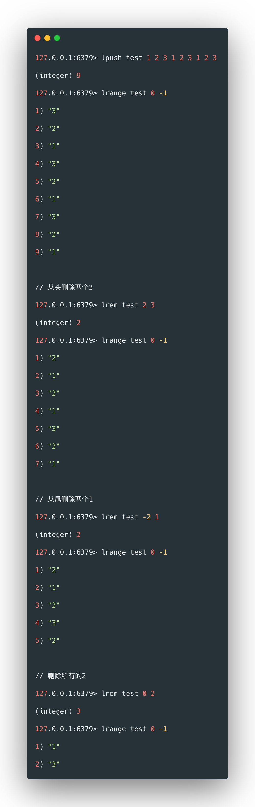
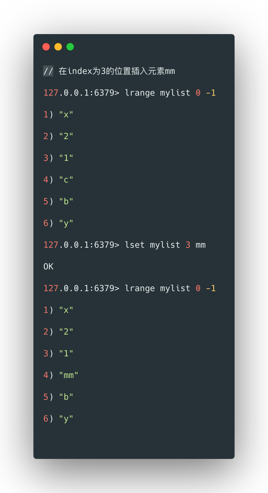
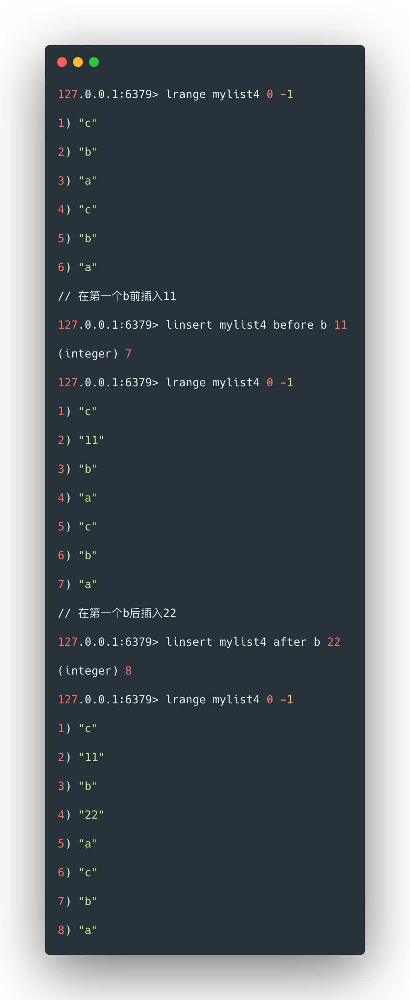
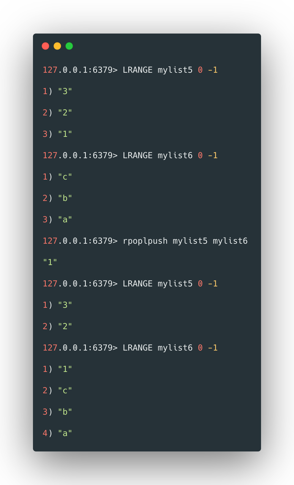

list类型是按照插入顺序排序的字符串列表，和数据结构中普通列表是一样的。可以在其头部和尾部插入新元素。插入时如果key不存在，则会为其创建新的列表；如果列表中的所有元素都被移除，那么这个key也会从数据库中移除。

 

向列表头尾插入和删除元素是比较高效的。如果插入和删除操作位于列表中间，则效率比较低。

 

## 列表两端添加

`lpush`可以从左侧向列表中添加数据，如果添加的key不存在，则会创建，其格式如下：

```bash
lpush [key] [value1] [value2] ...
```


 例如：



> 第一次添加将创建名为mylist的列表，从返回值可以看出，经过两次添加，列表长度为6。先添加的数据会被后添加的数据挤到右侧。

 

`rpush`可以从右侧向列表中添加数据，如果添加的key不存在，则会创建，其格式如下：

```bash
rpush [key] [value1] [value2] ...
```

 

例如：



>  先添加的数据会被后添加的数据挤到左侧。

 <br>


## 查看列表

`lrange`可以从左侧为起点查看列表，`lrange`也可以指定起始和结束的索引位置，其格式如下：

```bash
lrange [key] [起始索引] [结束索引]
```


 

例如：



 <br>


## 两端弹出

`lpop`和`rpop`可以实现左端和右端弹出列表第一个元素，如果不存在则弹出nil，其格式如下：

```bash
lpop [key] 
rpop [key] 
```


例如：



> 注意，只要是弹出，则这个元素在列表中将不再存在。

 <br>


## 获取元素个数

`llen`可以获取指定list中的元素的个数，其格式如下：

```bash
llen [key]
```


例如：



<br>

 

## 在头部添加元素

`lpushx`和`rpush`可以在指定的list的头部和尾部添加元素，其格式如下：

```bash
lpushx [key] [value]
rpushx [key] [value]
```


 

例如：



 

>  这种方式仅对已存在的list有效，如果指定的key为不存在的list，则返回0。

 <br>


## 删除元素

`lrem`可以删除在指定list中count个值为value的元素，如果count大于0则在删除时从头部到尾部依次遍历删除，如果count小于0则在删除时从尾部到头部部依次遍历删除，如果count为0则删除所有值为value的元素，其格式如下：

```bash
lrem [key] [count] [value]
```


例如：



 <br>


## 插入元素

`lset`来通过索引来添加元素，其格式为：

```bash
lset [key] [index] [value]
```


例如：

 


使用`linsert`在指定的元素前或后插入新的元素，其格式如下：

```bash
linsert [key] [before|after] [已存在的元素] [value] 
```


例如：



<br>

 

## rpoplpush指令

`rpoplpush`指令可以将一个list的尾部元素弹出，并加入另一个list的头部，其格式如下：

```bash
rpoplpush [source list] [target list]
```


例如：



 

这个指令的使用场景是：使用redis作为消息队列时，消费者从队列中取出数据进行处理。若此时消费者程序错误崩溃，那么此时取出的数据可以认为已经丢失，这将对业务数据的完整性造成影响。rpoplpush可以让消费者程序将消息从主队列取出放到备份队列中，实现备份的功能。

 