set类型可以看做没有排序的字符集合，可以对其执行添加、删除等操作。和list不同的是，set集合不允许出现重复元素。如果对set类型反复存入多个相同的元素，则只会保存一个。set最大包含40亿个元素。

 

## 添加元素

`sadd`可以向set中添加元素，其格式如下：

```bash
sadd [key] [value1] [value2] ...
```


例如：

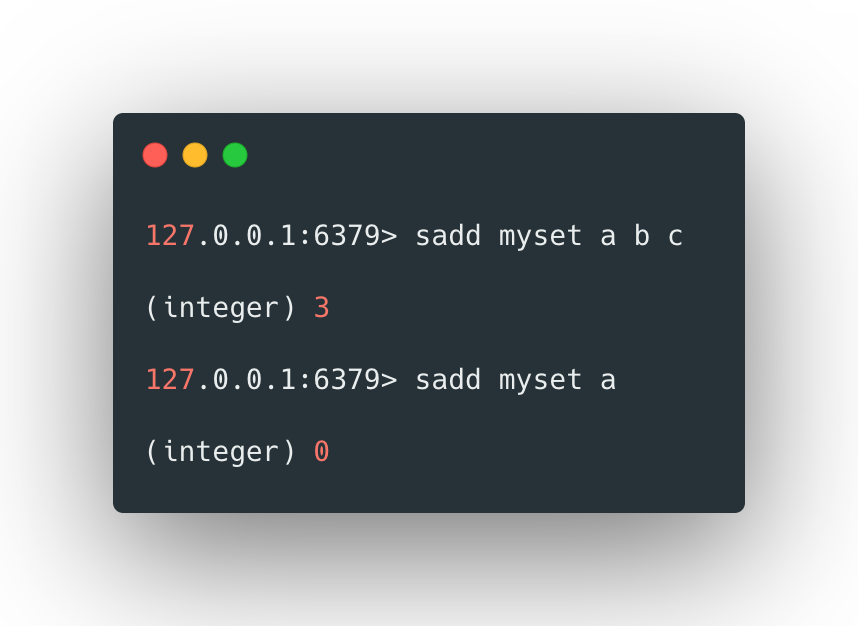

>  从返回值看，第二次添加a元素失败了，因为a已经存在，set不允许重复

 <br>


## 查看元素

`smembers`来查看set中的元素，其格式如下：

```bash
smembers [key]
```

 

例如：

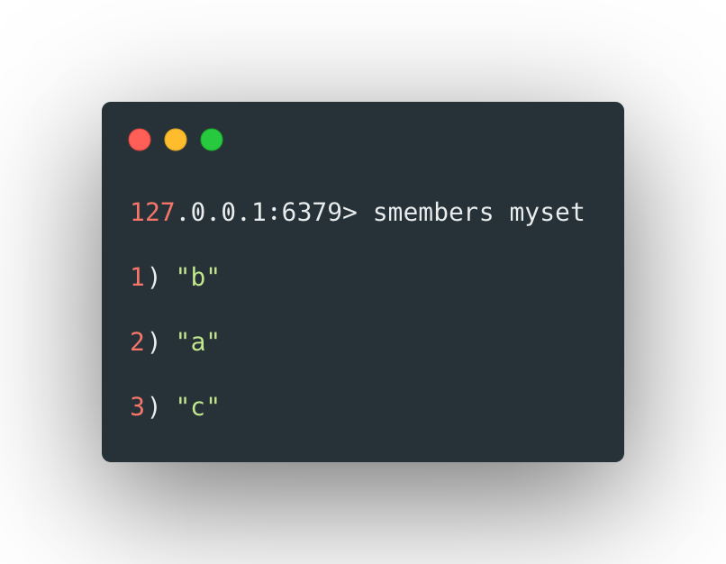

 <br>


## 删除元素

`srem`可以删除set中的元素，其格式如下：

```bash
srem [key] [value1] [value2] ... 
```


例如：

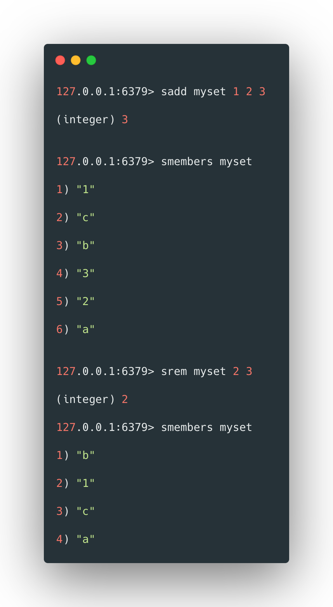

 <br>


## 判断元素是否存在

`sismember`可以判断指定元素是否存在于set中，其格式如下：

```bash
sismember [key] [target]
```


例如：

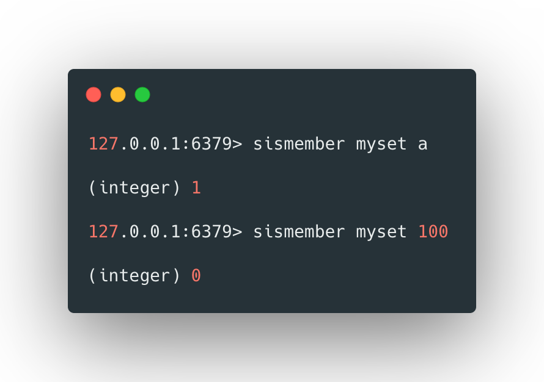

>  存在则返回1，不存在则返回0。

 <br>


## 差集运算

`sdiff`可以计算出两个set集合的差集，其格式如下：

```bash
sdiff [key1] [key2] ...
```


其中key的顺序将影响计算的结果，计算方式是第一个key中有的而后面key中没有的，例如：

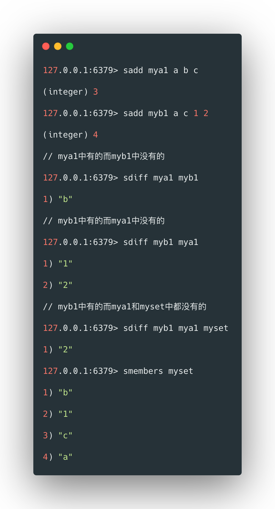 

<br>


可以使用`sdiffstore`将集合的差集存储到新的set中，其格式如下：

```bash
sdiffstore [new set] [key1] [key2] ...
```

 

例如：

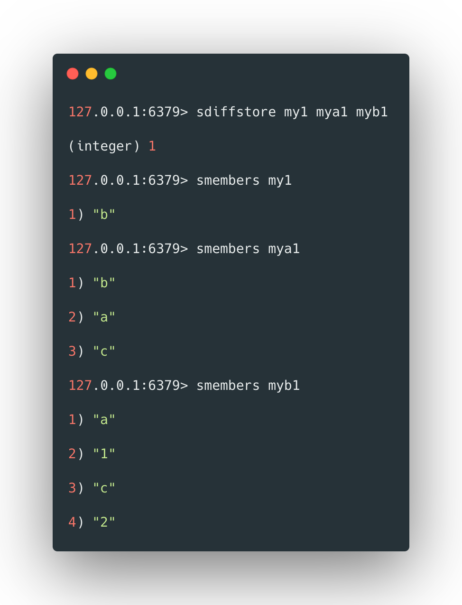

 <br>


## 交集运算

使用sinter可以计算set集合的交集，其格式如下：

```bash
sinter [key1] [key2] ...
```


例如：

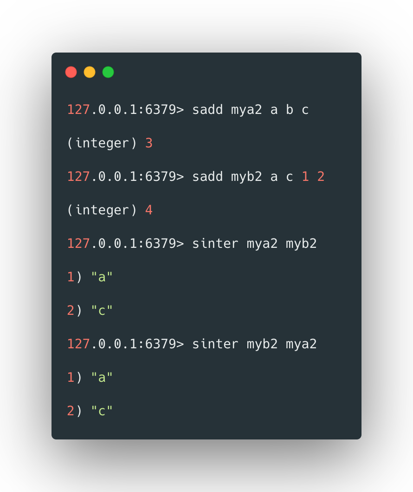

 

<br>


可以使用`sinterstore`将集合的交集存储到新的集合中，其格式如下：

```bash
sinterstore [new set] [key1] [key2] ...
```


例如：

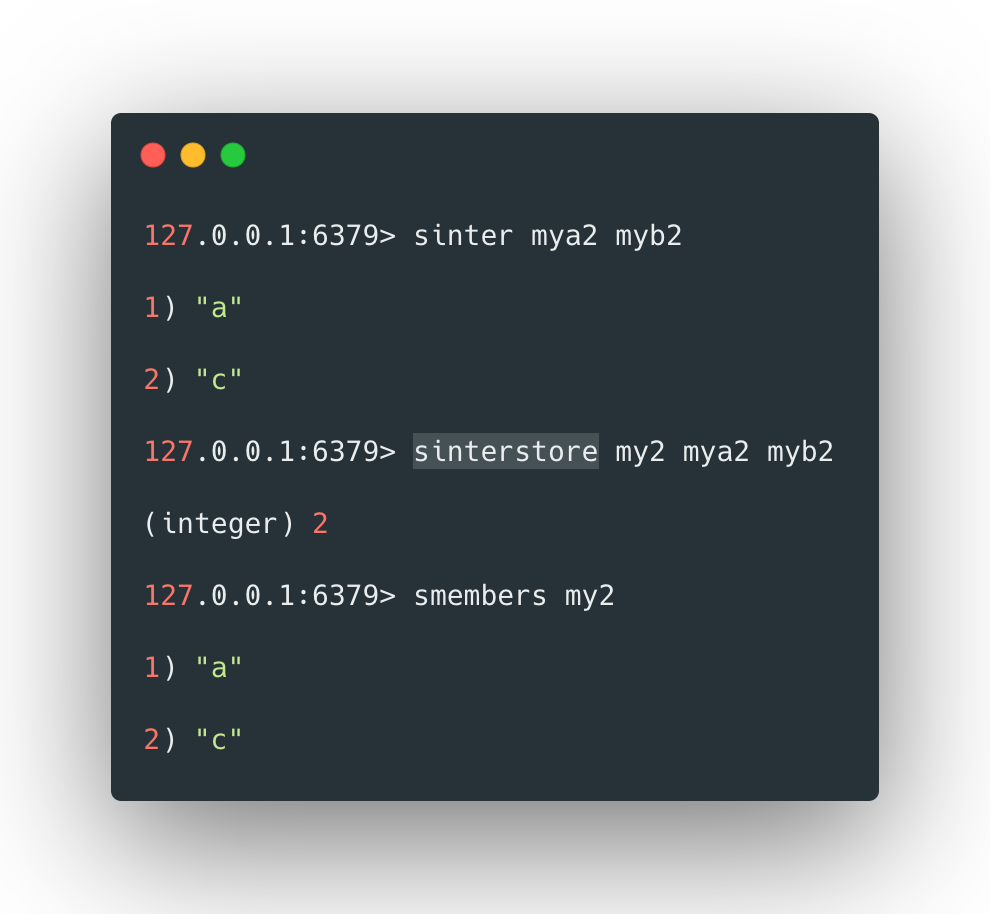

 <br>


## 并集运算

使用`sunion`可以计算集合的并集，其格式如下：

```bash
sunion [key1] [key2] ...
```


例如：

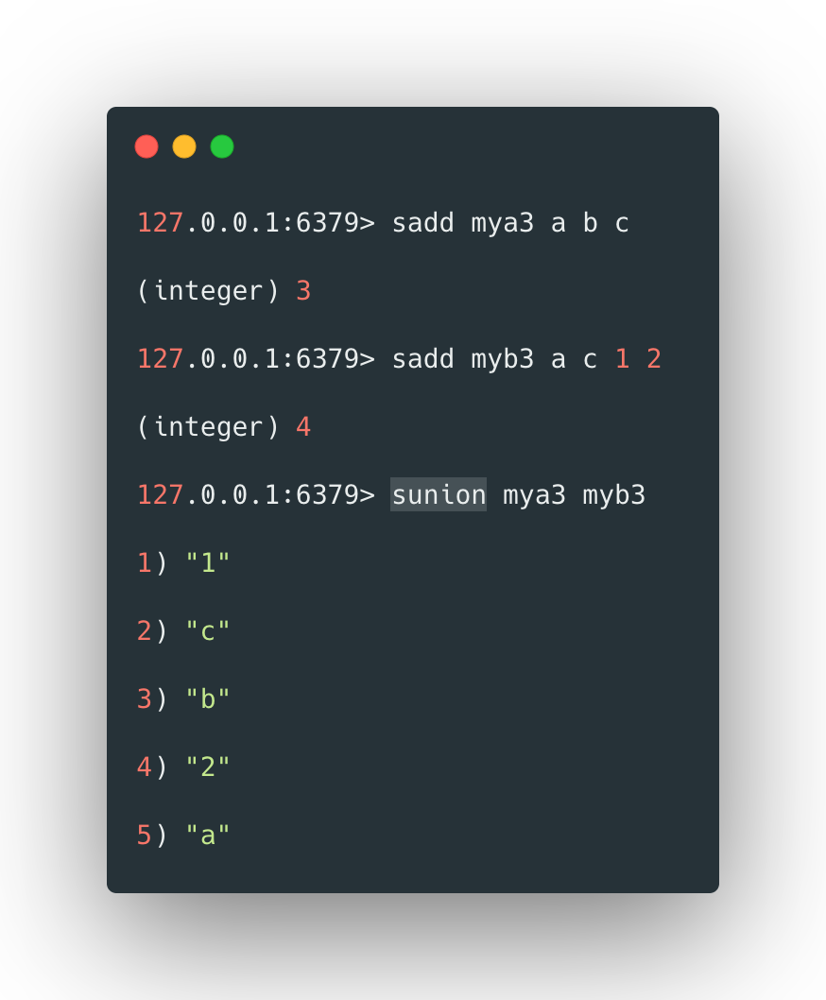

<br>

 

可以使用`sunionstore`将集合的并集存储到新的set中，其格式如下:

```bash
sunionstore [new set] [key1] [key2] ...
```


例如：

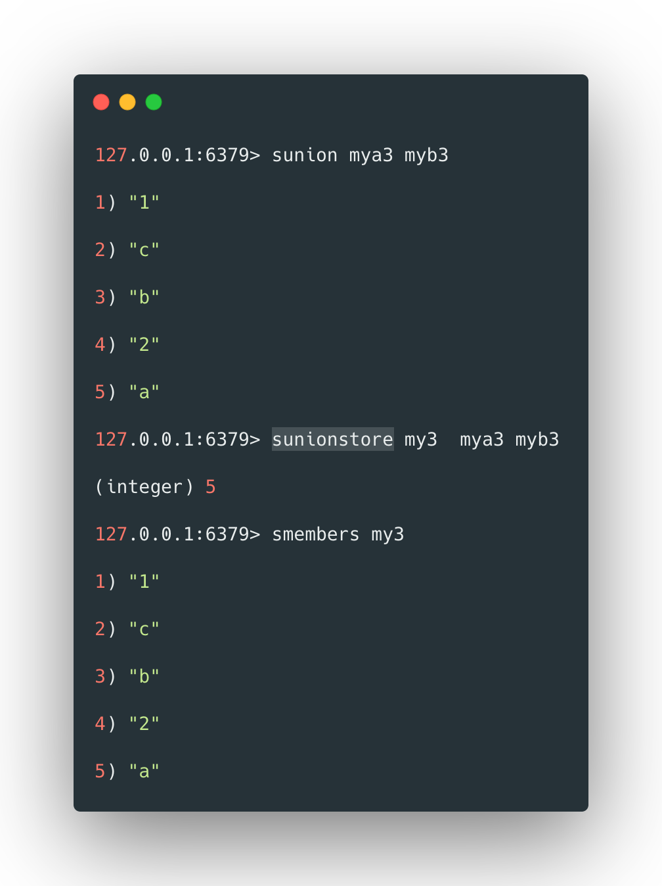

<br>

 

## 获取元素个数

使用`scard`可以获取集合中元素的个数，其格式如下：

```bash
scard [key]
```


例如：

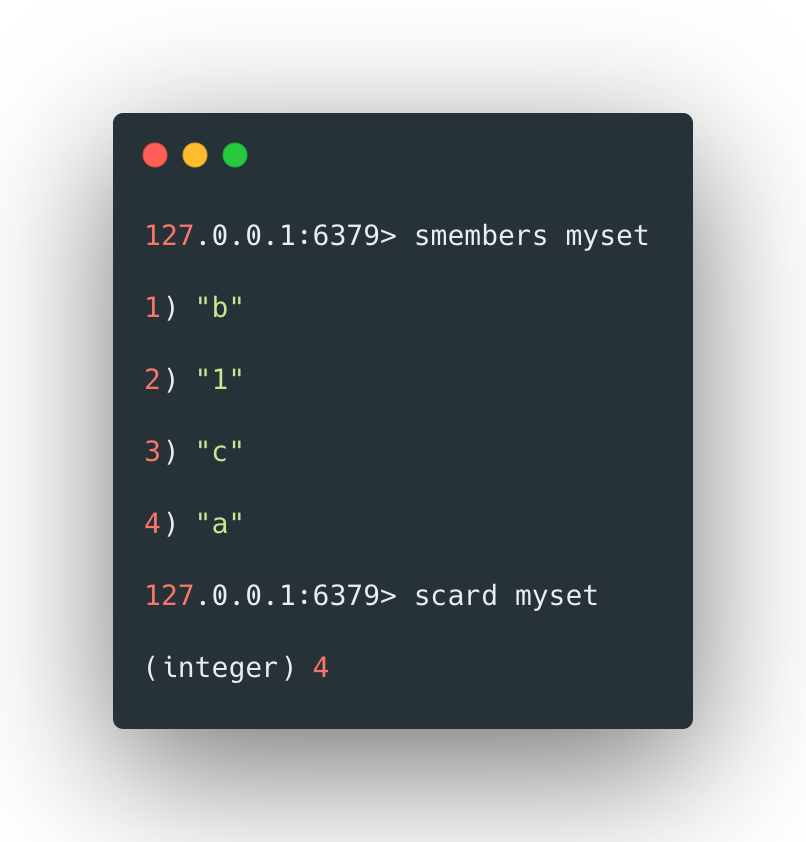

<br>


## 随机返回set元素

`srandmember`可以随机返回set中的一个元素，其格式如下：

```bash
srandmember [key]
```


例如：

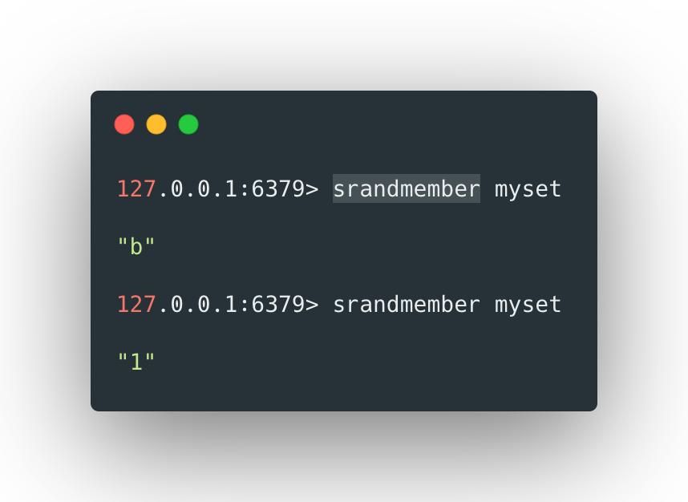


