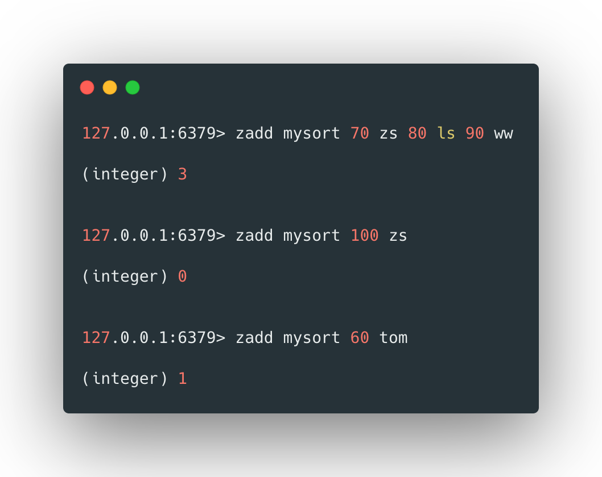
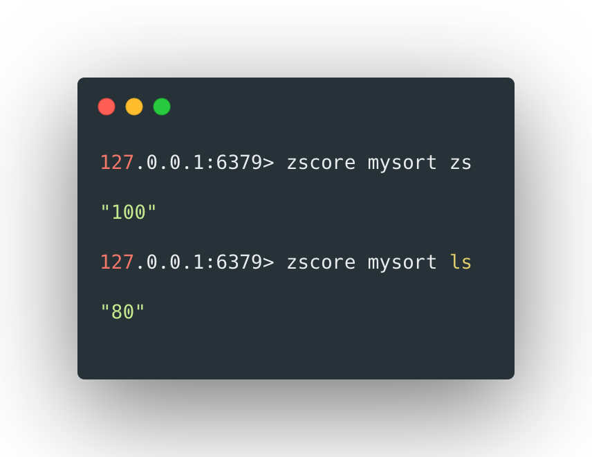
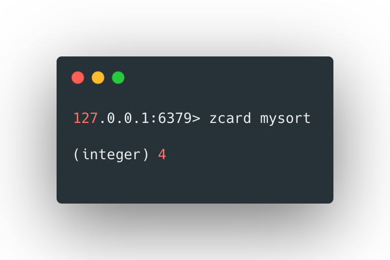
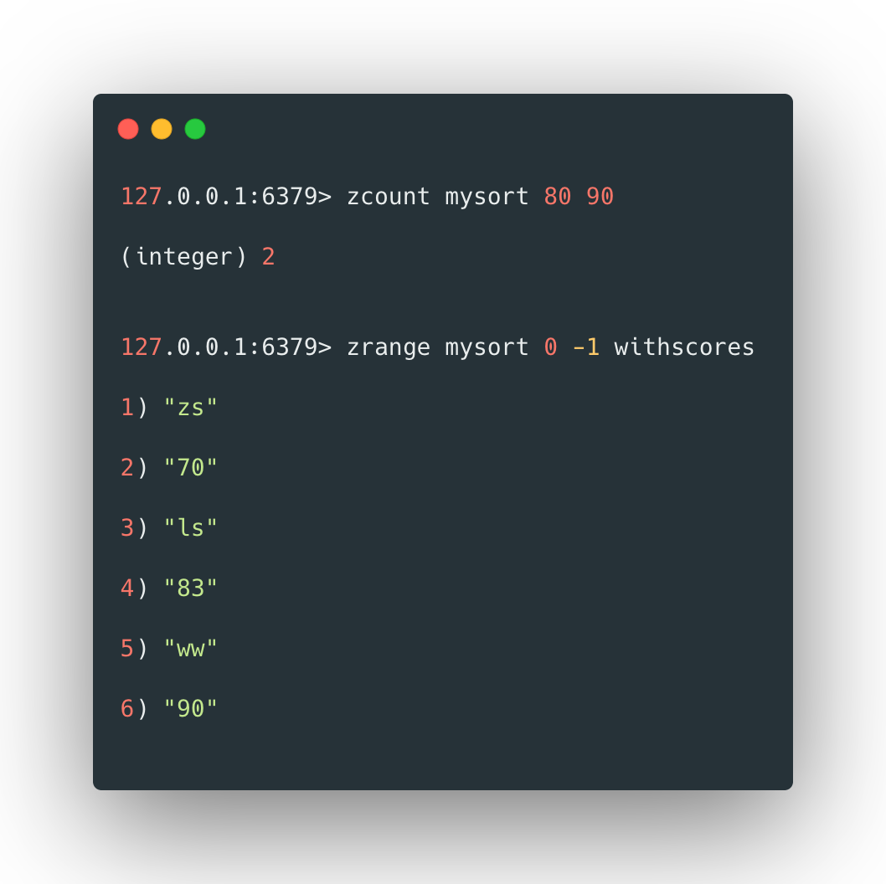

`sorted-set`和`set`的区别是，`sorted-set`是有序的`set`（通过内置的score来控制排序），其访问和修改是非常高效的。主要应用于游戏排名和微博话题排列。

<br>


## 添加元素

使用`zadd`来添加元素，其格式如下：

```bash
zadd [key] [score1] [value1] [score2] [value3] ...
```

 

例如：



***\*分数来控制set中排序，如果添加的值已经存在（第二步），那么将会用这个值的新的score替换原来的score，并返回0。\****

<br> 

## 查看元素

使用`zscore`可以查看某一元素的分数，其格式如下：

```bash
zscore [key] [value]
```


 例如：

 


使用`zcard`可以获得set中元素的个数，其格式如下：

```bash
zcard [key]
```


 

例如：



 


可以使用`zcount`获取分数在某一范围内的元素的个数，其格式如下：

```bash
zcount [key] [start score] [end score]
```


 例如：



 

 <br> 

 

## 删除元素

使用zrem可以删除set中的元素，其格式如下：

```bash
zrem [key] [value1] [value2] ...
```


 

例如：

```bash
127.0.0.1:6379> zrem mysort tom ww

(integer) 2

127.0.0.1:6379> zcard mysort

(integer) 2
```


 

可以使用`zremrangebyrank`来实现删除指定范围内的元素，其格式如下：

```bash
zremrangebyrank [key] [开始index] [结束index]
```


 

例如：

```bash
127.0.0.1:6379> zrange mysort 0 -1 

1) "ls"

2) "jack"

3) "rose"

4) "zs"

127.0.0.1:6379> zremrangebyrank mysort 0 2

(integer) 3

127.0.0.1:6379> zrange mysort 0 -1 

1) "zs"
```


 

也可以使用`zremrangebyscore`按照分数的范围进行删除，其格式如下：

```bash
zremrangebyscore [key] [起始score] [结束score]
```


 

例如：

```bash
127.0.0.1:6379> zrange mysort 0 -1  withscores

1) "zs"

2) "80"

3) "ls"

4) "90"

5) "ws"

6) "100"

127.0.0.1:6379> zremrangebyscore mysort 80 100

(integer) 3

127.0.0.1:6379> zrange mysort 0 -1  withscores

(empty list or set)
```


<br>


## 范围查找

使用`zrange`可以查看指定索引范围内的元素，使用`withscores`可以连score一起显示，其格式如下：

```bash
zrange [key] [开始index] [结束index] <withscores>
```


 

例如：

```bash
127.0.0.1:6379> zadd mysort 85 jack 95 rose

(integer) 2

127.0.0.1:6379> zrange mysort 0 -1

1) "ls"

2) "jack"

3) "rose"

4) "zs"

127.0.0.1:6379> zrange mysort 0 -1 withscores

1) "ls"

2) "80"

3) "jack"

4) "85"

5) "rose"

6) "95"

7) "zs"

8) "100"


```


***\*可以看到其中的元素排序是按照score从小到大排列的。\****

 

也可以使用`zrevrange`来实现根据score从大到小排列，例如：

```bash
127.0.0.1:6379> zrevrange mysort 0 -1 withscores

1) "zs"

2) "100"

3) "rose"

4) "95"

5) "jack"

6) "85"

7) "ls"

8) "80"
```


 

可以使用`zrangebyscore`来根据score的值的范围进行查找，其格式如下：

```bash
zrange [key] [开始index] [结束index] <withscores> <limit [offset] [count]>
```


 

例如：

```bash
127.0.0.1:6379> zadd mysort 70 zs 80 ls 90 ww 

(integer) 3

127.0.0.1:6379> zrangebyscore mysort 0 100 

1) "zs"

2) "ls"

3) "ww"

127.0.0.1:6379> zrangebyscore mysort 0 100 withscores

1) "zs"

2) "70"

3) "ls"

4) "80"

5) "ww"

6) "90"

127.0.0.1:6379> zrangebyscore mysort 0 100 withscores limit 0 2

1) "zs"

2) "70"

3) "ls"

4) "80"
```

<br>


 

## score自增

使用`zincrby`可以将某一元素的score增加一定的值，其格式如下：

```bash
zscore [key] [步长] [元素]
```


 

例如：

```bash
127.0.0.1:6379> zscore mysort ls 

"80"

127.0.0.1:6379> zincrby mysort 3 ls

"83"

127.0.0.1:6379> zscore mysort ls 

"83"
```


