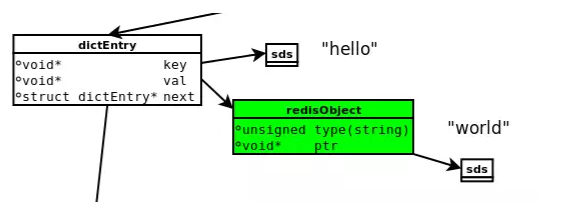
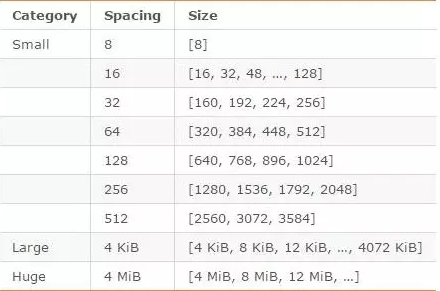

## 内存统计

### 查看内存信息

在通过redis-cli命令连接到redis后，可以使用下面的命令查看内存使用情况：

```bash
10.10.62.17:6379> INFO memory

Memory

used_memory:895280
used_memory_human:874.30K
used_memory_rss:11419648
used_memory_rss_human:10.89M
used_memory_peak:936168
used_memory_peak_human:914.23K
...
```


> info命令可以显示全部的redis服务器信息，后接参数memory则可以显示指定内容的信息。


其中比较重要的信息如下所述。

### 内存使用率

- `used_memory`、`used_memory_human`：redis分配器分配的总内存，包括使用的swap，单位字节；后者是带单位显示；
- `used_memory_rss`、`used_memory_rss_human`：redis进程占操作系统的内存，包括进程本身的内存、内存碎片，不包括swap，单位字节，后者带单位显示；
- `used_memory`和`used_memory_rss`，前者是从Redis角度得到的量，后者是从操作系统角度得到的量。

> 二者之所以有所不同，一方面是因为内存碎片和Redis进程运行需要占用内存，使得前者可能比后者小，另一方面虚拟内存的存在，使得前者可能比后者大。


### 内存碎片比率

- `mem_fragmentation_ratio`：内存碎片比率，该值是`used_memory_rss / used_memory`的比值，是衡量Redis内存碎片率的参数；这个值一般大于1，且该值越大，内存碎片比例越大。
- `mem_fragmentation_ratio<1`，说明Redis使用了虚拟内存，由于虚拟内存的媒介是磁盘，比内存速度要慢很多，当这种情况出现时，应该及时排查，如果内存不足应该及时处理，如增加Redis节点、增加Redis服务器的内存、优化应用等。

> 一般来说，`mem_fragmentation_ratio`在1.03左右是比较健康的状态（对于jemalloc来说）；刚开始redis服务器的`mem_fragmentation_ratio`值很大，是因为还没有向Redis中存入数据，Redis进程本身运行的内存使得`used_memory_rss `比`used_memory`大得多。


### 内存分配器

- `mem_allocator`：Redis使用的内存分配器，在编译时指定；内存分配器可以指定libc、jemalloc或者tcmalloc，默认是jemalloc。

<br>

## 内存划分

redis在运行过程中，不仅存储的数据需要占据内存，其程序本省以及其他东西也会占用内存。


### 数据

redis数据存储在内存中，这部分数据会统计在`used_memory`中。

Redis在存储对象时，并不是直接将数据扔进内存，而是会对对象进行各种包装：如redisObject、SDS等。


### 进程本身占用

Redis主进程本身运行肯定需要占用内存，如代码、常量池等等；这部分内存大约几兆，在大多数生产环境中与Redis数据占用的内存相比可以忽略。

>  这部分内存不是由jemalloc分配，因此不会统计在used_memory中。


除了主进程外，Redis创建的子进程运行也会占用内存，如Redis执行AOF、RDB重写时创建的子进程。当然，这部分内存不属于Redis进程，也不会统计在used_memory和used_memory_rss中。


### 缓冲内存

缓冲内存包括客户端缓冲区、复制积压缓冲区、AOF缓冲区等；

- 客户端缓冲：存储客户端连接的输入输出缓冲；
- 复制积压缓冲：用于部分复制功能；
- AOF缓冲区：用于在进行AOF重写时，保存最近的写入命令。

这部分内存由jemalloc分配，因此会统计在used_memory中。


### 内存碎片

内存碎片是Redis在分配、回收物理内存过程中产生的。如果对数据的更改频繁，而且数据之间的大小相差很大，可能导致redis释放的空间在物理内存中并没有释放，但redis又无法有效利用，这就形成了内存碎片。内存碎片不会统计在`used_memory`中。


内存碎片的产生与对数据进行的操作、数据的特点等都有关；此外，与使用的内存分配器也有关系：如果内存分配器设计合理，可以尽可能的减少内存碎片的产生。

> jemalloc便在控制内存碎片方面做的很好。


如果Redis服务器中的内存碎片已经很大，可以通过安全重启的方式减小内存碎片：因为重启之后，Redis重新从备份文件中读取数据，在内存中进行重排，为每个数据重新选择合适的内存单元，减小内存碎片。

<br>


## redis数据存储细节

### 概述

redis存储数据的细节涉及到内存分配器（jemalloc）、简单动态字符串（SDS）、5种对象类型及内部编码、redisObject。下图为执行 set hello world时设计的数据模型。




- `dictEntry`：redis中每一个键值对都有一个`dictEntry`，里面存储了指向Key和Value的指针；next指向下一个dictEntry，与本Key-Value无关；
- `key`：Key（”hello”）并不是直接以字符串存储，而是存储在SDS结构中；
- `redisObject`：Value(“world”)既不是直接以字符串存储，也不是像Key一样直接存储在SDS中，而是存储在redisObject中；
- `jemalloc`：无论是DictEntry对象，还是redisObject、SDS对象，都需要内存分配器（如jemalloc）分配内存进行存储。以DictEntry对象为例，有3个指针组成，在64位机器下占24个字节，jemalloc会为它分配32字节大小的内存单元；


不论Value是5种类型的哪一种，都是通过redisObject来存储的；而redisObject中的type字段指明了Value对象的类型，ptr字段则指向对象所在的地址。不过可以看出，字符串对象虽然经过了redisObject的包装，但仍然需要通过SDS存储。


### jemalloc

jemalloc作为Redis的默认内存分配器，在减小内存碎片方面做的相对比较好。jemalloc在64位系统中，将内存空间划分为小、大、巨大三个范围；每个范围内又划分了许多小的内存块单位；当Redis存储数据时，会选择大小最合适的内存块进行存储。




例如，如果需要存储大小为130字节的对象，jemalloc会将其放入160字节的内存单元中。


### redisObject

无论是哪种数据类型，Redis都不会直接存储，而是通过redisObject对象进行存储。Redis对象的类型、内部编码、内存回收、共享对象等功能，都需要redisObject支持。

RedisObject包含以下的几个字段：

- type：表示对象类型，4个比特，可以是字符串、列表、哈希等；
- encoding：表示对象的内部编码，4比特。通过这个字段来为不同场景的对象设置不同编码，提高效率和灵活性；
- lru：记录对象最后一次被程序访问的时间；
- refcount：记录该对象别引用的次数，类型为整型；当创建新对象时refcount初始化为1；当有新程序使用该对象时refcount加1；当对象不再被一个新程序使用时refcount减1；当refcount变为0时，对象占用的内存会被释放；
- ptr：ptr指针指向具体数据；


### SDS

SDS是简单动态字符串(Simple Dynamic String)的缩写，其包含以下几个字段：

- buf：表示字节数组，用于存储字符串；
- len：表示buf已使用的长度；
- free：表示buf未使用的长度；

