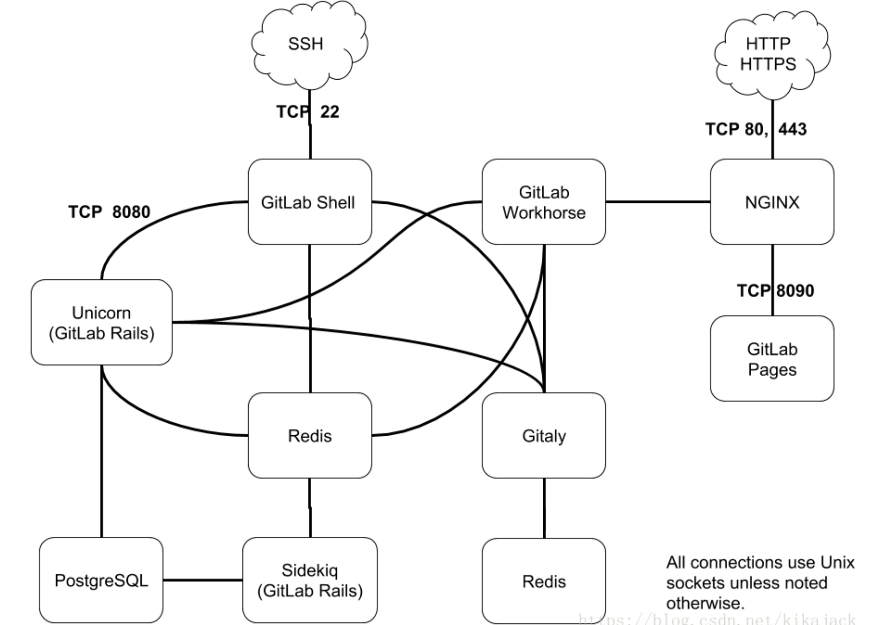

## gitlab组件

gitlab组件架构图如下：

其中的组件如下：

1. gitlab workhorse：存储gitlab处理的内容，可以放在外置硬盘或者其他文件系统(如NFS)上；
2. nginx：用户访问的前端代理；
3. PostgreSQL：存储元数据、问题、合并请求、用户和权限等数据；
4. Redis：消息中心，包含任务列表；
5. Sidekiq：负责发送邮件(邮件任务从Redis中获取)；
6. Unicorn：通过Redis中存储的用户信息进行用户验证、对代码进行修改操作；
7. gitlab shell：从ssh前台接受用户命令；
8. gitaly：提供高层次的gitrpc服务以访问git仓库；