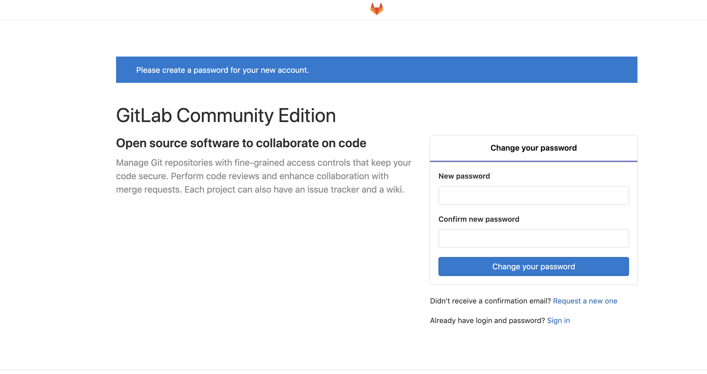

## 安装依赖

### 安装postfix

后续使用其发送邮件会用到：

```bash
yum install -y postfix
systemctl start postfix
systemctl enable postfix
```


### 安装openssh服务端和客户端

```bash
yum install -y openssh-server openssh-clients
systemctl start sshd
systemctl enable sshd
```


### 其他依赖

```bash
yum install -y curl policycoreutils-python
```

<br>


## 安装gitlab

这里从gitlab官方下载rpm包，使用的是官方提供的快速安装命令，也可以下载对应的rpm包安装：

```bash
# 添加官方yum源
curl -s https://packages.gitlab.com/install/repositories/gitlab/gitlab-ce/script.rpm.sh | bash

# yum安装，这里安装的是12.0.3的版本
yum install -y  gitlab-ce-12.0.3-ce.0.el7.x86_64
```

<br>

## 配置gitlab

安装完成后会在 `/etc/gitlab/` 下生成一个 `gitlab.rb` 的文件，需要对这个文件进行一定的修改：

```bash
# external_url为gitlab对外访问地址，包括邮件展示地址、拉去代码地址等；这里使用本机内网ip
external_url 'http://10.10.62.17/'

# 修改gitlab服务端口(因为后续的jenkins计划和gitlab安装在一台上所以要改，如果不在一台可以跳过)
unicorn['port'] = 8081
```

<br>

## 加载配置

运行下面的命令加载配置，第一次加载时间较长：

```bash
gitlab-ctl reconfigure
```


> 这个命令是gitlab用来将修改过的配置立即生效的


当最后出现下面提示时表示加载完成：

```bash
gitlab Reconfigured!
```

<br>

## 查看gitlab状态

通过下面的命令查看gitlab各组件的状态：

```bash
gitlab-ctl status
```

我的输出如下：

```bash
run: alertmanager: (pid 30606) 83s; run: log: (pid 30264) 131s
run: gitaly: (pid 30438) 86s; run: log: (pid 29657) 229s
run: gitlab-monitor: (pid 30493) 85s; run: log: (pid 30156) 149s
run: gitlab-workhorse: (pid 30466) 86s; run: log: (pid 29970) 174s
run: grafana: (pid 30632) 82s; run: log: (pid 30405) 99s
run: logrotate: (pid 30015) 164s; run: log: (pid 30069) 161s
run: nginx: (pid 29981) 170s; run: log: (pid 30001) 167s
run: node-exporter: (pid 30482) 86s; run: log: (pid 30128) 155s
run: postgres-exporter: (pid 30621) 83s; run: log: (pid 30307) 125s
run: postgresql: (pid 29741) 224s; run: log: (pid 29790) 222s
run: prometheus: (pid 30508) 84s; run: log: (pid 30220) 137s
run: redis: (pid 29584) 236s; run: log: (pid 29594) 235s
run: redis-exporter: (pid 30500) 85s; run: log: (pid 30184) 143s
run: sidekiq: (pid 29925) 182s; run: log: (pid 29940) 179s
run: unicorn: (pid 29893) 188s; run: log: (pid 29920) 185s
```

<br>

## 停止、重启gitlab

停止、启动和重启gitlab的命令如下：

```bash
gitlab-ctl stop 
gitlab-ctl start
gitlab-ctl restart
```


## 查看日志

通过下面的命令可以看到每一个组件的日志文件及其内容：

```bash
gitlab-ctl tail
```


想看某个组件的日志可以在上面命令的基础上指定组件名称，例如：

```bash
gitlabctl tail nginx
```


还可以在上面命令的基础上指定某一个日志文件，例如：

```bash
gitlab-ctl tail gitlab-rails/production_json.log
```

<br>


## 访问gitlab

前面我绑定的是内网ip，我的PC和服务器在一个内网下，所以可以直接打开浏览器输入服务器IP地址，便可以访问到gitlab了




