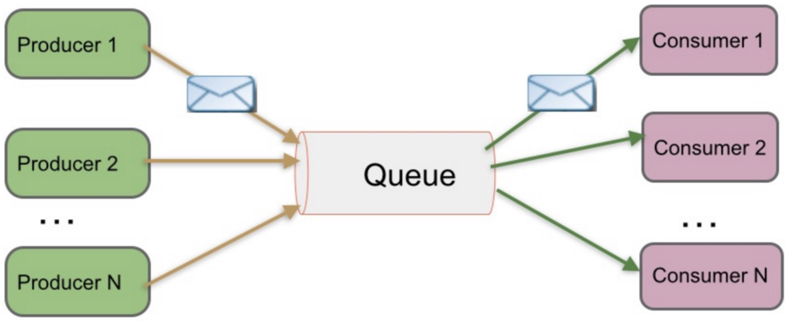
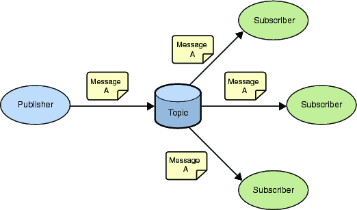

 

我们知道常见的消息系统有Kafka、RabbitMQ、ActiveMQ等等，但是这些消息系统中所使用的消息模式有Peer-to-Peer (Queue)和Publish/Subscribe（Topic）两种。

 

## Peer-to-Peer (Queue)

### 介绍

简称PTP队列模式，也可以理解为点到点。例如单发邮件，发送一封邮件给A，发送过之后邮件会保存云端服务器，当A打开邮件客户端并且成功连接云端服务器后，可以自动接收邮件或者手动接收邮件到本地，当服务器云端的邮件被A消费过之后，云端就不再存储(这根据邮件服务器的配置方式而定)。

- `Producer`：生产者
- `Queue`：队列
- `Consumer`：消费者

### 工作原理

1. 消息生产者`Producer1`生产消息到`Queue`，然后`Consumer1`从Queue中取出并且消费消息。
2. 消息被消费后，`Queue`将不再存储消息，其它所有`Consumer`不可能消费到已经被其它Consumer消费过的消息。
3. `Queue`支持存在多个`Producer`，但对一条消息而言，只有一个`Consumer`可以消费，其它Consumer则不能再次消费。
4. 但`Consumer`不存在时，消息则由`Queue`一直保存，直到有`Consumer`把它消费。

 

## Publish/Subscribe（Topic）

### 介绍

简称发布/订阅模式。例如微博有30万粉丝，今天更新了一条微博，那么这30万粉丝都可以接收到微博更新，大家都可以消费消息。

- `Publisher`：发布者
- `Topic`：主题
- `Subscriber`：订阅者

### 工作原理

1. 消息发布者`Publisher`将消息发布到主题`Topic`中，同时有多个消息消费者 `Subscriber`消费该消息。
2. 和PTP方式不同，发布到`Topic`的消息会被所有订阅者消费。
3. 当发布者发布消息，不管是否有订阅者，都不会报错信息。
4. 一定要先有消息发布者，后有消息订阅者。

 

## 常用消息系统对比

- RabbitMQ： Erlang编写，支持多协议 AMQP，XMPP，SMTP，STOMP。支持负载均衡、数据持久化。同时 支持Peer-to-Peer和发布/订阅模式；
- Redis： 基于Key-Value对的NoSQL数据库，同时支持MQ功能，可做轻量级队列服务使用。就入队操作而言， Redis对短消息(小于10KB)的性能比RabbitMQ好，长消息的性能比RabbitMQ差。
- ZeroMQ： 轻量级，不需要单独的消息服务器或中间件，应用程序本身扮演该角色，Peer-to-Peer。它实质上是 一个库，需要开发人员自己组合多种技术，使用复杂度高；
- ActiveMQ：JMS实现，Peer-to-Peer，支持持久化、XA事务；
- Kafka/Jafka：高性能跨语言的分布式发布/订阅消息系统，数据持久化，全分布式，同时支持在线和离线处理；
- MetaQ/RocketMQ：纯Java实现，发布/订阅消息系统，支持本地事务和XA分布式事务；