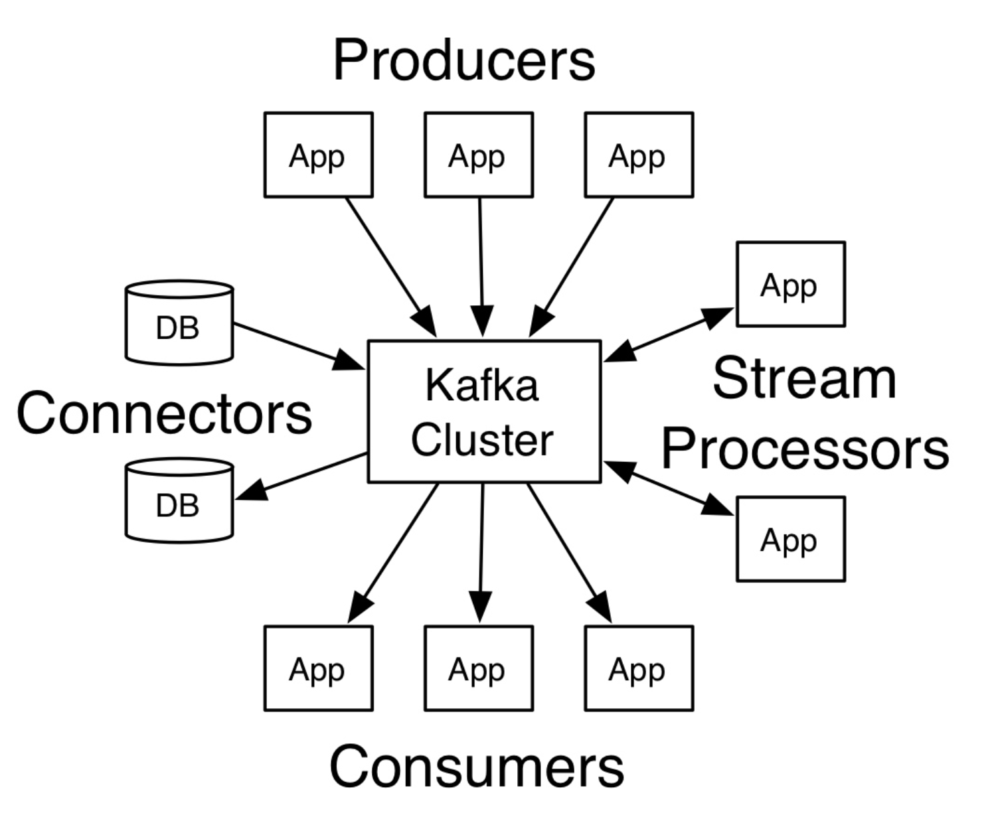
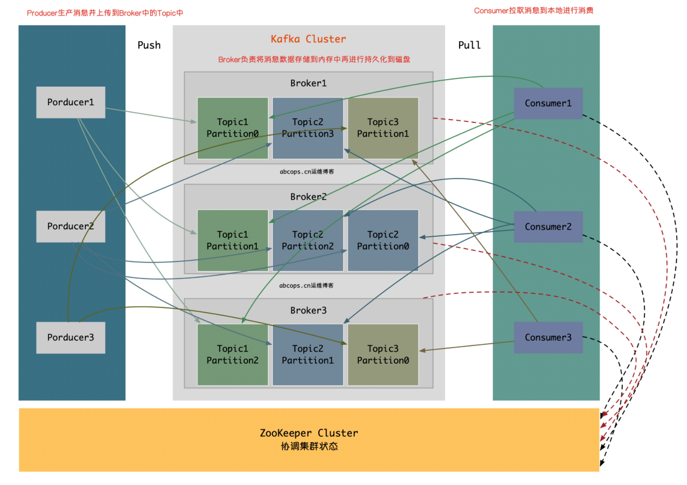
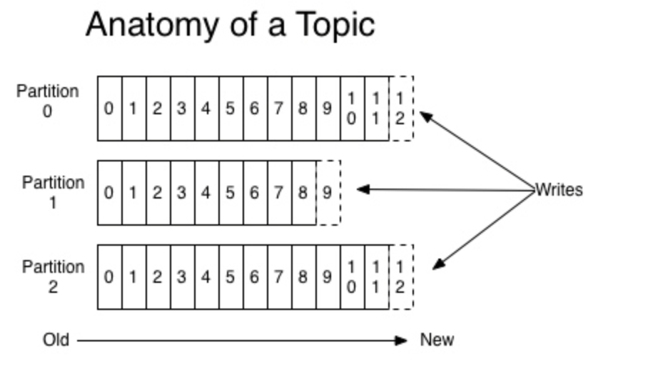
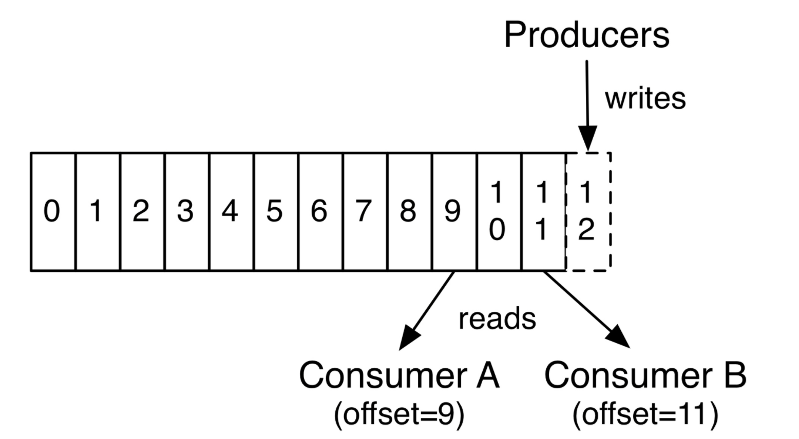
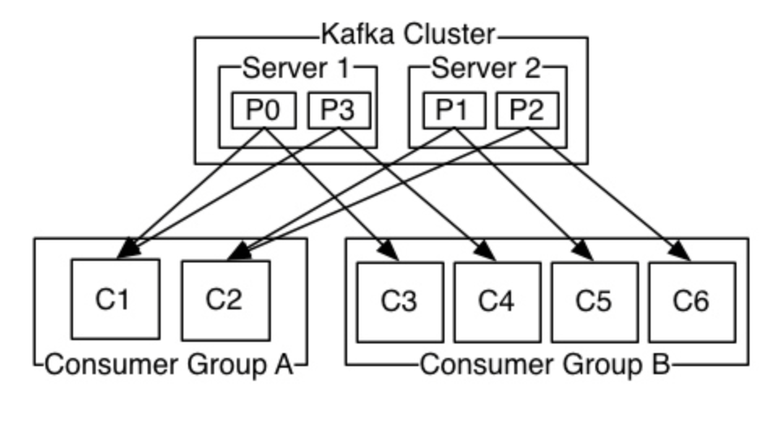

## kafka是什么

Kafka是Apache旗下的一款分布式流媒体平台，Kafka是一种高吞吐量、持久性、分布式的发布订阅的消息队列系统。它最初由LinkedIn(领英)公司发布，使用Scala语言编写，与2010年12月份开源，成为Apache的顶级子项目。它主要用于处理消费者规模网站中的所有动作流数据。动作指(网页浏览、搜索和其它用户行动所产生的数据)。

 

## kafka特点

1. **高吞吐量**：可以满足每秒百万级别消息的生产和消费。
2. **持久性**：有一套完善的消息存储机制，确保数据高效安全且持久化。
3. **分布式**：基于分布式的扩展；Kafka的数据都会复制到几台服务器上，当某台故障失效时，生产者和消费者转而使用其它的Kafka。
4. Kafka作为一个集群运行在一个或多个服务器上，这些服务器可以跨多个机房，所以说kafka是分布式的发布订阅消息队列系统。
5. Kafka集群将记录流存储在称为Topic的类别中。
6. 每条记录由键值；"key value"和一个时间戳组成。

 

## 核心API

1. **Producer API**：生产者API，允许应用程序将一组记录发布到一个或多个Kafka Topic中。

2. **Consumer API**：消费者API，允许应用程序订阅一个或多个Topic，并处理向他们传输的记录流。

3. **Streams API**：流API，允许应用程序充当流处理器，从一个或者多个Topic中消费输入流，并将输出流生成为一个或多个输出主题，从而将输入流有效地转换为输出流。

4. **Connector API**：连接器API，允许构建和运行可重用的生产者或消费者，这些生产者或消费者将Kafka Topic连接到现有的应用程序或数据系统。例如：连接到关系数据库的连接器可能会捕获对表的每次更改。

   

   > 在Kafka中，客户端和服务器之间的通信采用TCP协议完成，该协议经过版本控制，新版本与旧版本保存向后兼容性，我们为Kafka提供了一个Java客户端，但是客户端可以使用多种语言。

 

## kafka架构

- **Producer：**消息和数据的生产者，主要负责生产`Push`消息到指定Broker的Topic中。

- **Broker：**Kafka节点就是被称为Broker，Broker主要负责创建Topic，存储Producer所发布的消息，记录消息处理的过程，先将消息保存到内存中，然后持久化到磁盘。

- **Topic：**同一个Topic的消息可以分布在一个或多个Broker上，一个Topic包含一个或者多个Partition分区，数据被存储在多个Partition中。

- **replication-factor：**复制因子；这个名词在上图中从未出现，为创建当前的Topic是否需要副本，如果在创建Topic时将此值设置为1的话，代表整个Topic在Kafka中只有一份，该复制因子数量建议与Broker节点数量一致。

- **Partition：**分区；在这里被称为Topic物理上的分组，一个Topic在Broker中被分为1个或者多个Partition，也可以说为每个Topic包含一个或多个Partition，(一般为kafka节. 点数CPU的总核心数量)分区在创建Topic的时候可以指定。分区才是真正存储数据的单元。

- **Consumer：**消息和数据的消费者，主要负责主动到已订阅的Topic中拉取消息并消费。

- **ZooKeeper：**ZooKeeper负责维护整个Kafka集群的状态，存储Kafka各个节点的信息及状态，实现Kafka集群的高可用，协调Kafka的工作内容。

  

> 为什么Consumer不能像Producer一样的由Broker去push数据呢？因为Broker不知道Consumer能够消费多少，如果push消息数据量过多，会造成消息阻塞，而由Consumer去主动pull数据的话，Consumer可以根据自己的处理情况去pull消息数据，消费完多少消息再次去取。这样就不会造成Consumer本身已经拿到的数据成为阻塞状态。

Kafka从0.8版本开始，Producer并不需要根据ZooKeeper来获取集群状态，而是在配置中指定多个Broker节点进行发送消息，同时跟指定的Broker建立连接，来从该Broker中获取集群的状态信息，这是Producer可以知道集群中有多少个Broker是否在存活状态，每个Broker上的Topic有多少个Partition，Prodocuer会讲这些元信息存储到Producuer的内存中。如果Producoer像集群中的一台Broker节点发送信息超时等故障，Producer会主动刷新该内存中的元信息，以获取当前Broker集群中的最新状态，转而把信息发送给当前可用的Broker，当然Prodocuer也可以在配置中指定周期性的去刷新Broker的元信息以更新到内存中。

**只有Broker和ZooKeeper才是服务，而Producer和Consumer只是Kafka的SDK**

 

## 主题和日志

主题和日志官方被称为是`Topic and log`。Topic是记录发布到的类别或者订阅源的名称，Kafka的Topic总是多用户的；也就是说，一个Topic可以有零个、一个或者多个消费者订阅写入它的数据。每个Topic Kafka集群都为一个Partition分区日志。

每个Partition分区都是一个有序的记录序列(不可变),如果有新的日志会按顺序结构化添加到末尾，分区中的记录每个都按顺序的分配一个ID号，称之为偏移量，在整个Partition中具有唯一性。如上图所示，有Partition、Partition1、Partition2，其中日志写入的顺序从Old到New，ID号从0-12等。

Kafka集群发布过的消息记录会被持久化到硬盘中，无论该消息是否被消费，发布记录都会被Kafka保留到硬盘当中，我们可以设置保留期限。例如，如果保留策略我们设置为两天，则在发布记录的两天内，该消息可供使用，之后则被Kafka丢弃以释放空间，Kafka的性能是非常出色的，可以长时间保留数据不成问题。

实际上，以消费者为单位地保留的唯一元数据是消费者在日志中的偏移或位置。这个偏移量由消费者控制的：消费者通常会在读取记录时线性地推进偏移量，但事实上，由于消费者的位置时由消费者控制的，所以它可以按照自己喜欢的任何顺序进行消费记录。例如，消费者可以重置之前的偏移量来处理之前的数据，或者直接从最新的偏移量开始消费。这些功能的组合意味着Kafka消费者非常的不值一提，他们可以很随便，即使这样，对集群或者其他消费者没有太大影响。例如：可以使用命令工具来“tail”任何Topic的内容，而不会更改任何现有使用者所使用的内容。

日志中分区有几个用途。首先，他们允许日志的大小超出适合单台服务器的大小，每个单独的分区必须适合托管它的服务器，但是一个主题可能有许多分区，因此它可以处理任意数量的数据，其次，他们作为并行的单位-更多的是在一点上。

 

## Distribution(分布)

日志Partition分区分布在Kafka集群中的服务器上，每台服务器都处理数据并请求共享分区。为了实现容错，每个Partition分区被复制到多个可配置的Kafka集群中的服务器上。

- `leader`：领导者
- `followers`：追随者

每个Partition分区都有一个`leader`(领导者)服务器，是每个Partition分区，假如我们的Partition1分区分别被复制到了三台服务器上，其中第二台为这个Partition分区的领导者，其它两台服务器都会成为这个Partition的`followers`(追随者)。

其中Partition分片的`leader`(领导者)处理该Partition分区的所有读和写请求，而`follower`(追随者)被动地复制`leader`(领导者)所发生的改变，如果该Partition分片的领导者发生了故障等，两个`follower`(追随者)中的其中一台服务器将自动成为新的`leader`领导者。每台服务器都充当一些分区的`leader`(领导者)和一些分区的`follower`(追随者)，因此集群内的负载非常平衡。

 

## Geo-Replication(地域复制)

Kafka Mirrormaker为集群提供地域复制支持，使用MirrorMaker，可以跨多个机房或云端来复制数据，可以在主动/被动方案中使用它进行备份和恢复；在主动方案中，可以使数据更接近用户，或支持数据位置要求。

 

## Producers(生产者)

生产者将数据发布到他们选择的Topic，生产者负责选择分配给Topic中的哪个分区的记录。这可以通过循环方式来完成，只是为了负载均衡，或者可以根据一些语义分区函数(比如基于记录中的某个键)来完成。

 

## Consumers(消费者)

- `Consumers`：消费者
- `Consumers Group`：消费者组
- `Consumers Group name`：消费者组名

`Consumers`使用`Consumers Group name`标记自己，并且发布到Topic的每个记录被传递到每个订阅`Consumers Group`中的一个Consumers实例，Consumers实例可以在单独的进程中，也可以在不同的机器，如果所有Consumers实例具有相同的`Consumers Group`，则记录将有效地在Consumers上进行负载均衡。

> 如果所有Consumers实例在不同的`Consumers Group`中，则每个记录将广播到所有Consumers进程中。

两个Kafka Cluster，托管了四个Partition(分区)，从P0-P3，包含两个`Consumers Group`分别是`Consumer Group A`和`Consumer Group B`，`Consumners Group A`有两个Consumers实例，B有四个Consumers实例。也就是消费者A组有两个消费者，B组有四个消费者。然后，更常见的是，我们发现Topic有少量的`Consumers Group`，每个消费者对应一个用户组，每个组有许多消费者实例组成，用于可伸缩和容错，这只不过是发布/订阅语义，其中订阅者是一组消费者，而不是单个进程。

在Kfaka中实现消费者的方式是通过在消费者实例上划分日志中的Partition分区，以便每个实例在任何时间点都是分配的“相同份额”，维护消费者组成功资格的过程由Kafka动态协议实现，如果新的消费者实例加入该消费者组，新消费者实例将从该组的其它成员手里接管一些分区；如果消费者实例故障，其分区将分发给其余消费者实例。

Kafka仅提供分区内记录的总顺序，而不是Topic中不同分区之间的记录。对于大多数应用程序而言，按分区排序和按键分许数据的能力已经足够，但是如果你需要记录总顺序，则可以使用只有一个分区的Topic来实现，尽管这意味着每个消费者组只有一个消费者进程。

 

## Consumer Group

Kafka采用的就是发布订阅模式，即一个消息产生者产生消息到Topic中，所有的消费者都可以消费到该条消息，采用异步模型；而P-T-P则是一个消息生产者生产的消息发不到Queue中，只能被一个消息消费者所消费，采用同步模型； 其实发布订阅模式也可以实现P-T-P的模式，即将多个消费者加入一个消费者组中，例如有三个消费者组，每个组中有3个消息消费者实例，也就是共有9个消费者实例，如果当Topic中有消息要接收的时候，三个消费者组都会去接收消息，但是每个人都接收一条消息，然后消费者组再将这条消息发送给本组内的一个消费者实例，而不是所有消费者实例，到最后也就是只有三个消费者实例得到了这条消息，当然我们也可以将这些消费者只加入一个消费者组，这样就只有一个消费者能够获得到消息了。

 

## Guarantees(担保)

在高级别的Kafka中提供了以下保证：

- 生产者发送到特定Topic分区的消息将按照其发送顺序附加。也就是说，如果一个Producers生产者发送了M1和M2，一般根据顺序来讲，肯定是先发送的M1，随后发送的M2，如果是这样，假如M1的编号为1，M2的编号为2，那么在日志中就会现有M1，随后有M2。
- 消费者实例按照他们存储在日志中的顺序查看记录。
- 对于具有复制因子N的Topic，Kafka最多容忍N-1个服务器故障，则不会丢失任何提交到日志的记录。

