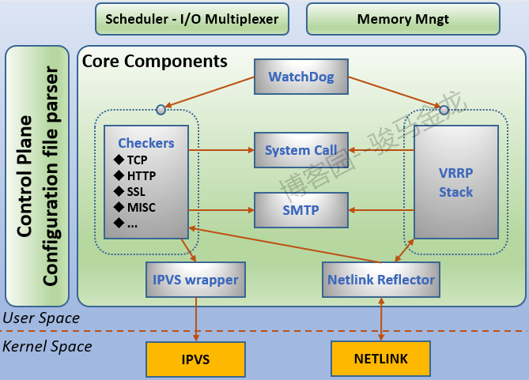
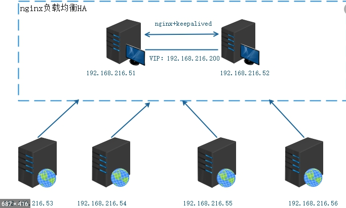

## 什么是keepalived

Keepalived是基于vrrp协议的一款高可用软件。Keepailived有一台主服务器和多台备份服务器，在主服务器和备份服务器上面部署相同的服务配置，使用一个虚拟IP地址对外提供服务，当主服务器出现故障时，虚拟IP地址会自动漂移到备份服务器。

 

## 架构和模块

从上面架构图中可以看到， Keepalived的多数核心功能模块均位于用户空间，而仅有IPVS和NETLINK模块位于内核空间，但是这两个内核模块正是Keepalived 实现负载均衡和路由高可用的核心模块，其中的NETLINK主要用于提供高级路由及其相关的网络功能。

Keepalived的几个核心功能模块如下：

- `watchdog`：监控checkers和vrrp子进程运行情况；
- `checkers`：真实服务器的健康检查（核心功能之一）；
- `vrrpstack`：负责负载均衡器之间的故障切换；
- `ipvs warpper`：发送设定的规则到内核ipvs代码；
- `netlink reflector`：设定vrrp的vip地址并提供相应的网络功能；

 

## 工作原理

> keepalived设计之初是为了构建高可用lvs架构。

在实际应用中， Keepalived通常部署在两台主备或一主多备的服务器上，所有运行Keepalived进程的服务器都遵循VRRP协议。在VRRP的协议框架下，作为Master的服务器将会处理两个主要任务：

1. 转发客户端访问请求到后端物理服务器以进行负载均衡；

2. 周期性的发送VRRP协议报文；

   

而作为Slave的服务器则负责接收VRRP报文，如果某一时刻作为Slave 的服务器接收VRRP报文失败，则认为Master故障， 并从Slave 中重新选举产生一个新的Master。

### 用户访问

从客户端的角度来看，访问请求的目的地址是位于VIP，而该VIP与客户端地址处于相同网络中， VIP 还可以是管理员指定的互联网域名，如www.example.com 。VIP在Keepalived的配置中通常被指定到一个或者多个虚拟服务器上，而虚拟服务器的主要任务便是监昕VIP及相应端口上的请求，当主服务器故障的时候， VIP会从一个Master转移到另一个服务器上（VIP漂移）。

 

## keepalived负载均衡算法

Keepalived所使用的负载均调度机制由集成到内核中的IPVS模块提供， IPVS是LVS项目的核心功能模块，其设计的主要目的之一就是解决单IP多服务器的工作环境，IPVS模块使得基于TCP/IP传输层（ 第4 层）的数据交换成为可能。在实际使用中， IPVS会在内核中创建一个名为IPVS Table的表，该表记录了后端服务器的地址及服务运行状态，通过IPVS Table, Keepalived便可跟踪并将请求路由到后端物理服务器中， 即LVS Router利用此表将来自Keepalived 虚拟服务器地址的请求转发到后端服务器池中，同时将后端服务器的处理结果转发给客户端。此外， IPVS table的表结构主要取决于管理员对指定的虚拟服务器所设置的负载均衡算法， Keepalived支持以下几种负载均衡算法。

### Round-Robin（RR）

**轮询负载均衡**，在这种算法中，服务请求会被依次转发到服务器池中的每一个服务器上，而不去评估服务器的当前负载或者处理能力，服务器池中的每一个服务器都被平等对待。如果使用Round-Robin负载均衡算法，每台后端服务器会轮询依次处理服务请求。

### Weighted Round-Robin（WRR）

**加权Round-Robin 算法**，是对Round-Robin 算法的一种扩展。在这种算法中，请求被依次转发到每一台服务器上，但是当前负载较轻或者计算能力较大的服务器会被转发更多的请求，服务器的处理能力通过用户指定的权重因子来决定，权重因子可以根据负载信息动态上调或者下调。如果服务器的配置差别较大，导致不同服务器的处理能力相差较大，则加权的Round-Robin 算法会是不错的选择，但是如果请求负载频繁变动，则权重较大的服务器可能会超负荷工作。

### Least-Connection（LC）

**最少连接算法**，在这种算法中，请求被转发到活动连接较少的服务器上。在Keepalived的实际使用中， 利用内核中的IPVS Table来记录后端服务器的活动连接，从而动态跟踪每个服务器的活动连接数。最少连接数算法是一种动态决策算法，它比较适合服务器池中每个成员的处理能力都大致相当，同时负载请求又频繁变化的场景， 如果不同服务器有不同的处理能力，则下面的加权最少连接数算法较为合适。

### Weighted Least-Connections（WLC）

**加权最少连接数算法**，在这种算法中，路由会根据服务器的权重，转发更多的请求到连接数较少的服务器上。服务器的处理能力通过用户指定的权重因子来决定，权重因子可以根据负载信息动态上调或者下调。一般来说，服务器加权算法主要用于集群存在不同类型服务器，而服务器配置和处理能力相差较大的场景中。

###  Destination Hash ScheduIing（DHS）

**目标地址哈希算法**，通过在静态Hash表中查询目的IP地址来确定请求要转发的服务器，这类算法主要用于缓存代理服务器集群中。

### Source Hash Scheduling（SHS）

**源地址哈希算法**，通过在静态Hash表中查询源IP地址来确定请求要转发的服务器，这类算法主要应用于存在多防火墙的LVS Router中。

###  Shortest Expected Delay

即最小延时算法，在这种算法中，请求被转发到具有最小连接响应延时的服务器上。

