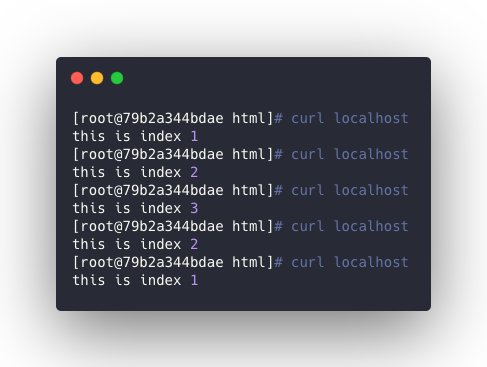

`--with-http_random_index_module`在yum安装时会默认加入，在源码安装时需要手动加入编译。


## 作用

<br>


在主目录中随机选择一个文件作为随机主页。


## 配置

<br>


**该模块需要配置在server中的location下。**


格式：

```bash
location / {
    random_index on;
}
```


> 默认 `random_index`为`off`。


例如：

```bash
server {
    listen       80;
    server_name  localhost;

    location / {
        root   /usr/share/nginx/html;
        random_index on;
        #index  index.html index.htm;
    }

    error_page   500 502 503 504  /50x.html;
    location = /50x.html {
        root   /usr/share/nginx/html;
    }
}
```


跟新配置后，作为测试，需要在根目录下创建几个静态文件作为测试：

```bash
touch /usr/share/nginx/html/{1,2,3}.html
echo this is index 1 > /usr/share/nginx/html/1.html
echo this is index 2 > /usr/share/nginx/html/2.html
echo this is index 3 > /usr/share/nginx/html/3.html
```


## 生效配置

<br>


```bash
nginx -t
nginx -s reload
```


通过浏览器访问首页，并不断刷新，可以看到3个页面会随机出现。




