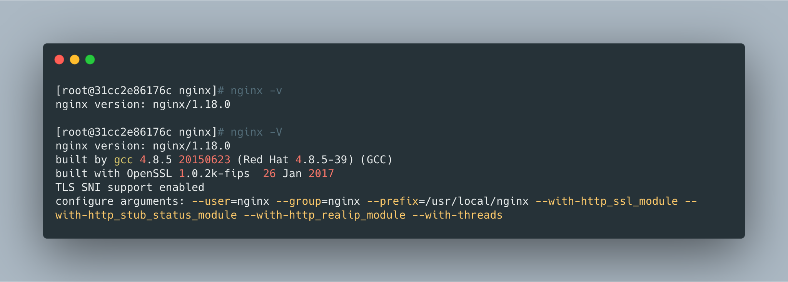

## 安装依赖

<br>


```bash
yum install -y gcc gcc-c++ autoconf pcre pcre-devel make automake yum-utils zlib zlib-devel openssl openssl-devel
```


<br>


## 下载源码包

<br>


这里使用的是1.18.0版本。

```bash
wget http://nginx.org/download/nginx-1.18.0.tar.gz
```


<br>


## 编译安装

<br>


```bash
# 添加用户和组
groupadd nginx
useradd -g nginx nginx 

# 编译安装
tar zxf nginx-1.18.0.tar.gz
cd cd nginx-1.18.0
./configure \
--user=nginx \
--group=nginx \
--prefix=/usr/local/nginx \
--with-http_ssl_module \
--with-http_stub_status_module \
--with-http_realip_module \
--with-threads

make && make install
```


> 编译时指定的模块需要根据实际业务增减；


```bash
# 设置环境变量
echo "export PATH=$PATH:/usr/local/nginx/sbin" >> /etc/profile
source /etc/profile
```


<br>


## 检查

<br>


```bash
nginx -v
nginx -V
```




<br>


## 设置nginx启动文件

<br>


```bash
cat > /usr/lib/systemd/system/nginx.service << EOF
[Unit]
Description=nginx service
After=network.target

[Service]
Type=forking
ExecStart=/usr/local/nginx/sbin/nginx
ExecReload=/usr/local/nginx/sbin/nginx -s reload
ExecStop=/usr/local/nginx/sbin/nginx -s quit
PrivateTmp=true

[Install]
WantedBy=multi-user.target
EOF
```


<br>


## 启动nginx

<br>


```bash
systemctl daemon-reload
systemctl start nginx
systemctl enable nginx
systemctl status nginx
```


<br>

## 安装的目录

<br>


在编译的时候指定了nginx的安装目录为：`--prefix=/usr/local/nginx`，安装后会有以下文件：

- `conf`：配置文件目录；
  - `fastcgi.conf`：fastcgi配置文件；
  - `mime.types`：设置http协议的Content-Type与扩展名对应关系的配置文件；
  - `uwsgi_params`：uwsgi配置文件；
  - `koi-win, koi-utf, win-utf`：编码转换配置文件；
  - `scgi_params`：scgi配置文件；
  - `fastcgi_params`：fastcgi配置文件；
  - `nginx.conf`：nginx主配置文件；
- `html`：默认的静态文件根目录；
- `sbin`：二进制命令文件目录；


