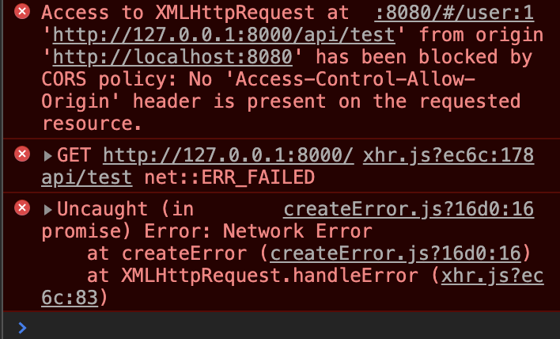

首先安装axios：

```shell
npm install axios --asve
```


安装完成后，在`main.js`中添加下面的几行代码引入axios：

```vue
import axios from 'axios'

Vue.use(axios);
Vue.prototype.$axios = axios;
```


然后component中请求的代码可以是如下的形式：

```vue
created() {
  	this.$axios.get('/api/test').then(response => {
  			console.log(response.data);
  	this.django_message = response.data.message
  	});
		this.$axios.get('/api/user').then(response => {
				console.log(response.data);
		this.user_list = JSON.parse(response.data.data)
		})
}
```


在使用vue请求后端django的时候，出现跨域问题，浏览器报错如下：




解决方式：

在vue项目的config目录下，编辑index.js文件，修改proxy代理配置：

```vue
proxyTable: {
      '/api': {
        target: 'http://127.0.0.1:8000/api',  // 接口地址
        changeOrigin: true,   // 是否跨域
        pathRewrite: {
          '^/api': ''   // rewrite重写
        }
      }
},
```


改动后需要重启vue