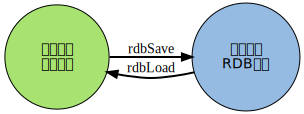
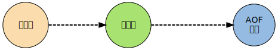

## 什么是Redis

Redis是C语言编写的开源的基于键值对的存储服务系统，支持多种数据结构的一种高性能，功能丰富的NoSQL数据库。

Redis很像memcache，整个数据都是放在内存中进行操作的，定期通过异步方式持久化到硬盘上。

> Redis有时候也会用户缓存，相比于memcache，如果是单纯的缓存场景，memcache性能是优于redis的；

## Redis特性

- **速度快**：单线程模型，数据存储在内存，最高可达10W OPS；
- **支持持久化**：提供AOF和RDB方式的持久化；
- **支持多种数据结构**：支持字符串、哈希、列表、集合、有序集合等数据结构；
- **支持多种编程语言**：提供TCP接口，支持Python，Java，Lua等；
- **功能丰富**：支持发布订阅、lua脚本、事物、pipeline等功能；
- **代码简单，使用简单**：核心代码量2W行，个性化定制方便；不依赖外部的库；
- **支持主从复制**
- **支持高可用和分布式**：2.8版本后提供Sentinel功能以支持高可用；3.0版本后支持分布式；
- **原子性**：redis所有操作都是原子的(要么成功要么失败)；

> redis支持的数据结构有：字符串(string)、哈希(hash)、字符串列表(list)、字符串集合(set)、有序字符串集合(sorted set)等

## Redis应用场景

- **缓存系统**：使用redis在server层和存储层中间构建存储层，加速请求的响应，减轻后端压力；
- **计数器**：一条微博的转发数、评论数、点赞数；
- **消息队列系统**
- **排行榜功能**
- **社交网络**：粉丝数、关注数、共同关注等；
- **实时系统**：垃圾邮件系统、过滤器；

## Redis持久化

Redis提供了两种数据持久化的方式：AOF和RDB，用于防止服务器宕机导致数据丢失。

### RDB

rdb是Redis DataBase缩写，核心函数为`rdbSave`(生成RDB文件)和`rdbLoad`（从文件加载内存）两个函数。

### AOF

每当执行服务器任务或者函数时`flushAppendOnlyFile`函数都会被调用， 这个函数执行以下两个工作：

1.  WRITE：根据条件，将 aof_buf 中的缓存写入到 AOF 文件；
2. SAVE：根据条件，调用 fsync 或 fdatasync 函数，将 AOF 文件保存到磁盘中；

### 两种方式的比较

- aof文件比rdb更新频率高，优先使用aof还原数据；
- aof比rdb更安全也更大；
- rdb性能比aof好；
- 如果两个都配了优先加载AOF；