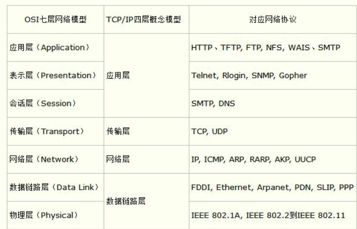
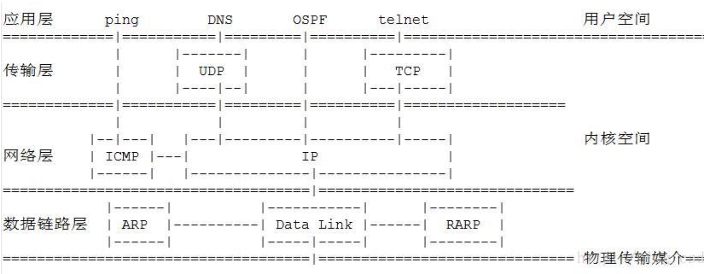

## OSI7层模型和TCP4层模型的关系

OSI参考模型是学术上和法律上的国际标准，是完整的权威的网络参考模型。而TCP/IP参考模型是事实上的国际标准，即现实生活中被广泛使用的网络参考模型。

 

OSI引入了服务、接口、协议、分层的概念，TCP/IP借鉴了OSI的这些概念建立TCP/IP模型。

OSI先有模型，后有协议，先有标准，后进行实践；而TCP/IP则相反，先有协议和应用再提出了模型，且是参照的OSI模型。

**OSI是一种理论下的模型，而TCP/IP已被广泛使用，成为网络互联事实上的标准。**

 

## OSI7层模型

- **应用层**：常见应用运行的层次，提供例如http、ftp、snmp、telnet等协议；
- **表示层**：将应用处理的信息转换为适合网络传输的格式，或者将来自下层的数据转为上层数据能够处理的格式，例如进行数据的加密、打包、压缩等功能；提供例如：ssl/tls、ascii等协议；
- **会话层**：负责建立和断开数据连接以及数据的分割等数据传输相关的管理，提供rpc、adsp等协议；
- **传输层**：负责建立两点之间的数据传输，确保数据送达到目标地址，提供tcp、udp协议；
- **网络层**：负责地址管理和路由选择，提供ip、icmp协议；
- **数据链路层**：负责将0,1序列划分成数据帧并在物理层面上进行数据传输，实现设备之间的传送和识别数据帧；提供PPP、sltp等协议；
- **物理层**：将0,1序列转换为电压和脉冲管信号传输给物理介质，是整个传输过程的基础；

**OSI参考模型是学术上和法律上的国际标准，是完整的权威的网络参考模型**

 

## TCP/IP4层模型

TCP/IP借鉴了OSI的这些概念建立TCP/IP模型，TCP/IP参考模型是事实上的国际标准，即现实生活中被广泛使用的网络参考模型。

- **数据链路层**：实现网卡接口的网络驱动，以处理数据在以太网线等物理媒介上的传输；为上层协议提供一个统一的接口
- **网络层**：确定两台主机间的通讯路径，对上层协议隐藏了网络拓扑连接的细节，在使得传输层看来通讯双方是直接连接的
- **传输层**：应用程序提供端对端通讯的”错觉”，即为应用程序隐藏了数据包跳转的细节，负责数据包的收发、链路超时重连等
- **应有层**：负责处理众多业务逻辑，如文件传输、网络管理

